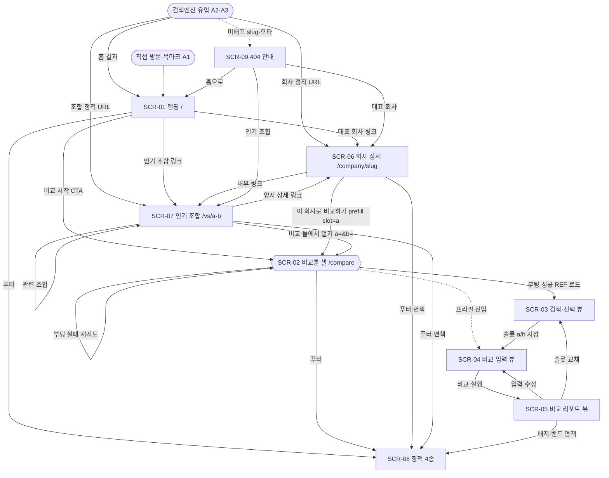

# FLOW — loupit

> 이 문서는 **얇은 인덱스**다. 요약·참조 파일 목록·화면(SCR) 마스터표·플로우(FLOW) 마스터표·상위 사이트맵만 담는다. 각 화면의 구획·인터랙션·상태·전이 상세는 개별 `FLOW/xx.md` 파일이 소유하며 여기서는 서술하지 않는다.

## 1. 목적

loupit FLOW 문서군은 USECASE·FRD가 정의한 화면과 화면 사이의 전이를 **안정 ID(SCR-*·FLOW-*)**로 확정하는 문서군이다. 8개 문서가 사이트맵·전역 네비게이션과 기능 대역별 화면·플로우(랜딩·검색·입력·리포트·회사상세/조합·정책/광고/동의·오류/엣지)를 나눠 소유한다. 상위 추적은 FLOW → FRD([FRD.md](FRD.md)) → USECASE → PRD → 브리프이며, 로그인/회원/프로파일러/서버 측 사용자 쓰기 화면은 제품 범위에서 영구 제외되어 어떤 화면·라우트·전이에도 등장하지 않는다(FR-01).

## 2. 참조 파일 목록

| 파일 | 설명 |
| --- | --- |
| [FLOW/01-사이트맵과-네비.md](FLOW/01-사이트맵과-네비.md) | 사이트맵·라우트 트리, 전역 헤더/푸터/동의 배너, 광고 배치 정본, 사이트 전체 전이 지도 (SCR-01~09 · FLOW-01~04) |
| [FLOW/02-랜딩.md](FLOW/02-랜딩.md) | 랜딩(홈) 화면·부팅 로딩/실패 상태·동의 배너, 첫 진입 탐색 분기와 광고·동의 폴백 (SCR-10~13 · FLOW-10~11) |
| [FLOW/03-비교-검색선택.md](FLOW/03-비교-검색선택.md) | 비교툴 진입 셸(슬롯 a/b)·검색/자동완성·무결과/오류·선택 반영·직접 입력 (SCR-20~24 · FLOW-20~22) |
| [FLOW/04-비교-입력.md](FLOW/04-비교-입력.md) | 비교 입력 a/b 병렬 5구획·프리셋 자동채움·실시간 요약(calc)·검증·재계산 루프 (SCR-30~34 · FLOW-30~32) |
| [FLOW/05-비교-리포트.md](FLOW/05-비교-리포트.md) | 리포트 결과 구획·재계산/부분 미산출·최근 비교 로컬 저장·회사쌍 공유 (SCR-40~43 · FLOW-40~43) |
| [FLOW/06-회사상세-인기조합.md](FLOW/06-회사상세-인기조합.md) | 회사 상세·인기 조합 정적 페이지, CTA 프리필·배지/면책·내부 링크, 유입→열람→전환 (SCR-50~56 · FLOW-50~52) |
| [FLOW/07-정책-광고-동의.md](FLOW/07-정책-광고-동의.md) | 정책 4종 공통 셸·개인화 동의 배너 상태 머신·광고/제휴 컴포넌트·page_type 게이팅 (SCR-60~62 · FLOW-60~62) |
| [FLOW/08-오류-엣지-플로우.md](FLOW/08-오류-엣지-플로우.md) | 로드/검색 실패·localStorage 불가·프리셋 폴백·비-JS·404 복구의 횡단 상태·무크래시 검증 (SCR-90~95 · FLOW-90~96) |

## 3. 화면(SCR) 마스터표

전체 43개 화면을 소유 문서 순으로 모은다. **SCR-01~09**(01 소유)는 라우트를 갖는 사이트 마스터 화면이고, **SCR-1x~SCR-9x**는 각 기능 FLOW가 소유한 상세 화면·구획·상태로 상위 화면을 분해·인용한다(별도 라우트 없는 경우 `(상태)`·`(구획)`·`(오버레이)`로 표기). "관련 FR"은 각 화면이 주로 충족·인용하는 FR 대역이다.

### 3.1 사이트 마스터 화면 — 01 사이트맵과 네비 (SCR-01~09)

| SCR-ID | 화면명 | 라우트 | 유형 | 관련 FR |
| --- | --- | --- | --- | --- |
| SCR-01 | 랜딩(홈) | `/` | 정적 | FR-71·72·73(진입 F1~F5) |
| SCR-02 | 비교 툴 셸(SPA) | `/compare` | SPA 셸 | FR-02·92·E1 |
| SCR-03 | 회사 검색·선택 뷰 | `/compare`(뷰) | SPA 뷰 | FR-10~17 |
| SCR-04 | 비교 입력 뷰 | `/compare`(뷰) | SPA 뷰 | FR-20~25 |
| SCR-05 | 비교 리포트 뷰 | `/compare`(뷰) | SPA 뷰 | FR-30~45 |
| SCR-06 | 회사 상세 페이지 | `/company/{slug}` | 정적 | FR-50~59 |
| SCR-07 | 인기 비교 조합 페이지 | `/vs/{a}-{b}` | 정적 | FR-60~65 |
| SCR-08 | 정책·고지 페이지(4종) | `/privacy·/terms·/disclaimer·/ads` | 정적 | FR-80~87 |
| SCR-09 | 404 오류 안내 페이지 | (미배포 경로) | 오류 | FR-E6·E7 |

### 3.2 랜딩 상세 — 02 랜딩 (SCR-10~13, 상위 SCR-01)

| SCR-ID | 화면명 | 라우트 | 유형 | 관련 FR |
| --- | --- | --- | --- | --- |
| SCR-10 | 랜딩(홈) 화면 | `/` | 정적 | FR-02·07·43·51·56·60·71~79·80·E5 |
| SCR-11 | 랜딩 부팅 로딩 상태 | `/`(상태) | SPA 향상 상태 | FR-02·92 |
| SCR-12 | 랜딩 참조 번들 로드 실패 상태 | `/`(상태) | 오류 상태 | FR-02·92·95·E1·E7 |
| SCR-13 | 개인화 동의 배너 | `/`(오버레이) | 오버레이 | FR-78·79·87 |

### 3.3 검색·회사 선택 상세 — 03 비교-검색선택 (SCR-20~24, 상위 SCR-03)

| SCR-ID | 화면명 | 라우트 | 유형 | 관련 FR |
| --- | --- | --- | --- | --- |
| SCR-20 | 비교툴 진입 화면(슬롯 a/b 셸) | `/compare`(뷰) | SPA 뷰 | FR-02·14·15·16·17 |
| SCR-21 | 슬롯 회사 검색·자동완성 후보 패널 | `/compare`(상태) | SPA 상태 | FR-10·11·12 |
| SCR-22 | 무결과·검색 오류 빈 상태 | `/compare`(상태) | SPA 상태 | FR-13·E2 |
| SCR-23 | 슬롯 회사 선택 반영 상태 | `/compare`(상태) | SPA 상태 | FR-14·15·06 |
| SCR-24 | 직접 입력 모드(회사 미선택) | `/compare`(상태) | SPA 상태 | FR-17·06·D3 |

### 3.4 비교 입력 상세 — 04 비교-입력 (SCR-30~34, 상위 SCR-04)

| SCR-ID | 화면명 | 라우트 | 유형 | 관련 FR |
| --- | --- | --- | --- | --- |
| SCR-30 | 비교 입력 화면(a/b 병렬 5구획) | `/compare`(뷰) | SPA 뷰 | FR-20~25·30·42 |
| SCR-31 | 복지 프리셋 자동채움 상태 | `/compare`(상태) | SPA 상태 | FR-21·06·D4·D8·D9·E4 |
| SCR-32 | 직접 입력 모드 상태 | `/compare`(상태) | SPA 상태 | FR-17·21·D3·D8 |
| SCR-33 | 실시간 요약(calc) 패널 상태 | `/compare`(상태) | SPA 상태 | FR-30·42 |
| SCR-34 | 입력 검증·정정 안내 상태 | `/compare`(상태) | SPA 상태 | FR-04·20·24 |

### 3.5 비교 리포트 상세 — 05 비교-리포트 (SCR-40~43, 상위 SCR-05)

| SCR-ID | 화면명 | 라우트 | 유형 | 관련 FR |
| --- | --- | --- | --- | --- |
| SCR-40 | 비교 리포트 결과 화면 | `/compare`(뷰) | SPA 뷰 | FR-40·41·45(표시 FR-30~39) |
| SCR-41 | 리포트 재계산·부분 미산출 상태 | `/compare`(상태) | SPA 상태 | FR-42·40(2a) |
| SCR-42 | 최근 비교 저장·목록 패널(로컬) | `/compare`(상태) | SPA 상태 | FR-43·44·07 |
| SCR-43 | 리포트 공유(회사쌍 프리필 링크) | `/compare`(상태) | SPA 상태 | FR-62·16·17 |

### 3.6 회사 상세·인기 조합 상세 — 06 회사상세-인기조합 (SCR-50~56, 상위 SCR-06·07)

| SCR-ID | 화면명 | 라우트 | 유형 | 관련 FR |
| --- | --- | --- | --- | --- |
| SCR-50 | 회사 상세 페이지 | `/company/{slug}` | 정적 | FR-50·51·52·55·56·06 |
| SCR-51 | 복지표·배지·출처·검증/만료·면책 섹션 | `/company/{slug}`(구획) | 정적 구획 | FR-53·54·05·D9·83 |
| SCR-52 | "이 회사로 비교하기" CTA 프리필 진입점 | `/company/{slug}`(구획)→SPA | 정적→SPA | FR-57·02·14·16·06 |
| SCR-53 | 인기 비교 조합 페이지 | `/vs/{a}-{b}` | 정적 | FR-60·64·65·D4 |
| SCR-54 | 사전 계산 비교 요약 대조 섹션 | `/vs/{a}-{b}`(구획) | 정적 구획 | FR-61·05·06·D3·83 |
| SCR-55 | 양사 프리필 "비교 툴에서 열기" 진입점 | `/vs/{a}-{b}`(구획)→SPA | 정적→SPA | FR-62·02·14·16·06·07 |
| SCR-56 | 관련 조합·양사 회사 상세 내부 링크 블록 | `/vs/{a}-{b}`(구획) | 정적 구획 | FR-63·60 |

### 3.7 정책·광고·동의 상세 — 07 정책-광고-동의 (SCR-60~62, 상위 SCR-08 외)

| SCR-ID | 화면명 | 라우트 | 유형 | 관련 FR |
| --- | --- | --- | --- | --- |
| SCR-60 | 정책·고지 페이지(4종 공통 셸) | `/privacy·/terms·/disclaimer·/ads` | 정적 | FR-80~86·87 |
| SCR-61 | 광고·쿠키 개인화 동의 배너 | (전역 오버레이) | 오버레이 | FR-78·79·87 |
| SCR-62 | 광고·제휴 컴포넌트(슬롯·제휴·"광고" 표기) | (호스트 페이지 마운트) | 컴포넌트 | FR-70~77 |

### 3.8 오류·엣지 상태 — 08 오류-엣지 (SCR-90~95, 횡단)

| SCR-ID | 화면명 | 라우트 | 유형 | 관련 FR |
| --- | --- | --- | --- | --- |
| SCR-90 | 참조 번들 로드 실패 오류 상태 | `/compare`(상태) | 오류 상태 | FR-E1·02·D1 |
| SCR-91 | 검색 실패·번들 폴백 매칭 상태 | `/compare`(상태) | 오류/폴백 상태 | FR-E2·13·D6 |
| SCR-92 | localStorage 불가 비침투 안내 상태 | `/compare`(횡단 상태) | 상태 | FR-E3·07 |
| SCR-93 | 기업유형 프리셋 직접입력 기본복지 표시 상태 | `/compare`(직접입력 상태) | 렌더 상태 | FR-E4·06·D3·D4 |
| SCR-94 | 비-JS·크롤러 정적 본문 폴백 상태 | 정적 페이지(렌더 모드) | 렌더 모드 | FR-E5·50·60·73 |
| SCR-95 | 404·not-found 오류 상태 | (미배포/API not-found) | 오류 상태 | FR-E6·D7·94 |

## 4. 플로우(FLOW) 마스터표

전체 29개 플로우를 소유 문서 순으로 모은다. **FLOW-01~04**는 사이트 전체·유입 전환·전역 네비·404 폴백의 상위 전이(01 소유)이고, **FLOW-1x~FLOW-9x**는 각 기능 대역 화면 내부의 단계별 플로우다. "시작화면"은 각 플로우의 진입 노드, "관련 UC"는 충족·연동 유즈케이스다.

| FLOW-ID | 이름 | 시작화면 | 관련 UC |
| --- | --- | --- | --- |
| FLOW-01 | 사이트 전체 화면 전이 지도 | 검색엔진 유입·직접 방문 → SCR-01/06/07 | 전 UC |
| FLOW-02 | 검색 유입 → 콘텐츠 열람 → 비교 툴 전환 | SCR-06/07(검색 유입) | UC-40·50·52 |
| FLOW-03 | 전역 네비게이션(헤더·푸터·동의 배너) | SCR-01~09(현재 화면) | UC-63·62 |
| FLOW-04 | 잘못된 URL·404·폴백 네비게이션 | 요청 URL·식별자 | UC-95 |
| FLOW-10 | 랜딩 첫 진입 → 부팅 → 탐색 분기 | SCR-10 | UC-A1·A2·A3·40·43·50·52·63·90·94 |
| FLOW-11 | 랜딩 광고·제휴 게이팅·개인화 동의 폴백 | SCR-10 | UC-60·61·62 |
| FLOW-20 | 비교툴 진입 → 프리필 판별 → 슬롯 초기 상태 | SCR-20 | UC-A1·14·43·52 |
| FLOW-21 | 슬롯 검색 → 결과 분기 → 선택/직접입력 → 다음 | SCR-21 | UC-10·11·12·13·14·15·91 |
| FLOW-22 | 슬롯 상태 전이(교체·동일회사·해제·직접↔선택) | SCR-23/24 | UC-14·15 |
| FLOW-30 | 비교 입력 진입 → 구획 입력 → 요약 → 실행/뒤로 | SCR-30 | UC-20~25·14·35·43·52 |
| FLOW-31 | 슬롯 a·b 초기화(프리셋 자동채움·직접입력·교체) | SCR-30(슬롯 s) | UC-21·14·15·93 |
| FLOW-32 | 입력 변경 → 검증 → 실시간 요약(calc) 재계산 | SCR-30 | UC-20~25·35·92 |
| FLOW-40 | 비교하기 실행 → 리포트 생성 → 구획 조회 | SCR-04/30 → SCR-40 | UC-30·31·32·33·34 |
| FLOW-41 | 입력 변경 → 재계산·리렌더(입력 수정 복귀) | SCR-40 | UC-35 |
| FLOW-42 | 최근 비교 저장 → 불러오기 → 삭제(localStorage) | SCR-40 | UC-36 |
| FLOW-43 | 리포트에서 다음 행동: 공유·새 비교·면책 확인 | SCR-40 | UC-30·52·63·14 |
| FLOW-50 | 회사 상세: 유입 → 열람 → 비교 툴 진입 | SCR-50 | UC-40·41·42·43·44 |
| FLOW-51 | 인기 조합: 유입 → 요약 → 양사 프리필/내부 탐색 | SCR-53 | UC-50·51·52·53·54 |
| FLOW-52 | 복지 배지·출처·검증/만료·면책 확인(공통) | SCR-51/54 | UC-42(·51) |
| FLOW-60 | 광고·쿠키 개인화 동의 배너 상태 머신 | SCR-61 | UC-62 |
| FLOW-61 | 정책 진입 → 열람 → 상호 연결·정정요청 | SCR-60 | UC-63·A3·A4·42 |
| FLOW-62 | 광고 슬롯 노출·제휴 링크 클릭("광고" 표기) | SCR-62 | UC-60·61 |
| FLOW-90 | reference/all 로드 실패 → 재시도 → 복구/지속 실패 | SCR-90 | UC-90 |
| FLOW-91 | 검색 실패 → 오류/무결과 구분 → 번들 폴백 → 재시도 | SCR-91 | UC-91·13 |
| FLOW-92 | localStorage 저장·복원 실패 흡수 → 비교 정상 진행 | SCR-92 | UC-92·A2 |
| FLOW-93 | 비교 툴 직접 입력 모드 → 등록 밖 회사 기업유형 프리셋 기본복지 채움 | SCR-93 | UC-93·15·21 |
| FLOW-94 | 비-JS·크롤러 정적 본문 접근 → 점진적 향상 | SCR-94 | UC-94·A3 |
| FLOW-95 | 정적 404·조합 정규화·SPA API not-found 흡수 | SCR-95 | UC-95·A3·50 |
| FLOW-96 | 오류·빈 상태 안내·무크래시 검증(횡단 카탈로그) | 실패·엣지 트리거 | UC-90~95 |

## 5. 상위 사이트맵 (전체 화면 전이)

정상 진입(검색 유입·직접 방문)부터 정적 콘텐츠·비교 툴 SPA 3뷰·정책·404까지의 사이트 전체 전이(SCR-01~09). 세부 단계 플로우는 각 기능 FLOW가 소유한다(FLOW-01 정본).

- **커버리지**: 사이트의 모든 사용자 화면(랜딩·비교 툴 3뷰·회사 상세·인기 조합·정책 4종·404)이 SCR-01~09로 식별되고, 각 기능 대역의 상세 화면(SCR-1x~SCR-9x)이 이를 분해·인용한다. 로그인/회원/프로파일러/서버 측 사용자 쓰기 화면은 어떤 라우트·메뉴·전이에도 없다(FR-01).
- **하위 연결**: 각 `FLOW/xx.md`는 본 인덱스의 SCR-*·FLOW-* ID를 인용해 구획·상태·전이를 상세화하고, WIREFRAME/SPEC/TASK는 다시 그 ID를 인용한다.
