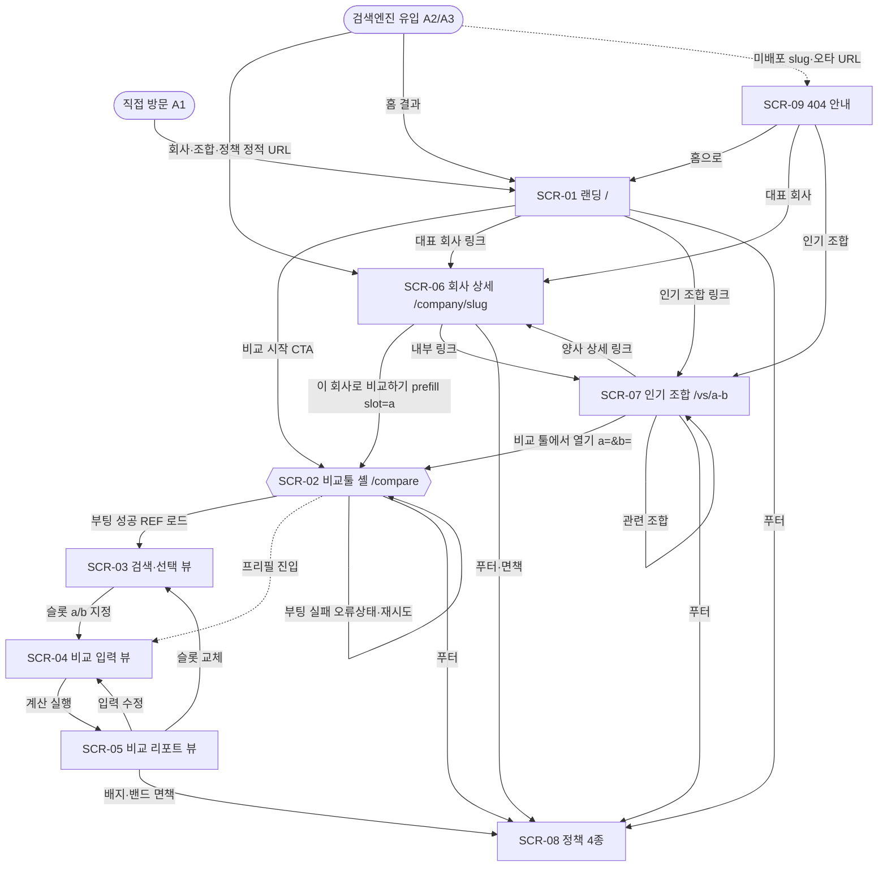
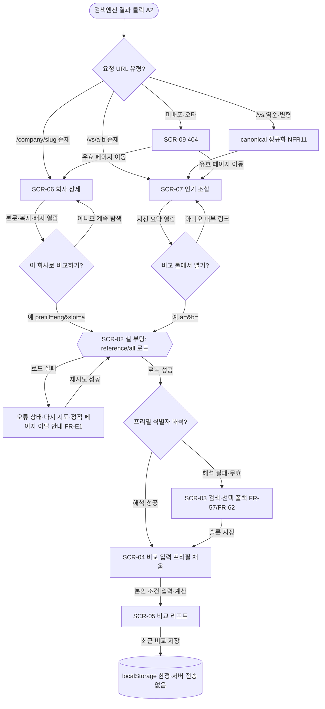
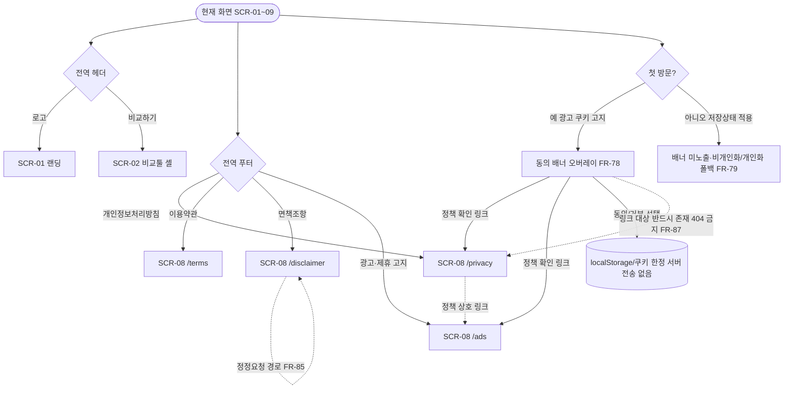
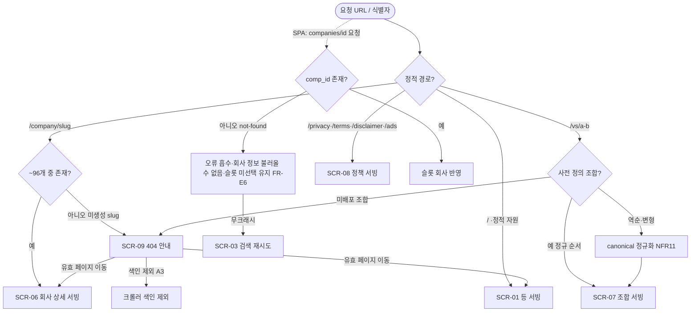

# 사이트맵과 네비게이션 (FLOW)

**목적**: loupit의 **전체 화면 구성(사이트맵)·전역 네비게이션·화면 전이 지도**를 확정한다. 이 문서는 FLOW 문서군의 진입점으로, 이후 각 기능 대역 FLOW(검색·입력·리포트·회사상세·조합·정책·오류)가 인용할 **안정적 화면 ID(SCR-*)와 명명 규칙**, **라우트 트리**, **헤더/푸터 전역 구성**, **광고·정책 링크의 전역 배치**, **상위(사이트 전체) 플로우차트**를 소유한다. 개별 화면의 상세 인터랙션·필드·컴포넌트 배치는 각 기능별 FLOW/WIREFRAME이 소유하며 여기서 재정의하지 않는다.

**상위 추적**: FLOW → FRD → USECASE → PRD → 브리프. 상위 근거 = FRD `07-회사페이지-정적생성.md`(FR-50·FR-51·FR-57), `08-인기조합-정적생성.md`(FR-60·FR-62·FR-63), `09-광고-제휴.md`(FR-71·FR-72·FR-73 배치 표·FR-78), `10-정책페이지.md`(FR-80 4종·전역 푸터·FR-87), `11-API.md`(FR-92 부팅 로드), `12-오류-엣지.md`(FR-E5·FR-E6·FR-E7 404·비-JS·안내). USECASE 마스터표(UC-A1~A5·UC-10~95), PRD `06-수익화.md`(MON7 배치 표·MON17 전역 정책 접근)·`07-비기능-요구사항.md`(NFR11 canonical·NFR12·NFR24 비-JS 본문·NFR9 sitemap). 브리프 §2-6(광고 배치)·§2-7(SEO 정적 페이지)·§9(문서 규칙·안정 ID).

**범위 경계**: 본 문서는 **라우트·화면 목록·전역 네비게이션·전이 지도**만 소유한다. 각 화면 내부의 상세 플로우(검색 자동완성, 입력 검증, 리포트 산출, CTA 프리필 소비, 광고 슬롯 마운트, 정책 문안)는 해당 기능 FLOW/FRD가 소유하고 본 문서는 **진입·이탈·전이 지점**으로만 인용한다. 로그인/회원/프로파일러/서버 측 사용자 쓰기 화면은 제품 범위에서 영구 제외이므로(FR-01) 어떤 라우트·화면·메뉴에도 등장하지 않는다.

**ID 대역**: 본 문서는 **화면 ID `SCR-01`~`SCR-09`**, **플로우 ID `FLOW-01`~`FLOW-04`**를 소유한다. 부여한 ID는 재사용하지 않는다(안정 ID, 브리프 §9). 하위 문서(WIREFRAME/SPEC/TASK)와 타 FLOW 문서가 이 ID를 인용한다.

---

## 1. SCR / FLOW 명명 규칙

- **`SCR-NN`**: 사용자에게 렌더되는 **화면(라우트 또는 SPA 뷰)** 단위. `NN`은 2자리 순번(01~). 정적 페이지는 하나의 URL이 하나의 화면 유형, SPA 뷰는 `/compare` 셸 안의 클라이언트 상태다. 하나의 화면 유형이 다수 인스턴스(회사 ~96개·조합 N개·정책 4종)를 가질 수 있으며, 이 경우 화면 **유형**에 단일 SCR-ID를 부여하고 인스턴스는 라우트 파라미터로 구분한다.
- **`FLOW-NN`**: 화면 사이의 **전이(네비게이션) 플로우차트** 단위. 본 문서는 사이트 전체·유입 전환·전역 네비게이션·오류 폴백의 **상위 전이**를 소유한다. 화면 **내부**의 단계별 플로우(예: 검색→선택, 입력→재계산)는 각 기능 FLOW 문서가 자체 `FLOW-*` 대역으로 소유한다.
- **표기 규약**: 화면은 `[SCR-06]`, 플로우는 `[FLOW-01]` 형태로 대괄호 인용한다. 광고 게이팅 축인 `page_type`(FR-73: `landing`/`company`/`combo`/`input`/`result`/`policy`)을 화면마다 병기하여 광고 배치와 화면을 1:1로 연결한다.
- **정적/SPA 유형 표기**: `정적`=빌드타임 생성 HTML, Nginx 직접 서빙, 요청 시 서버 렌더·DB 조회 0(NFR1). `SPA 셸`/`SPA 뷰`=`/compare` 단일 페이지 앱과 그 클라이언트 뷰 상태. `오류`=404 안내 정적 페이지.

---

## 2. 전체 사이트맵 (라우트 트리)

loupit은 **정적 콘텐츠 페이지 집합 + 단일 비교 툴 SPA(`/compare`)**로 구성된다. 주 진입은 랜딩 경유가 아니라 검색엔진의 정적 페이지 직접 유입이다(PRD-CTX-2). 모든 라우트는 HTTPS(jobcho.wiki)로 서빙된다(NFR12·NFR23).

```
jobcho.wiki
├─ /                        [SCR-01] 랜딩(홈)              정적   page_type=landing
├─ /compare                 [SCR-02] 비교 툴 셸(SPA)        SPA 셸  (부팅: reference/all 로드)
│    ├─ (뷰) 회사 검색·선택  [SCR-03] F1 검색·슬롯 지정      SPA 뷰
│    ├─ (뷰) 비교 입력       [SCR-04] F2 조건 입력           SPA 뷰  page_type=input  (무광고)
│    └─ (뷰) 비교 리포트     [SCR-05] F3 결과·판정·최근비교   SPA 뷰  page_type=result (절제 슬롯 1)
├─ /company/{slug}          [SCR-06] 회사 상세(~96개)        정적   page_type=company
├─ /vs/{a}-{b}              [SCR-07] 인기 비교 조합           정적   page_type=combo
├─ /privacy                 [SCR-08] 개인정보처리방침         정적   page_type=policy
├─ /terms                   [SCR-08] 이용약관                정적   page_type=policy
├─ /disclaimer              [SCR-08] 데이터 정확성 면책조항    정적   page_type=policy
├─ /ads                     [SCR-08] 광고·제휴 고지           정적   page_type=policy
├─ (그 외 미배포·오타 경로)  [SCR-09] 404 안내 페이지          오류
├─ /sitemap.xml             (비화면 SEO 산출물, FR-56·FR-64·NFR9)
└─ /robots.txt              (비화면, Sitemap 라인 포함, NFR10)
```

**라우트 파라미터·진입 쿼리**

| 라우트 | 파라미터 | 소스·의미 | 근거 |
| --- | --- | --- | --- |
| `/company/{slug}` | `slug` = `COMP_ENG_NM` 파생 ASCII slug(`^[a-z0-9]+(-[a-z0-9]+)*$`) | 복지 데이터가 있는 회사 ~96개 각 1개. 별칭·검색어는 slug 아님(검색으로 처리) | FR-51·FR-E6 |
| `/vs/{a}-{b}` | `{a}-{b}` = 두 회사 slug의 **사전식 정규 순서** | 역순·변형 경로는 동일 canonical로 정규화 | FR-60·NFR11 |
| `/compare` | `?prefill={COMP_ENG_NM}&slot=a\|b` | 회사 상세 CTA 프리필 진입(기본 `slot=a`) | FR-57 |
| `/compare` | `?a={식별자}&b={식별자}` | 조합 페이지 양사 프리필 진입(첫→a, 둘→b) | FR-62 |
| `/privacy·/terms·/disclaimer·/ads` | (없음) | 정책 4종 고정 경로 | FR-80 |

> **정책 경로 비고**: FR-80은 4종 정책 URL의 **존재·전역 푸터 접근·sitemap 등록**을 요구하되 정확한 경로 접두는 SPEC 확정 사항으로 남긴다(예시로 `/policy/privacy` 형태도 제시). 본 문서는 작성 지시의 짧은 경로(`/privacy`·`/terms`·`/disclaimer`·`/ads`)를 정본으로 채택한다. 접두 변경 시에도 4종 존재·푸터 링크·canonical·sitemap 요건은 불변이다.

---

## 3. 화면 목록 개요표

| SCR-ID | 화면 이름 | 라우트 | 유형 | page_type | 인스턴스 수 | 주 액터 | 주 커버 FR·UC |
| :---: | --- | --- | --- | --- | --- | --- | --- |
| SCR-01 | 랜딩(홈) | `/` | 정적 | `landing` | 1 | A1 | 진입 허브·광고 MON7-1(FR-71·72·73) |
| SCR-02 | 비교 툴 셸(SPA) | `/compare` | SPA 셸 | — | 1 | A1 | UC-A1·FR-02·FR-92·FR-E1(부팅 로드) |
| SCR-03 | 회사 검색·선택 뷰 | `/compare`(뷰) | SPA 뷰 | — | 1 | A1 | UC-10~15·FR-10~17(F1) |
| SCR-04 | 비교 입력 뷰 | `/compare`(뷰) | SPA 뷰 | `input` | 1 | A1 | UC-20~25·FR-20~25(F2) |
| SCR-05 | 비교 리포트 뷰 | `/compare`(뷰) | SPA 뷰 | `result` | 1 | A1 | UC-30~36·FR-30~45(F3) |
| SCR-06 | 회사 상세 페이지 | `/company/{slug}` | 정적 | `company` | ~96 | A2·A3 | UC-40~44·FR-50~59(F4) |
| SCR-07 | 인기 비교 조합 페이지 | `/vs/{a}-{b}` | 정적 | `combo` | N(큐레이션) | A2·A3 | UC-50~54·FR-60~65(F5) |
| SCR-08 | 정책·고지 페이지(4종) | `/privacy·/terms·/disclaimer·/ads` | 정적 | `policy` | 4 | A1·A2 | UC-63·UC-62·FR-80~87(F7) |
| SCR-09 | 404 오류 안내 페이지 | (미배포 경로) | 오류 | — | 1 | A2·A3 | UC-95·FR-E6·FR-E7 |

- SPA 뷰(SCR-03/04/05)는 별도 URL이 아니라 `/compare` 셸(SCR-02) 안의 클라이언트 상태 전이다. 광고 게이팅은 뷰 단위 `page_type`(`input`/`result`)으로 구분되며 검색·선택 뷰(SCR-03)는 입력 이전 단계로 광고 대상이 아니다(비교 툴 입력 흐름 광고 최소화, §2-6·MON8).
- SCR-06/07/08은 하나의 화면 **유형**이 다수 URL 인스턴스를 갖는다(회사 ~96·조합 N·정책 4). 각 인스턴스는 고유 `<title>`·canonical·sitemap 엔트리를 갖는다(NFR6·NFR11·NFR9).

---

## 4. 전역 네비게이션 (헤더 · 푸터 · 동의 배너)

세 개의 **전역 구획**이 모든(또는 지정) 화면에 공통 렌더된다. 정적 페이지에서는 빌드타임에 시맨틱 landmark(`<header>`/`<nav>`/`<footer>`)로 마크업에 포함되어 JS 없이 표시·색인되고(NFR12·NFR24), SPA에서는 셸 레이아웃에 포함된다. 모든 링크는 순수 `<a href>`로 JS 없이 이동 가능하다.

### 4.1 전역 헤더 (`<header>` / `<nav>`)

| 메뉴 항목 | 대상 라우트 | 대상 화면 | 노출 범위 | 근거 |
| --- | --- | --- | --- | --- |
| 로고 "loupit" | `/` | SCR-01 | 전 화면 | 홈 복귀(관례) |
| "비교하기"(비교 툴) | `/compare` | SCR-02→SCR-03 | 전 화면 | F1~F3 진입점 |

- 헤더는 최소 구성(로고 + 비교 툴 진입)으로 유지한다. 회사 랭킹/리스트 메뉴는 MVP 미포함(SC12·2차 검토)이므로 넣지 않는다(창작 금지).
- 콘텐츠 페이지(SCR-06/07)의 헤더는 정적 마크업이며, 헤더 존재가 본문 색인을 저해하지 않는다(단일 `<h1>`은 본문 회사·조합명, NFR13).

### 4.2 전역 푸터 (`<footer>`)

푸터는 **AdSense 승인·규정 준수의 전제 요건**인 정책 4종 전역 접근을 제공한다(MON17, FR-80). 모든 페이지(랜딩·회사 상세·조합·비교 툴·정책·404)의 푸터에 아래 링크 세트가 노출된다.

| 푸터 항목 | 대상 라우트 | 대상 화면 | 근거 |
| --- | --- | --- | --- |
| 개인정보처리방침 | `/privacy` | SCR-08 | FR-80·FR-81 |
| 이용약관 | `/terms` | SCR-08 | FR-80·FR-82 |
| 데이터 정확성 면책조항 | `/disclaimer` | SCR-08 | FR-80·FR-83 |
| 광고·제휴 고지 | `/ads` | SCR-08 | FR-80·FR-84 |
| 데이터 정확성 면책 요약(문구) | `/disclaimer` 로 연결 | SCR-08 | FR-54·FR-83(면책 정합) |

- 4종 링크는 **누락·404 0**이어야 한다(생성물 검증 대상, FR-80·FR-87). 동의 배너·회사 상세 면책 블록도 이 정책 페이지를 단일 진실로 참조한다(중복 정의 금지, MON14).

### 4.3 전역 동의 배너 (광고·쿠키 개인화 동의, 오버레이)

| 요소 | 동작·대상 | 노출 범위 | 근거 |
| --- | --- | --- | --- |
| 광고/쿠키 고지 배너 | 첫 방문 시 광고·쿠키 목적·제3자(Google) 고지 | 첫 방문 전역(재방문 시 저장 상태로 미재노출) | FR-78·MON13 |
| "개인정보처리방침" 링크 | `/privacy`(SCR-08) | 배너 내 | FR-78·FR-87 |
| "광고·제휴 고지" 링크 | `/ads`(SCR-08) | 배너 내 | FR-84·FR-87 |
| 동의/거부 선택 | 상태를 브라우저(localStorage/쿠키)에만 저장(서버 전송 없음) | — | FR-78·FR-79·NFR16 |

- 동의 상태는 광고 종류(개인화/비개인화/미노출)를 결정할 뿐 사이트 이용을 막지 않는다(FR-79·MON15). 배너가 링크하는 정책 페이지(SCR-08)가 반드시 존재·도달 가능해야 한다(링크 404 금지, FR-87).

---

## 5. 광고 · 정책 링크의 전역 배치

### 5.1 페이지 유형별 광고 배치 (FR-73 정본 표 인용)

광고/제휴 컴포넌트의 마운트는 **화면의 `page_type` 하나로 게이팅**된다(FR-73·MON8). 아래는 화면↔광고 배치 매핑이며 FR-73 배치 표의 정본을 어기지 않는다.

| 화면 | page_type | 자동광고 | 수동 슬롯 | 제휴 | 밀도 | 근거 |
| --- | --- | :---: | --- | :---: | :---: | --- |
| SCR-01 랜딩 | `landing` | ON | 콘텐츠 하단 1 | 선택 | 중 | MON7-1 |
| SCR-06 회사 상세 | `company` | ON | 본문 중간 1 + 하단 1 | O | 상 | MON7-2 |
| SCR-07 인기 조합 | `combo` | ON | 본문 중간 1 + 하단 1 | O | 상 | MON7-3 |
| SCR-04 비교 입력 뷰 | `input` | **OFF** | **없음** | **없음** | **없음** | MON7-4·MON8 |
| SCR-05 비교 리포트 뷰 | `result` | OFF | 리포트 하단 1(절제) | 선택 | 저 | MON7-5·MON9 |
| SCR-08 정책 | `policy` | OFF/최소 | 없음 | 없음 | 없음 | MON7-6 |
| SCR-03 검색·선택 뷰 | (게이팅 대상 아님) | OFF | 없음 | 없음 | 없음 | §2-6(입력 흐름 최소화) |
| SCR-02 셸 / SCR-09 404 | (판별 실패=안전 기본값) | OFF | 없음 | 없음 | 없음 | FR-73 default |

- **비교 입력 화면(SCR-04) 무광고 강제**: UX 보호를 위해 자동·수동·제휴 컴포넌트를 마운트 자체에서 게이팅한다(MON8·FR-73). 비교 결과(SCR-05)만 리포트 하단 절제 슬롯 1개를 허용한다(MON9).
- 모든 광고·제휴 영역에 "광고" 표기를 부착하고(FR-76·NFR19), 슬롯은 고정 크기 예약으로 CLS를 억제한다(FR-74·NFR5). 광고는 정적 본문 색인 이후 클라이언트 스크립트로 주입되어 비-JS 본문 가독을 저해하지 않는다(FR-E5).

### 5.2 정책 링크의 전역 배치

- **전역 푸터**(4.2): 전 화면에서 정책 4종(SCR-08) 도달(MON17·FR-80).
- **동의 배너**(4.3): `/privacy`·`/ads` 링크(FR-78·FR-87).
- **회사 상세 면책 블록**(SCR-06): 데이터 정확성 면책 고지 → `/disclaimer`(SCR-08) 연결(FR-54·FR-83).
- **리포트 배지·밴드 표시**(SCR-05): 불확실성 밴드 의미를 면책조항과 정합(FR-41·FR-83). 정책 문안이 단일 진실이며 타 화면은 참조·링크한다.

---

## 6. 화면별 개요

### [SCR-01] 랜딩(홈) — `/`
- **목적**: 서비스 소개와 비교 툴 진입, 대표 콘텐츠(회사·조합) 내부 링크 허브. 검색 유입이 주 경로이므로 필수 관문이 아니라 **보조 진입·내부 링크 노드**다(PRD-CTX-2).
- **주요 요소(구획)**: 전역 헤더 / 서비스 한 줄 소개·"비교 시작" CTA(→`/compare`) / 대표 회사 상세·인기 조합 내부 링크 / 콘텐츠 하단 광고 슬롯 1(page_type=landing) / 전역 푸터.
- **진입 경로**: 직접 방문·헤더 로고·검색엔진 홈 결과·404 페이지의 "홈으로".
- **이탈·전이**: `/compare`(SCR-02) · `/company/{slug}`(SCR-06) · `/vs/{a}-{b}`(SCR-07) · 푸터 정책(SCR-08).
- **표시 데이터**: 정적 소개 문구, 대표 회사/조합 링크 목록(빌드타임 큐레이션).
- **관련 FR·UC**: MON7-1·FR-71·FR-72·FR-73(광고), 진입 F1~F5.
- **광고 배치**: 자동광고 ON + 콘텐츠 하단 수동 1, 제휴 선택(§5.1).

### [SCR-02] 비교 툴 셸(SPA) — `/compare`
- **목적**: F1~F3 비교 도구를 담는 단일 페이지 앱 셸. 부팅 시 참조 번들을 1회 로드하여 검색·입력·계산의 단일 참조원을 확보한다.
- **주요 요소(구획)**: 전역 헤더 / 현재 뷰 컨테이너(SCR-03/04/05 전환) / 전역 푸터. 부팅 상태(로딩·오류·준비완료) 표시.
- **진입 경로**: 헤더 "비교하기" · 랜딩 CTA · 회사 상세 CTA(`?prefill=…&slot=`) · 조합 CTA(`?a=…&b=…`).
- **이탈·전이**: 부팅 성공→SCR-03(또는 프리필 시 SCR-04) / 부팅 실패→오류 상태(재시도·정적 페이지 이탈 안내).
- **표시 데이터**: `reference/all` 번들(회사+별칭+복지 인라인·기업유형·프리셋). 메모리 보관, 서버·localStorage 사용자 쓰기 없음.
- **관련 FR·UC**: UC-A1·FR-02·FR-92(부팅 로드), FR-E1(로드 실패·재시도), FR-D1(번들 계약).
- **광고 배치**: 셸 자체는 광고 없음(뷰별 게이팅). 판별 실패 시 안전 기본값 무광고(FR-73 default).

### [SCR-03] 회사 검색·선택 뷰 — `/compare`(SPA 뷰)
- **목적**: 회사명·별칭·영문 통칭 검색으로 현직(a)·이직처(b) 슬롯을 지정하거나, 미선택 직접 입력 모드로 진입.
- **주요 요소(구획)**: 검색 입력·자동완성 후보 리스트 / 슬롯(a/b) 지정·교체·해제 / 무결과·검색 실패 빈 상태 / 직접 입력 진입.
- **진입 경로**: SCR-02 부팅 완료 후 기본 뷰 / SCR-04·SCR-05에서 슬롯 재선택 복귀.
- **이탈·전이**: 슬롯 지정 후→SCR-04(비교 입력). 검색 실패→오류 안내(무결과와 구분, 번들 폴백 매칭). 직접 입력→SCR-04.
- **표시 데이터**: `companies/search` 결과 또는 번들 폴백 매칭 `{comp_id, comp_nm, comp_tp_cd, industry_nm, logo_nm}`.
- **관련 FR·UC**: UC-10~15·FR-10~17, FR-D6·FR-93, 오류 FR-E2·FR-13.
- **광고 배치**: 없음(입력 흐름 광고 최소화, §2-6).

### [SCR-04] 비교 입력 뷰 — `/compare`(SPA 뷰, page_type=input)
- **목적**: 두 직장의 연봉·복지·근무형태·통근·우선순위를 입력. 우선순위는 사용자가 직접 선택(프로파일러 없음).
- **주요 요소(구획)**: 연봉·범위·상승률 / 복지 프리셋·체크·금액 / 근무형태(재택·유연·야근·임금유형) / 통근시간 / 우선순위·희생요소 직접 선택.
- **진입 경로**: SCR-03 슬롯 지정 후 / 회사 상세·조합 CTA 프리필 진입(검색 단계 생략) / SCR-05에서 입력 수정 복귀.
- **이탈·전이**: 계산 실행→SCR-05(리포트). 슬롯 교체→SCR-03. 직접 입력 모드(회사가 등록 ~96개에 없을 때)의 유형 프리셋은 사용자 편집 가능.
- **표시 데이터**: 선택 회사(등록 ~96개)의 실복지, 직접 입력 모드는 유형 프리셋 템플릿, 근무형태 기본값. 사용자 입력은 메모리·localStorage 한정.
- **관련 FR·UC**: UC-20~25·FR-20~25, 프리셋 직접입력 FR-06·FR-E4, 저장 FR-07·FR-E3.
- **광고 배치**: **없음(무광고 강제, MON8·FR-73)**.

### [SCR-05] 비교 리포트 뷰 — `/compare`(SPA 뷰, page_type=result)
- **목적**: 총보상·시간조정 가치·워라밸·복지 카테고리 델타·우선순위 판정(vdCard)을 두 관점(a/b)으로 표시하고, 최근 비교를 기기 내 저장.
- **주요 요소(구획)**: 판정 카드(vdCard) / 총보상·시간가치 / 카테고리별 복지 델타·정성 / 배지·불확실성 밴드 표시 / 최근 비교 저장·불러오기·삭제 / 리포트 하단 절제 광고 슬롯 1.
- **진입 경로**: SCR-04 계산 실행 / 입력 변경 재계산.
- **이탈·전이**: 입력 수정→SCR-04. 슬롯 교체→SCR-03. 배지·밴드 이해→면책조항(SCR-08) 링크. 최근 비교는 localStorage에만 저장(서버 전송 없음).
- **표시 데이터**: 클라이언트 산출 리포트, 복지 배지(공식/추정/만료)·밴드. 모든 문자열 XSS 이스케이프.
- **관련 FR·UC**: UC-30~36·FR-30~45, 배지·밴드 FR-38·FR-41·FR-83(면책 정합), 최근 비교 FR-43·UC-A2, 폴백 FR-44·FR-E3.
- **광고 배치**: 리포트 하단 수동 슬롯 정확히 1개(판정 상단·중간 삽입 금지, MON9·FR-72), 제휴 선택.

### [SCR-06] 회사 상세 페이지 — `/company/{slug}` (정적, page_type=company)
- **목적**: 복지 데이터가 있는 회사 ~96개 각각의 기업정보·복지·근무형태를 검색 유입 열람용 정적 페이지로 제공하고 "이 회사로 비교하기" CTA로 비교 툴에 연결(SEO·AdSense 승인 콘텐츠 뼈대).
- **주요 요소(구획)**: 전역 헤더 / `<h1>` 회사 정식명·기업정보(산업·유형·로고·성장·안정성) / 근무형태 / 카테고리별 복지표·배지·출처·검증·만료 / 데이터 정확성 면책 블록(→`/disclaimer`) / "이 회사로 비교하기" CTA / 본문 중간·하단 광고 슬롯 / 전역 푸터.
- **진입 경로**: 검색엔진 직접 유입(A2·주 경로) / 크롤러 색인(A3) / 랜딩·조합·리포트 내부 링크.
- **이탈·전이**: CTA→`/compare?prefill={COMP_ENG_NM}&slot=a`(SCR-02→SCR-04, 검색 생략) / 조합·다른 회사 내부 링크 / 푸터 정책(SCR-08). 미존재 slug→404(SCR-09).
- **표시 데이터**: `TCOMPANY`(+유형)·복지 실데이터(등록 회사는 모두 실복지 보유 → 회사페이지 프리셋 폴백 불필요), 배지·출처·만료. 빌드타임 완성 HTML(비-JS 가독).
- **관련 FR·UC**: UC-40~44·FR-50~59, SEO FR-55·FR-56, CTA FR-57, 면책 FR-54·FR-83, 광고 FR-58·FR-73, 404 FR-E6.
- **광고 배치**: 자동광고 ON + 본문 중간 1 + 하단 1 + 제휴(§5.1).

### [SCR-07] 인기 비교 조합 페이지 — `/vs/{a}-{b}` (정적, page_type=combo)
- **목적**: 자주 찾는 회사쌍("A vs B")의 사전 계산 비교 요약을 정적 페이지로 제공하고, 양사 프리필로 비교 툴에 연결.
- **주요 요소(구획)**: 전역 헤더 / 두 회사 기업정보·근무형태·복지 카테고리 대조(사전값 기준 고지) / "비교 툴에서 열기" CTA(양사 프리필) / 관련 조합·양사 회사 상세 내부 링크 / 본문 중간·하단 광고 슬롯 / 전역 푸터.
- **진입 경로**: 검색엔진 유입(A2) / 크롤러(A3) / 랜딩·회사 상세·다른 조합 내부 링크.
- **이탈·전이**: CTA→`/compare?a=…&b=…`(SCR-02→SCR-04, 양사 a/b 프리필) / 회사 상세(SCR-06) / 관련 조합(SCR-07) / 푸터 정책(SCR-08). 미배포 조합·역순→canonical 정규화 또는 404(SCR-09).
- **표시 데이터**: 두 회사 참조·복지(실데이터, 등록 회사는 모두 실복지 보유 → 프리셋 폴백 불필요)의 사전 계산 대조. 개인화 판정(vdCard)은 표시하지 않음(비교 툴 안내).
- **관련 FR·UC**: UC-50~54·FR-60~65, 프리필 FR-62, 내부 링크 FR-63, SEO FR-64, 광고 FR-65·FR-73, 정규화·404 FR-60·FR-E6.
- **광고 배치**: 자동광고 ON + 본문 중간 1 + 하단 1 + 제휴(§5.1).

### [SCR-08] 정책·고지 페이지(4종) — `/privacy·/terms·/disclaimer·/ads` (정적, page_type=policy)
- **목적**: 개인정보처리방침·이용약관·데이터 정확성 면책조항·광고/제휴 고지 4종을 전역 접근 가능한 정적 문서로 게시(AdSense 승인·규정 준수 전제).
- **주요 요소(구획)**: 전역 헤더 / `<h1>` 정책명 이하 정책 본문(각 필수 항목) / 정정요청 연락 경로(면책·고지 내) / 전역 푸터. 얇은 유틸리티 페이지(광고 없음/최소).
- **진입 경로**: 전 화면 푸터 링크 / 동의 배너 링크(`/privacy`·`/ads`) / 회사 상세·리포트 면책 링크(`/disclaimer`).
- **이탈·전이**: 정책 상호 링크 / 헤더 홈·비교 툴 / 동의 배너 흐름 복귀.
- **표시 데이터**: 정적 정책 문안(운영자 확정·플레이스홀더 상수). 서버 사용자 쓰기 없음(정정요청은 오프라인 채널→빌드타임 재반영).
- **관련 FR·UC**: UC-63·UC-62·FR-80~87, 동의 연결 FR-87, 색인 정합 FR-86, 비-JS FR-E5.
- **광고 배치**: 자동광고 OFF/최소·수동 슬롯 없음(MON7-6·FR-86).

### [SCR-09] 404 오류 안내 페이지 — 미배포 경로 (오류)
- **목적**: 미생성 회사 slug·미배포 조합·오타·잘못된 URL 요청을 404로 일관 처리하고, 유효 페이지로의 탐색 경로를 안내(색인 제외·무크래시).
- **주요 요소(구획)**: 전역 헤더 / "페이지를 찾을 수 없습니다" 안내 / 유효 페이지(홈·대표 회사 상세·인기 조합) 이동 링크 / 전역 푸터.
- **진입 경로**: Nginx가 미존재 정적 경로에 404 반환 / 크롤러의 미존재 URL 요청.
- **이탈·전이**: 홈(SCR-01) / 회사 상세(SCR-06) / 인기 조합(SCR-07) / 푸터 정책(SCR-08).
- **표시 데이터**: 정적 안내 문구·이동 링크(빌드타임 확정). 색인 제외.
- **관련 FR·UC**: UC-95·FR-E6·FR-E7, canonical 정규화 NFR11. (SPA 내 `companies/{id}` not-found는 SCR-03/04에서 흡수·안내, FR-E6.)
- **광고 배치**: 없음(판별 실패 안전 기본값).

---

## 7. 플로우차트

### [FLOW-01] 사이트 전체 화면 전이 지도

정상 진입(검색 유입·직접 방문)부터 정적 콘텐츠·비교 툴 SPA·정책·404까지의 상위 전이. 세부 단계는 각 기능 FLOW가 소유한다.



### [FLOW-02] 검색 유입 → 콘텐츠 열람 → 비교 툴 전환 네비게이션

주 진입인 검색 유입(A2)이 정적 콘텐츠를 읽고 비교 툴로 전환하는 경로. 정상 + 프리필 실패 대안 + 404 오류 경로 포함.



### [FLOW-03] 전역 네비게이션 (헤더 · 푸터 · 동의 배너)

어느 화면에서든 도달 가능한 전역 링크 경로. 정책 4종 전역 접근·동의↔정책 단일 진실 연결 포함.



### [FLOW-04] 잘못된 URL · 404 · 폴백 네비게이션

정적 경로 404, 조합 역순 정규화, SPA 내 API not-found 흡수를 일관 처리(무크래시·색인 제외).



---

## 8. 추적 요약 (본 문서)

| 화면/플로우 | 라우트·유형 | page_type | 주 커버 FR | 주 커버 UC | 근거 |
| :---: | --- | --- | --- | --- | --- |
| SCR-01 | `/` 정적 | landing | FR-71·72·73 | (진입 허브) | MON7-1·§2-6 |
| SCR-02 | `/compare` SPA 셸 | — | FR-02·92·E1 | UC-A1 | FR-D1·NFR3 |
| SCR-03 | SPA 뷰 | — | FR-10~17 | UC-10~15 | FR-D6·E2·13 |
| SCR-04 | SPA 뷰 | input | FR-20~25 | UC-20~25 | MON8·E3·E4 |
| SCR-05 | SPA 뷰 | result | FR-30~45 | UC-30~36 | MON9·FR-43·83 |
| SCR-06 | `/company/{slug}` 정적 | company | FR-50~59 | UC-40~44 | FR-57·73·E6 |
| SCR-07 | `/vs/{a}-{b}` 정적 | combo | FR-60~65 | UC-50~54 | FR-62·63·E6 |
| SCR-08 | 정책 4종 정적 | policy | FR-80~87 | UC-63·UC-62 | MON17·E5 |
| SCR-09 | 404 오류 | — | FR-E6·E7 | UC-95 | NFR11·NFR26 |
| FLOW-01 | 사이트 전체 전이 | — | (전 FR 전이) | 전 UC | — |
| FLOW-02 | 유입→콘텐츠→전환 | — | FR-57·62·E1 | UC-40·50·52 | PRD-CTX-2 |
| FLOW-03 | 전역 헤더·푸터·동의 | — | FR-80·78·87 | UC-63·62 | MON14·17 |
| FLOW-04 | 404·정규화·폴백 | — | FR-E6·60 | UC-95 | NFR11 |

- **커버리지**: 사이트맵의 모든 사용자 화면(랜딩·비교 툴 3뷰·회사 상세·인기 조합·정책 4종·404)이 SCR-01~09로 식별되고, 각 화면이 담당 FR·UC로 추적된다. 로그인/회원/프로파일러/서버 측 사용자 쓰기 화면은 어떤 라우트·메뉴·전이에도 없다(FR-01).
- **하위 문서 연결**: WIREFRAME은 각 SCR의 구획을 픽셀·컴포넌트로, 기능별 FLOW는 각 화면 내부 단계 플로우를 자체 대역으로 상세화하며 본 문서의 SCR-*·FLOW-* ID를 인용한다.
