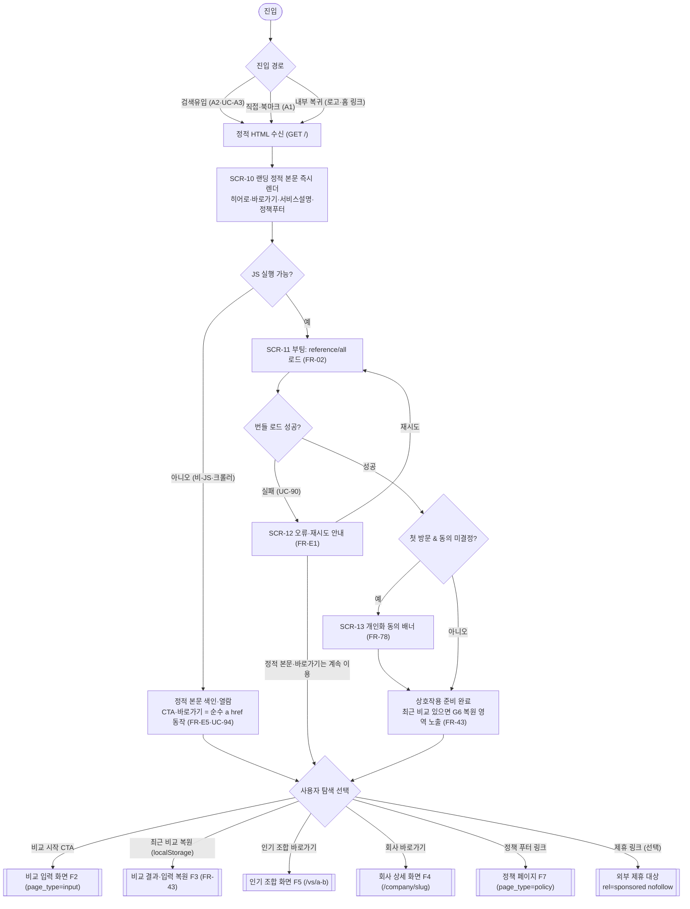
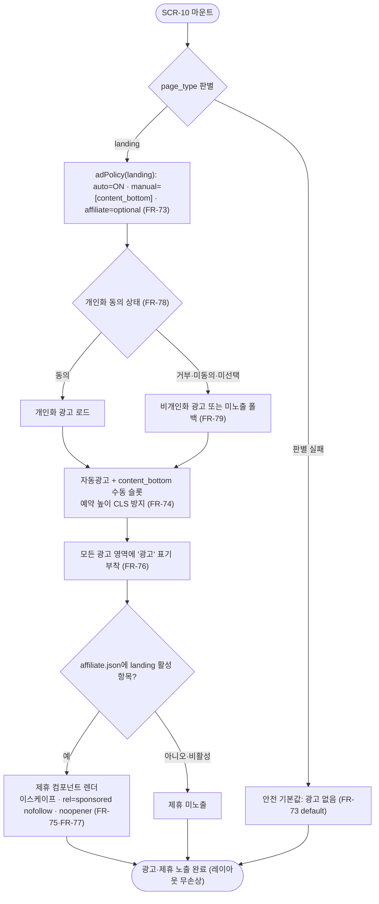

# 랜딩 화면·플로우 (FLOW)

**문서 목적**: 서비스 홈인 **랜딩 화면(`/`, `page_type=landing`)**의 화면 구성·구획·진입/전이·표시 데이터·광고 배치와, 첫 진입에서 탐색 목적지로 갈라지는 사용자 플로우차트를 확정한다. 랜딩은 SPA 진입점이자 SEO 정적 허브로서, 방문자를 **비교 툴(F1·F2·F3)·회사 상세(F4)·인기 조합(F5)·정책 페이지(F7)**로 분기시키고, 콘텐츠 페이지 광고 정책(F6, `page_type=landing`)을 적용받는다.

**상위 추적**: FLOW → FRD → USECASE → PRD → 브리프. 상위 근거 = FRD [09-광고·제휴](../FRD/09-광고-제휴.md)(FR-70~FR-79, 특히 `page_type=landing` 배치 표·FR-71·FR-72·FR-73·FR-74·FR-76·FR-78·FR-79), FRD [07-회사페이지-정적생성](../FRD/07-회사페이지-정적생성.md)(FR-51 회사 URL·FR-56 sitemap의 랜딩 URL 포함·FR-57 CTA 프리필 계약·FR-58 슬롯 배치), FRD.md FR 마스터표(FR-02·FR-07·FR-43·FR-56·FR-60·FR-80·FR-E1·FR-E5), USECASE.md(UC-A1·UC-A2·UC-A3·UC-40·UC-43·UC-50·UC-52·UC-60~UC-63·UC-90·UC-92·UC-94). 전역 규약(비로그인·서버 무쓰기·클라 계산·읽기 전용 API)은 FR-01을 인용하며 재정의하지 않는다.

**범위 경계**: 본 문서는 **랜딩 화면 자체의 구성·상태·전이 트리거와 랜딩에서 시작하는 플로우**만 소유한다. (1) 전이 목적지 화면(비교 입력 F2 / 비교 결과 F3 / 회사 상세 F4 / 인기 조합 F5 / 정책 F7)의 내부 구성·플로우는 각 담당 FLOW 문서가 소유하며 본 문서는 **진입 링크·프리필 계약**으로만 참조한다. (2) 광고/제휴 컴포넌트의 렌더·게이팅·표기·동의 로직은 F6(FR-7x)이 소유하고 본 문서는 랜딩에서의 **슬롯 배치·게이팅 결과·"광고" 표기 부착**만 규정한다. (3) 참조 번들 응답 스키마·검색 API는 F8이 소유한다. 프로파일러(가치관 진단 설문)와 익명 서버 쓰기 화면은 제품 범위에서 영구 제외이며, 로그인·회원·계정은 복지 등록·수정 기여(SC14, 문서 09/13·SP-AUTH) 한정 In-scope이나 이 익명 플로우엔 어떤 구획·전이에도 등장하지 않는다(FR-01). 랜딩 열람·CTA·바로가기 전 과정에서 사용자 데이터의 서버 전송·저장이 없으며, 상태는 브라우저(localStorage/쿠키)·URL 파라미터에만 존재한다(NFR16, FR-07).

**ID 대역**: 본 문서는 화면 **SCR-1x**(SCR-10~SCR-13), 플로우 **FLOW-1x**(FLOW-10~FLOW-11)를 소유한다(안정 ID, 재사용·중복 금지). 하위 문서(WIREFRAME/SPEC/TASK)가 이 ID를 인용한다.

---

## 화면 인덱스

| 화면 ID | 화면명 | `page_type` | 성격 | 주 커버 UC |
| --- | --- | --- | --- | --- |
| SCR-10 | 랜딩(홈) 화면 `/` | `landing` | SEO 정적 본문 + SPA 진입 허브 | UC-A1·UC-40(홈)·UC-94·UC-60 |
| SCR-11 | 랜딩 부팅 로딩 상태(참조 번들 로드 중) | `landing` | 향상(JS) 상태 | UC-A1 |
| SCR-12 | 랜딩 참조 번들 로드 실패 상태(오류·재시도) | `landing` | 오류 상태 | UC-90 |
| SCR-13 | 개인화 동의 배너(첫 방문 오버레이) | `landing` | 동의 컴포넌트 상태 | UC-62 |

> SCR-11·SCR-12·SCR-13은 SCR-10 위에 겹쳐지는 **상태/오버레이**다(별도 라우트 아님). SCR-10의 정적 본문(히어로·바로가기·서비스 설명·푸터)은 이들 상태와 무관하게 항상 먼저 표시·색인된다(비-JS 안전, UC-94·FR-E5).

## 플로우 인덱스

| 플로우 ID | 플로우명 | 다루는 경로 |
| --- | --- | --- |
| FLOW-10 | 랜딩 첫 진입 → 부팅 → 탐색 분기 | 정상(진입·정적 렌더·번들 부팅·탐색 분기) + 대안(비-JS·최근 비교 복원) + 오류(번들 로드 실패·재시도) |
| FLOW-11 | 랜딩 광고·제휴 슬롯 게이팅·개인화 동의 폴백 | 정상(landing 배치 적용) + 대안(비개인화/미노출 폴백) + 오류(판별 실패=무광고) |

---

## [SCR-10] 랜딩(홈) 화면 `/`

**목적**: 로그인 없는 한국 회사 복지·연봉·근무조건 비교 서비스의 첫인상을 전달하고, 방문자를 **비교 시작·인기 조합·회사 상세·정책**으로 안내하는 SEO 정적 허브. 검색엔진 색인 대상 본문을 JS 없이 담고(§2-7 SEO=수익 뼈대), 동시에 비교 툴 SPA를 부팅한다(UC-A1).

**주요 요소(구획)**

| 구획 | 내용 | 비-JS 렌더 | 근거 |
| --- | --- | :---: | --- |
| G1 헤더·글로벌 내비 | 로고(→ `/`), 서비스명, 비교 시작 진입점 | O | UC-94 |
| G2 히어로 | 한 줄 정의("로그인 없이 두 직장을 비교"), 핵심 가치 문구, **비교 시작 CTA**(순수 `<a href>`) | O | UC-A1·UC-94 |
| G3 인기 조합 바로가기 | 큐레이션된 인기 회사쌍 카드 목록 → 각 `/vs/{a}-{b}` 내부 링크 | O(정적 링크) | FR-60·UC-50·UC-52 |
| G4 회사 바로가기 | 대표 회사 카드 목록 → 각 `/company/{slug}` 내부 링크 | O(정적 링크) | FR-51·UC-40 |
| G5 서비스 설명 | 사용 3단계(회사 검색 → 조건 입력 → 리포트 확인) 요약, 데이터 정확성·면책 요약 + 정책 링크 | O | UC-63·FR-83(면책 정합) |
| G6 최근 비교(선택) | localStorage에 저장된 최근 비교가 있으면 복원 카드 노출(없으면 미표시) | 미표시(JS 향상) | FR-43·FR-07·UC-A2·UC-36 |
| G7 광고 슬롯 | 자동광고(ON) + 콘텐츠 하단 수동 슬롯 1(`content_bottom`), "광고" 표기 | 예약만(스크립트 미실행 시 빈 슬롯) | FR-71·FR-72·FR-73·FR-74·FR-76 |
| G8 제휴(선택) | `affiliate.json`에서 `landing` 대상 활성 항목이 있을 때만 노출, "광고" 표기·`rel="sponsored nofollow"` | 데이터 유무에 따름 | FR-75·FR-77·UC-61 |
| G9 정책 푸터 | 개인정보처리방침·이용약관·면책조항·광고/제휴 고지 4종 링크(전역 접근) | O | FR-80·UC-63 |
| G10 동의 배너 트리거 | 첫 방문·동의 미결정 시 SCR-13 표시 트리거 | 미표시(JS 향상) | FR-78·UC-62 |

**진입 경로**

- **검색유입(A2)**: 브랜드·서비스 키워드 검색 결과에서 `/`로 직접 유입(색인 대상, UC-A3·UC-94).
- **직접(A1)**: URL 직접 입력·북마크·외부 링크로 `/` 접속(UC-A1 SPA 부팅).
- **내부 복귀**: 회사 상세(F4)·인기 조합(F5)·정책(F7)·비교 결과(F3) 화면의 헤더 로고·홈 링크 → `/`.

**이탈·전이(다음 화면)**

| 트리거 | 다음 화면 | 전이 계약 | 근거 |
| --- | --- | --- | --- |
| 비교 시작 CTA(G2) | 비교 입력 화면(F2, `page_type=input`) | 프리필 없는 신규 세션 진입(순수 링크) | UC-A1→F2 |
| 최근 비교 복원(G6) | 비교 결과/입력 복원(F3, `page_type=result`) | localStorage 기록으로 상태 복원(서버 미조회) | FR-43·UC-A2·UC-36 |
| 인기 조합 카드(G3) | 인기 조합 화면(F5, `/vs/{a}-{b}`) | 정적 내부 링크 | FR-60·UC-50 |
| 회사 카드(G4) | 회사 상세 화면(F4, `/company/{slug}`) | 정적 내부 링크(이후 FR-57 CTA로 비교 프리필 가능) | FR-51·UC-40·UC-43 |
| 정책 푸터 링크(G9) | 정책 페이지(F7, `page_type=policy`) | 정적 링크 | FR-80·UC-63 |
| 제휴 링크(G8) | 외부 제휴 대상 | 새 탭, `rel="sponsored nofollow"`·`noopener` | FR-77·UC-61 |

**표시 데이터**

- 정적/빌드타임: 서비스 카피, 인기 조합 목록(회사쌍 식별자→`/vs/{a}-{b}`), 대표 회사 목록(`COMP_ENG_NM`→slug→`/company/{slug}`), 서비스 설명 3단계, 면책 요약, 정책 링크 4종. 모든 문자열은 이스케이프(NFR21), URL은 `http`/`https` 스킴 한정.
- 클라이언트/향상: 참조 번들(`reference/all`, FR-02) 로드 결과(비교 툴 사용 준비), 최근 비교(localStorage, FR-43), 동의 상태(localStorage/쿠키, FR-78).
- 인기 조합/회사 목록 선정은 빌드타임 큐레이션(FR-60 선정 기준 준용). 본 화면은 특정 회사를 창작하지 않는다.

**관련 FR·UC 추적**: FR-02·FR-07·FR-43(부팅·로컬)·FR-51·FR-60(내부 링크)·FR-56(랜딩 URL sitemap 포함)·FR-71~FR-79(광고/제휴/동의)·FR-80(정책 푸터)·FR-E5(비-JS 본문) / UC-A1·UC-A2·UC-A3·UC-40·UC-43·UC-50·UC-52·UC-60·UC-61·UC-62·UC-63·UC-94.

**광고 배치**(FR-73 배치 표, `page_type=landing`): 자동광고 **ON** + 수동 슬롯 **콘텐츠 하단 1개(`content_bottom`)** + 제휴 **선택(콘텐츠 적합 시)**, 밀도 **중**. 각 슬롯은 예약 높이로 CLS ≤ 0.1 보장(FR-74), "광고" 라벨 부착(FR-76). 비교 입력·판정 열람을 막지 않는 위치(콘텐츠 하단)에만 배치하며 히어로·바로가기 상단에는 수동 슬롯을 넣지 않는다.

---

## [SCR-11] 랜딩 부팅 로딩 상태(참조 번들 로드 중)

**목적**: 정적 본문(SCR-10 G1~G5·G9)은 이미 표시된 상태에서, 비교 툴·최근 비교 등 **JS 향상 기능이 참조 번들(`reference/all`)을 로드하는 동안**의 과도 상태를 표현한다. 정적 본문·바로가기·정책 푸터는 로딩과 무관하게 즉시 이용 가능하다(점진적 향상).

**주요 요소(구획)**: SCR-10 정적 본문 유지 + 향상 영역(예: 최근 비교 G6, 비교 시작 준비 표시)에 로딩 스켈레톤/비활성 표시. 광고 슬롯은 예약 높이만 유지(FR-74).

**진입 경로**: SCR-10 렌더 후 JS 실행 가능 환경에서 `reference/all` 요청 개시(UC-A1).

**이탈·전이**: 로드 성공 → SCR-10 상호작용 준비 완료(향상 영역 활성). 로드 실패 → SCR-12.

**표시 데이터**: 정적 본문(불변) + 향상 영역 로딩 표시. 번들 데이터는 아직 미반영.

**관련 FR·UC 추적**: FR-02·FR-92 / UC-A1.

**광고 배치**: SCR-10과 동일(예약 높이 유지). 로딩 상태가 광고 노출/미노출을 바꾸지 않는다.

---

## [SCR-12] 랜딩 참조 번들 로드 실패 상태(오류·재시도)

**목적**: `reference/all` 로드가 실패했을 때, 정적 본문·바로가기는 계속 이용 가능함을 유지하면서 **비교 툴 사용에 필요한 데이터가 아직 없음**을 알리고 재시도 경로를 제공한다(무크래시, UC-90·FR-E1).

**주요 요소(구획)**: SCR-10 정적 본문·인기 조합/회사 바로가기·정책 푸터 유지(정상 이용) + 향상 영역에 오류 안내 배너("일시적으로 비교 데이터를 불러오지 못했습니다")와 **재시도** 버튼. 정적 링크(G3·G4·G9)는 오류와 무관하게 동작.

**진입 경로**: SCR-11에서 번들 로드 실패(네트워크 오류·타임아웃·계약 위반)(UC-90·FR-E1).

**이탈·전이**: 재시도 → SCR-11(재로드 시도). 정적 본문 계속 이용 → 인기 조합/회사 상세/정책으로 전이 가능(SCR-10 전이 표와 동일, 비교 툴 진입만 데이터 대기). 재시도 반복 실패 시에도 사이트 크래시 없음(FR-E7).

**표시 데이터**: 오류 안내 문구(한국어)·재시도 컨트롤 + 정적 본문. 부분/오염 데이터는 반영하지 않는다.

**관련 FR·UC 추적**: FR-02·FR-92·FR-95·FR-E1·FR-E7 / UC-90.

**광고 배치**: SCR-10과 동일. 오류 상태에서도 슬롯 예약 높이로 레이아웃 무손상(FR-74).

---

## [SCR-13] 개인화 동의 배너(첫 방문 오버레이)

**목적**: AdSense 광고 쿠키 사용에 대한 **첫 방문 고지·동의/거부 선택**을 제공하고, 배너를 정책 페이지로 연결한다. 동의 상태는 서버 저장 없이 브라우저(localStorage/쿠키)에만 보관한다(FR-78·UC-62).

**주요 요소(구획)**: 고지 문안(광고/쿠키 목적·제3자 Google 사용 사실) + **동의/거부** 액션 + 개인정보처리방침·광고/제휴 고지 **링크**(동의↔정책 단일 진실, FR-87). 랜딩 본문·CTA·바로가기를 차단하지 않는 비파괴적 배너.

**진입 경로**: SCR-10/SCR-11 위에서 첫 방문 & 동의 미결정 판정 시 표시(FR-78). 재방문·기결정 시 미표시(저장 상태 적용, UC-62 4a).

**이탈·전이**: 동의 → 개인화 광고 경로(FLOW-11). 거부/닫기(미선택) → 비개인화 광고 또는 미노출 폴백(FR-79). 정책 링크 → 정책 페이지(F7). 어느 선택에서도 랜딩·비교·열람 정상 이용(FR-79·UC-62 3a).

**표시 데이터**: 동의 문안(한국어)·정책 링크. 저장: 동의 상태(로컬 전용, 서버 전송·저장 0, NFR16).

**관련 FR·UC 추적**: FR-78·FR-79·FR-87 / UC-62(·연계 UC-63).

**광고 배치**: 배너 자체는 광고가 아니라 동의 UI. 선택 결과가 SCR-10 광고 슬롯의 개인화/비개인화/미노출을 결정(FLOW-11).

---

## [FLOW-10] 랜딩 첫 진입 → 부팅 → 탐색 분기

방문자가 `/`에 진입해 정적 본문을 즉시 보고, (JS 가능 시) 참조 번들을 부팅한 뒤, **비교 시작·인기 조합·회사 상세·정책·최근 비교**로 갈라지는 핵심 플로우. 비-JS·번들 로드 실패의 대안/오류 경로를 포함한다.

**경로 요약**

- **정상**: 진입 → 정적 렌더(SCR-10) → 번들 부팅(SCR-11) → (첫 방문 시 동의 SCR-13) → 탐색 분기 → 5개 목적지 중 선택.
- **대안**: 비-JS/크롤러는 정적 본문·순수 링크만으로 색인·탐색(FR-E5·UC-94); 최근 비교가 있으면 복원 카드로 F3 재진입(FR-43·UC-A2).
- **오류**: 번들 로드 실패 시 SCR-12에서 재시도, 실패해도 정적 본문·바로가기·정책은 정상 이용(무크래시, UC-90·FR-E7). 비교 시작만 번들 확보 후 활성.

---

## [FLOW-11] 랜딩 광고·제휴 슬롯 게이팅·개인화 동의 폴백

랜딩이 `page_type=landing` 배치 정책(FR-73 정본 표)을 적용하고, 개인화 동의 상태(FR-78)에 따라 개인화/비개인화/미노출로 폴백하는 광고·제휴 렌더 플로우. 판별 실패는 안전 기본값(무광고)로 처리한다.

**경로 요약**

- **정상**: `landing` 판별 → 자동광고 ON + 하단 수동 슬롯 1 + (있으면) 제휴, 모두 예약 높이·"광고" 표기(FR-71·FR-72·FR-74·FR-76).
- **대안**: 미동의/거부/미선택 → 비개인화 또는 미노출 폴백, 사이트 이용 정상·레이아웃 무손상(FR-79·MON15). 제휴 항목 없으면 컴포넌트 부재(FR-75).
- **오류**: 페이지 유형 판별 실패 → 무광고(오노출 방지, FR-73 default). 광고 스크립트 미실행(차단기·네트워크 실패)에도 본문·바로가기 표시 유지(FR-74).

---

## 추적 요약 (본 문서)

| 화면/플로우 | 충족·연동 UC | 관련 FR | 상위 F |
| --- | --- | --- | --- |
| SCR-10 랜딩(홈) | UC-A1·UC-40(홈)·UC-43·UC-50·UC-52·UC-60·UC-61·UC-63·UC-94 | FR-02·FR-07·FR-43·FR-51·FR-56·FR-60·FR-71~FR-79·FR-80·FR-E5 | F1·F2·F4·F5·F6·F7 |
| SCR-11 부팅 로딩 | UC-A1 | FR-02·FR-92 | F8→F1·F2·F3 |
| SCR-12 번들 실패 | UC-90 | FR-02·FR-92·FR-95·FR-E1·FR-E7 | F8 |
| SCR-13 동의 배너 | UC-62·UC-63 | FR-78·FR-79·FR-87 | F6·F7 |
| FLOW-10 진입→탐색 분기 | UC-A1·UC-A2·UC-A3·UC-40·UC-43·UC-50·UC-52·UC-63·UC-90·UC-94 | FR-02·FR-43·FR-51·FR-60·FR-80·FR-E1·FR-E5·FR-E7 | F1·F4·F5·F7·F8 |
| FLOW-11 광고·동의 폴백 | UC-60·UC-61·UC-62 | FR-71·FR-72·FR-73·FR-74·FR-75·FR-76·FR-77·FR-78·FR-79 | F6 |

**커버리지 메모**: 랜딩은 신규 UC를 창설하지 않고, 공통·시스템 UC(UC-A1·UC-A2·UC-A3)와 콘텐츠 진입 UC(UC-40·UC-50 등)·광고/정책 UC(UC-60~UC-63)·오류 UC(UC-90·UC-94)를 **홈 허브 관점에서 진입·분기**로 충족한다. 전이 목적지 화면의 상세 플로우는 각 담당 FLOW 문서가 소유한다.
