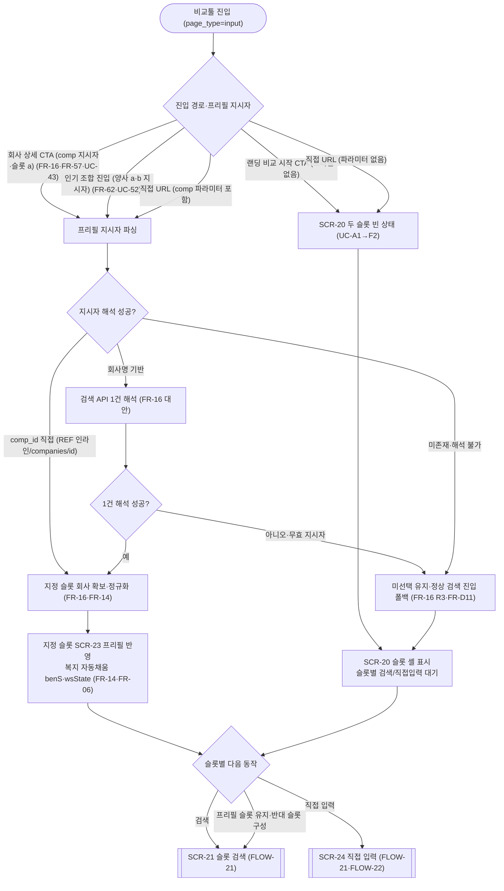
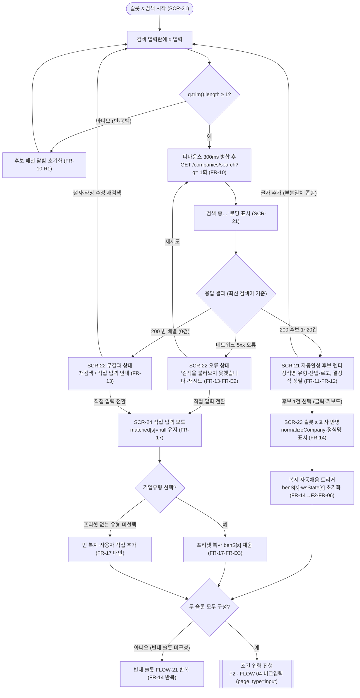
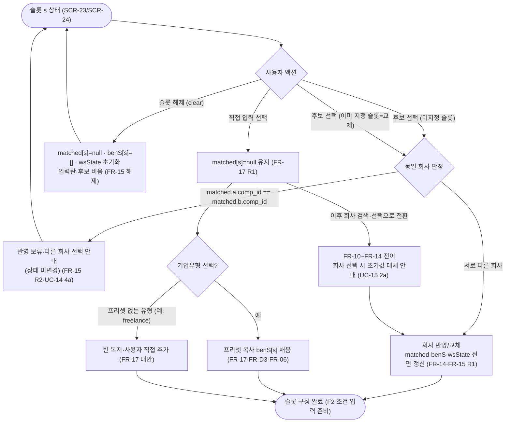

# 비교툴 진입·검색·회사 선택 화면·플로우 (FLOW)

**문서 목적**: 비교 툴의 **진입 화면(두 슬롯 셸, `page_type=input`)**과 그 안에서 회사를 찾아 슬롯(현직 a / 이직처 b)에 지정하는 **검색·자동완성·선택·직접 입력 전환** 단계의 화면 구성·구획·진입/전이·표시 데이터·광고 배치, 그리고 "검색 → 결과 유무 분기 → 선택/직접 입력 → 다음"으로 이어지는 사용자 플로우차트를 확정한다. 비교 툴 입력 화면은 UX 보호를 위해 광고를 최소화한다(브리프 §2-6).

**상위 추적**: FLOW → FRD → USECASE → PRD → 브리프. 상위 근거 = FRD [03-검색·회사선택](../FRD/03-검색-회사선택.md)(FR-10~FR-17), USECASE [02-검색과-회사선택](../USECASE/02-검색과-회사선택.md)(UC-10~UC-15). 연동 근거 = FRD.md FR 마스터표(FR-02 부팅 번들·FR-06 프리셋 폴백·FR-16/FR-57 회사 상세 CTA 프리필·FR-62 인기 조합 프리필·FR-D3/FR-D4/FR-D6/FR-D7/FR-D8/FR-D11 데이터 계약·FR-E2 검색 API 실패), USECASE.md(UC-10~UC-15, 연동 UC-43·UC-52·UC-91·UC-93). 전역 규약(비로그인·서버 무쓰기·클라 계산·읽기 전용 API)은 FR-01을 인용하며 재정의하지 않는다.

**범위 경계**: 본 문서는 **F1(검색·선택)의 화면·상태·전이와 이를 시작하는 플로우**만 소유한다. (1) 슬롯에 회사가 반영된 뒤의 조건 입력(연봉·복지 체크/금액·근무형태·통근·우선순위·희생요소)은 F2(FLOW [04-비교입력](04-비교입력.md), `page_type=input`의 조건 입력 구역)가 소유하며, 본 문서는 그 구역으로의 **진입 트리거**까지만 명세한다. (2) 리포트 산출·표현은 F3가 소유한다. (3) 검색·상세 API의 응답 스키마·상한·오류 형태는 데이터 계약(FR-D6·FR-D7·FR-D11)이 확정하고, 본 문서는 그 계약을 **소비하는 화면 동작**을 그린다. (4) 회사 상세 CTA·인기 조합 프리필 링크의 **생성**은 각각 F4(FR-57)·F5(FR-62)가 소유하고, 본 문서는 진입점에서 지시자를 **소비**하는 화면 동작만 규정한다(FR-16 R1). 프로파일러(가치관 진단 설문)와 익명 서버 쓰기 화면은 제품 범위에서 영구 제외이며, 로그인·회원·계정은 복지 등록·수정 기여(SC14, 문서 09/13·SP-AUTH) 한정 In-scope이나 이 익명 플로우엔 어떤 구획·전이에도 등장하지 않는다(FR-01). 검색·선택 전 과정에서 사용자 데이터의 서버 전송·저장이 없으며, 상태는 클라이언트 메모리·localStorage·URL 파라미터에만 존재한다(NFR16·NFR17, FR-07).

**ID 대역**: 본 문서는 화면 **SCR-2x**(SCR-20~SCR-24), 플로우 **FLOW-2x**(FLOW-20~FLOW-22)를 소유한다(안정 ID, 재사용·중복 금지). 하위 문서(WIREFRAME/SPEC/TASK)가 이 ID를 인용한다.

---

## 화면 인덱스

| 화면 ID | 화면명 | `page_type` | 성격 | 주 커버 UC / FR |
| --- | --- | --- | --- | --- |
| SCR-20 | 비교툴 진입 화면(슬롯 a/b 셸) | `input` | SPA 진입점·슬롯 컨테이너 | UC-14·UC-A1(전제) / FR-14·FR-16 |
| SCR-21 | 슬롯 회사 검색·자동완성 후보 패널 | `input` | 슬롯 내 검색 상태 | UC-10·UC-11·UC-12 / FR-10·FR-11·FR-12 |
| SCR-22 | 무결과·검색 오류 빈 상태 | `input` | 슬롯 내 빈/오류 상태 | UC-13·UC-91 / FR-13·FR-E2 |
| SCR-23 | 슬롯 회사 선택 반영 상태 | `input` | 슬롯 내 선택 완료 상태 | UC-14 / FR-14·FR-15 |
| SCR-24 | 직접 입력 모드(회사 미선택) | `input` | 슬롯 내 직접 입력 상태 | UC-15 / FR-17 |

> SCR-21~SCR-24는 SCR-20의 각 슬롯 카드가 취하는 **상태**다(별도 라우트 아님). 두 슬롯(a/b)은 각자 독립적으로 이 상태들을 취하며(FR-14 공통 규약 슬롯 표기), 한 슬롯이 검색 중이어도 다른 슬롯의 상태는 영향을 받지 않는다.

## 플로우 인덱스

| 플로우 ID | 플로우명 | 다루는 경로 |
| --- | --- | --- |
| FLOW-20 | 비교툴 진입 → 프리필 판별 → 슬롯 초기 상태 | 정상(4종 진입 경로·프리필 반영) + 대안(회사명 지시자 해석) + 오류(무효 지시자·해석 실패 → 검색 폴백) |
| FLOW-21 | 슬롯 검색 → 결과 유무 분기 → 선택/직접 입력 → 다음 | 정상(입력·디바운스·후보·선택) + 대안(무결과 재검색/직접 입력·부분일치 좁힘) + 오류(검색 API 실패) |
| FLOW-22 | 슬롯 상태 전이(교체·동일 회사·해제·직접입력↔회사선택) | 정상(반영) + 대안(교체·유형 프리셋·혼합 구성) + 오류(동일 회사 금지 안내) |

---

## [SCR-20] 비교툴 진입 화면(슬롯 a/b 셸)

**목적**: 두 직장을 비교하기 위한 비교 툴의 진입점. 현직(a, 비교 기준)·이직처(b, 비교 대상) 두 슬롯을 나란히 제공하고, 각 슬롯에서 **회사 검색·선택** 또는 **직접 입력**을 독립적으로 수행하도록 셸을 구성한다. 부팅 시 로드한 참조 번들(`reference/all`, FR-02)이 준비된 상태를 전제로 하며(UC-A1), 두 슬롯이 구성되면 조건 입력 구역(F2)으로 넘긴다. 입력 화면이므로 광고는 최소화한다(브리프 §2-6).

**주요 요소(구획)**

| 구획 | 내용 | 근거 |
| --- | --- | --- |
| G1 헤더·홈 링크 | 로고(→ `/`)·서비스명. 랜딩·타 화면으로의 복귀 경로 | UC-A1 |
| G2 슬롯 a 카드(현직) | 검색 입력란 + 후보 패널 영역 + 선택/직접입력 상태(SCR-21~24)를 담는 컨테이너. `s=a` | FR-14 공통 규약(슬롯), UC-14 |
| G3 슬롯 b 카드(이직처) | G2와 동일 구조·동일 상태 집합, `s=b`. 슬롯 a와 완전 독립 | FR-14 공통 규약(슬롯), UC-14 |
| G4 슬롯 간 제약 안내 | 비교는 서로 다른 두 회사를 전제 — 동일 회사 지정 시 안내(FLOW-22) | FR-15 R2, UC-14 4a |
| G5 다음 단계 진입점 | 두 슬롯 구성 후 조건 입력(연봉·복지·근무형태·통근·우선순위)으로 진행. 구역 소유는 F2 | FR-14→F2, UC-14 |

**진입 경로**

- **랜딩 비교 시작 CTA(A1)**: 랜딩(SCR-10 G2)의 "비교 시작" CTA → 프리필 없는 신규 세션 진입(두 슬롯 빈 상태). UC-A1→F2.
- **회사 상세 CTA 프리필(A2→A1)**: 회사 상세(F4)의 "이 회사로 비교하기" CTA가 회사 지시자(주로 `comp_id`)를 담아 진입 → 지정 슬롯(기본 현직 a)에 회사 사전 반영. FR-16·FR-57, UC-43·UC-14(1a).
- **인기 조합 프리필(A2→A1)**: 인기 비교 조합(F5, `/vs/{a}-{b}`)의 "직접 비교하기" 진입이 양사 지시자를 담아 진입 → 슬롯 a·b **양쪽** 사전 반영. FR-62, UC-52.
- **직접 URL(A1)**: 비교 툴 URL 직접 입력·북마크. 파라미터가 없으면 빈 슬롯, 회사 지시 파라미터가 있으면 FR-16으로 프리필 해석.

**이탈·전이(다음 화면)**

| 트리거 | 다음 화면/상태 | 전이 계약 | 근거 |
| --- | --- | --- | --- |
| 슬롯 검색 입력 시작 | SCR-21(해당 슬롯 검색·후보) | 슬롯별 독립 상태 진입 | FR-10, UC-10 |
| 슬롯 "직접 입력" 선택 | SCR-24(해당 슬롯 직접 입력) | `matched[s]=null` 유지 | FR-17, UC-15 |
| 프리필 지시자 반영 | SCR-23(해당 슬롯 선택 반영) | FR-14 정규화·복지 초기화 합류 | FR-16·FR-14, UC-14(1a) |
| 두 슬롯 구성 완료 → 다음 | 조건 입력 구역(F2, FLOW [04-비교입력](04-비교입력.md)) | 슬롯의 `matched`/`benS`/`wsState`를 F2 입력으로 인계 | FR-14→F2, UC-14 |
| 헤더 로고·홈 | 랜딩(SCR-10, `page_type=landing`) | 정적 링크 | UC-A1 |

**표시 데이터**

- 클라이언트/향상: 참조 번들(`reference/all`, FR-02) 로드 결과(검색·프리셋 폴백 준비), 각 슬롯의 `matched[s]`(선택 시), URL 프리필 파라미터(FR-16). 최근 비교 복원 진입은 F3(결과) 소유이며 본 화면에서 창설하지 않는다.
- 슬롯 라벨은 현직(a)·이직처(b) 고정. 모든 사용자 문자열은 이스케이프하여 삽입한다(NFR21).
- 서버·localStorage에 어떤 사용자 입력도 이 화면에서 쓰기 저장하지 않는다(입력 단계, NFR16·NFR17).

**관련 FR·UC 추적**: FR-02(부팅 번들 전제)·FR-14(슬롯)·FR-15(동일 회사 제약)·FR-16(CTA 프리필)·FR-17(직접 입력 진입) / UC-14·UC-A1(전제)·UC-43·UC-52.

**광고 배치**(브리프 §2-6, FR-73 배치 게이팅 매트릭스, `page_type=input`): **광고 최소화**. 비교 입력·판정 흐름을 방해하지 않도록 자동광고를 억제하고 입력 구역 내 수동 슬롯을 두지 않는다(UX 보호). 절제된 슬롯 허용은 **비교 결과 화면(F3)**에서만 적용되며(브리프 §2-6), 본 진입·검색·선택 화면에는 배치하지 않는다.

---

## [SCR-21] 슬롯 회사 검색·자동완성 후보 패널

**목적**: 특정 슬롯(a/b)에서 회사 정식명·별칭·영문·통칭으로 검색하여, 디바운스된 서버 검색 결과를 자동완성 후보 리스트로 좁혀 표시하고 선택 지점을 제공한다. UC-10(회사명)·UC-11(별칭·영문)·UC-12(자동완성·부분일치)의 검색·표시측을 담당한다.

**주요 요소(구획)**

| 구획 | 내용 | 근거 |
| --- | --- | --- |
| E1 검색 입력란 | 슬롯 `s`의 회사 검색 텍스트 입력. 입력 이벤트마다 `q=값.trim()` 계산 | FR-10, UC-10 |
| E2 로딩 표시 | 디바운스 대기·요청 중 "검색 중…" 표시(무결과·오류와 구분) | FR-10, UC-12 |
| E3 자동완성 후보 리스트 | 후보 행(최대 20건): 정식명 주 라벨 + 유형 라벨·산업·로고 보조. 키보드 이동·선택 가능 | FR-11·FR-12, UC-10·UC-11 |
| E4 좁힘 안내 | 20건 초과 시 "글자를 더 입력해 좁히세요" 하단 안내 | FR-11(20건 상한), UC-10(4a)·UC-12(4a) |
| E5 직접 입력 전환 링크 | 검색 대신 직접 입력(SCR-24)으로 넘어가는 진입 | FR-17, UC-15 |

**진입 경로**: SCR-20의 슬롯 검색 입력란에 글자 입력 시(FR-10). 무결과·오류(SCR-22)에서 철자·약칭 수정 재검색으로 재진입(UC-13 3a). 프리필/선택 상태(SCR-23)에서 슬롯 재검색(교체)로 재진입.

**이탈·전이(다음 화면·상태)**

| 트리거 | 다음 상태 | 근거 |
| --- | --- | --- |
| 후보 1건 선택(클릭·키보드) | SCR-23(슬롯 회사 반영) | FR-14, UC-14 |
| 결과 0건(200 빈 배열) | SCR-22(무결과 빈 상태) | FR-13, UC-13 |
| 네트워크·5xx 오류 | SCR-22(검색 오류 상태) | FR-13·FR-E2, UC-91 |
| 빈/공백 입력으로 복귀 | 후보 패널 닫힘(SCR-20 슬롯 대기) | FR-10(R1), UC-12(2a) |
| 직접 입력 전환(E5) | SCR-24(직접 입력) | FR-17, UC-15 |

**표시 데이터**

- 후보 항목: `{comp_id, comp_nm, comp_tp_cd(6종), industry_nm|null, logo_nm|null}`(FR-D6). 별칭으로 매칭된 후보도 리스트에는 **정식명**으로 표시된다(FR-11, UC-11 기본 흐름 5).
- 정렬은 클라이언트에서 결정적: 정식명 완전일치 → 정식명 접두 일치 → 별칭 접두 일치 → 정식명 길이 오름차순 → 가나다(`ko`) 순(FR-12). 서버 반환 순서에 의존하지 않는다.
- 후보 텍스트(정식명·산업·유형 라벨)는 `textContent`/이스케이프로 삽입, `innerHTML` 직접 삽입 금지(NFR21). 표시 문자열은 한국어·UTF-8(NFR29). 로고 이미지에는 대체 텍스트(NFR15).
- 검색어·후보를 서버에 쓰기 전송하지 않는다(NFR16·NFR20).

**관련 FR·UC 추적**: FR-10(입력·디바운스·요청 트리거)·FR-11(이름·별칭 매칭·20건 상한)·FR-12(자동완성·정렬) / UC-10·UC-11·UC-12 / FR-D6.

**광고 배치**: 없음(입력 화면 광고 최소화, 브리프 §2-6). 검색 상호작용 구역에는 광고·제휴 슬롯을 배치하지 않는다.

---

## [SCR-22] 무결과·검색 오류 빈 상태

**목적**: 검색 결과가 0건이거나 검색 API가 실패했을 때, 후보 리스트 대신 상태에 맞는 빈 상태를 표시하고 다음 행동을 안내한다. **무결과(정상 0건)**와 **오류(네트워크·5xx)**를 문구·행동으로 구분해, 오류를 무결과로 오인해 직접 입력으로 넘기지 않게 한다. UC-13(검색결과 없음)·UC-91(검색 API 실패)을 담당한다.

**주요 요소(구획)**

| 구획 | 내용 | 근거 |
| --- | --- | --- |
| N1 무결과 안내 | "검색 결과 없음" + 두 대안: (a) 다른 검색어·별칭 재검색, (b) 직접 입력 모드 진행 | FR-13(정상 무결과), UC-13 |
| N2 오류 안내 | "검색을 불러오지 못했습니다" + **재시도** 우선 안내(무결과와 다른 문구·행동), 직접 입력도 대안 제시 | FR-13(오류)·FR-E2, UC-13(1a)·UC-91 |
| N3 재검색 진입 | 검색 입력란으로 복귀(철자·약칭 수정) | FR-13, UC-13(3a) |
| N4 직접 입력 전환 | 직접 입력 모드(SCR-24)로 전이 | FR-17, UC-13(3b)·UC-15 |

**진입 경로**: SCR-21 검색 응답이 0건(200 빈 배열, FR-D6·FR-D11) 또는 네트워크·타임아웃·5xx 오류(FR-E2)일 때.

**이탈·전이(다음 화면·상태)**: 재검색(N3) → SCR-21; 직접 입력(N4) → SCR-24; 오류 재시도(N2) → SCR-21 검색 재요청. 대상 슬롯의 `matched[s]`는 미선택(`null`)으로 유지된다.

**표시 데이터**: 상태별 안내 문구(한국어). 무결과 = 재검색·직접 입력 두 경로, 오류 = 재시도 우선·직접 입력 대안. 앱은 크래시하지 않으며 반대 슬롯·기타 기능은 정상 동작한다(NFR26·FR-E7). 서버 쓰기 없음(NFR16).

**관련 FR·UC 추적**: FR-13(무결과·오류 구분)·FR-E2(검색 API 실패·번들 폴백 매칭) / UC-13·UC-91 / FR-D11·NFR26.

**광고 배치**: 없음(입력 화면 광고 최소화, 브리프 §2-6).

---

## [SCR-23] 슬롯 회사 선택 반영 상태

**목적**: 후보 리스트에서 회사 1건을 선택(또는 CTA/조합 프리필로 사전 지정)하면, 그 회사를 지정 슬롯(a/b)에 반영하고 유형·산업·복지 데이터를 비교 입력(F2)에 연동한 상태를 표현한다. 슬롯 교체·해제·동일 회사 처리의 시작점이다. UC-14(비교 대상 회사 선택)를 담당한다.

**주요 요소(구획)**

| 구획 | 내용 | 근거 |
| --- | --- | --- |
| S1 선택 회사 표시 | 입력란 표시값 = 정식명. 유형·산업·로고 표시. 상세 호출 방식일 때 "회사 정보 불러오는 중…" 과도 표시 | FR-14, UC-14 |
| S2 복지 자동채움 안내 | 회사 복지(실데이터 또는 유형 프리셋 폴백 병합)를 각 항목 `checked=true`로 `benS[s]` 초기화, `work_style_val`로 `wsState[s]` 초기화 — "회사 데이터로 복지 자동 채움" 취지 표시(세부 편집은 F2) | FR-14·FR-06·FR-D4, UC-14(3), UC-93 |
| S3 교체/해제 컨트롤 | 슬롯 재검색(교체) 진입·슬롯 해제(clear) | FR-15, UC-14(2a) |
| S4 동일 회사 안내 | 반대 슬롯과 동일 회사 지정 시 다른 회사 선택 안내 | FR-15 R2, UC-14(4a) |

**진입 경로**: SCR-21 후보 선택(FR-14); SCR-20 프리필 지시자 반영(FR-16, 회사 상세 CTA·인기 조합 진입); SCR-24 직접 입력 중 회사 검색·선택으로 전환(FR-17, UC-15 2a).

**이탈·전이(다음 화면·상태)**

| 트리거 | 다음 상태 | 근거 |
| --- | --- | --- |
| 재검색(교체) | SCR-21 → 새 회사로 전면 갱신 | FR-15(R1), UC-14(2a) |
| 슬롯 해제(clear) | SCR-20 슬롯 빈 상태(`matched[s]=null`) | FR-15(해제) |
| 두 슬롯 구성 완료 → 다음 | 조건 입력 구역(F2, FLOW [04-비교입력](04-비교입력.md)) | FR-14→F2, UC-14 |

**표시 데이터**

- `matched[s]` = 정규화된 회사 객체(`{comp_id, comp_nm, comp_tp_cd, industry_nm, logo_nm, work_style_val, aliases[], benefits[], …}`, FR-D8; 정규화 FR-D8.2 — 카테고리 폴백 `perks`·배지 폴백 `est`·불리언 강제).
- `benS[s]` = 회사 복지 초기값(각 `checked=true`), `wsState[s]` = `work_style_val` 기반 초기값(F2 소유 필드의 초기화 트리거). 실데이터 없으면 이미 유형 프리셋으로 폴백 병합된 값 반영(amt_source=`preset`, FR-06·FR-D3, UC-93).
- 렌더되는 회사명·별칭·복지 문자열은 이스케이프한다(NFR21). 선택 상태는 클라이언트 메모리·(요약 수준)localStorage에만 존재하고 서버로 저장·전송하지 않는다(NFR16·NFR17, FR-01·FR-07).

**관련 FR·UC 추적**: FR-14(선택·슬롯 반영·F2 연동)·FR-15(교체·동일 회사·해제)·FR-06(프리셋 폴백)·FR-16(프리필 합류) / UC-14 / FR-D4·FR-D7·FR-D8.

**광고 배치**: 없음(입력 화면 광고 최소화, 브리프 §2-6).

---

## [SCR-24] 직접 입력 모드(회사 미선택)

**목적**: 회사를 선택하지 않고 슬롯을 구성하는 경로를 제공한다. 검색 결과가 없거나(SCR-22/FR-13) 사용자가 선택을 건너뛴 경우, 회사 연동 없이 조건만 직접 입력해 비교 입력(F2)으로 진입한다. 기업유형만 선택하면 해당 유형 프리셋으로 복지 초기값을 채운다. UC-15(회사 미선택 시 직접 입력 모드)를 담당한다.

**주요 요소(구획)**

| 구획 | 내용 | 근거 |
| --- | --- | --- |
| D1 직접 입력 표시 | 슬롯 `s`가 `matched[s]=null`을 유지한 채 조건 입력으로 진입함을 표시(회사 선택과 상태상 구분) | FR-17 R1, UC-15 |
| D2 기업유형 선택(선택적) | 6종(`large`/`startup`/`mid`/`foreign`/`public`/`freelance`) 중 선택 시 `benefit_presets[comp_tp_cd]`를 `benS[s]`로 복사(각 항목 `checked=default_checked_yn`, amt_source=`preset`) | FR-17·FR-D3·FR-06, UC-15 |
| D3 프리셋 없는 유형 안내 | 프리셋이 빈 유형(예: `freelance`)은 복지 목록이 빌 수 있으며 사용자가 항목 직접 추가 | FR-17(대안)·FR-06, UC-15 |
| D4 회사 선택 전환 링크 | 이후 회사를 검색·선택하기로 전환(초기값 대체 가능 안내) | FR-17, UC-15(2a) |

**진입 경로**: SCR-20 슬롯 "직접 입력" 선택; SCR-22 무결과·오류에서 직접 입력 전환(UC-13 3b); SCR-21 검색 중 직접 입력 링크(E5).

**이탈·전이(다음 화면·상태)**

| 트리거 | 다음 상태 | 근거 |
| --- | --- | --- |
| 기업유형 선택 | 프리셋 복사된 직접 입력 상태 유지(`matched[s]=null`) | FR-17·FR-D3, UC-15 |
| 회사 검색·선택으로 전환(D4) | SCR-21 → SCR-23(회사 반영, 초기값 대체 가능) | FR-17→FR-10~FR-14, UC-15(2a) |
| 슬롯 구성 완료 → 다음 | 조건 입력 구역(F2, FLOW [04-비교입력](04-비교입력.md)) | FR-17→F2, UC-15 |

**표시 데이터**: `matched[s]=null` 유지. `benS[s]` = 유형 프리셋 복사값(유형 선택 시) 또는 빈 배열/사용자 직접 추가값. 한 슬롯은 회사 선택(SCR-23), 다른 슬롯은 직접 입력의 **혼합 구성**을 허용한다(UC-15 1a). 서버 쓰기·전송 없음, 저장은 localStorage 한정이며 미지원·차단 시에도 비교는 정상 동작(NFR16·NFR17·NFR25, FR-07·FR-E3).

**관련 FR·UC 추적**: FR-17(직접 입력 모드)·FR-06(프리셋 폴백)·FR-D3(프리셋 항목) / UC-15 / NFR25.

**광고 배치**: 없음(입력 화면 광고 최소화, 브리프 §2-6).

---

## [FLOW-20] 비교툴 진입 → 프리필 판별 → 슬롯 초기 상태

방문자가 비교 툴에 진입하는 4종 경로(랜딩 CTA / 회사 상세 CTA 프리필 / 인기 조합 프리필 / 직접 URL)를 판별하고, 프리필 지시자를 해석해 슬롯 초기 상태(빈 슬롯 또는 사전 반영)를 정한 뒤 검색·직접 입력으로 갈라지는 진입 플로우. 무효 지시자·해석 실패는 크래시 없이 정상 검색 진입으로 폴백한다.

**경로 요약**

- **정상**: 진입 → 경로 판별 → (프리필이면) 지시자 해석·슬롯 반영(SCR-23) → 검색/직접 입력 분기. 랜딩 CTA·파라미터 없는 직접 URL은 빈 두 슬롯으로 시작.
- **대안**: 회사명 기반 지시자는 검색 API로 1건 해석 후 선택 흐름 합류(FR-16 대안). 인기 조합은 양 슬롯(a·b) 동시 프리필(FR-62), 이후 각자 재구성 가능.
- **오류**: 존재하지 않거나 해석 불가한 지시자는 슬롯 미선택으로 두고 정상 검색 진입으로 폴백(FR-16 R3·FR-D11·NFR26), 크래시 없음.

---

## [FLOW-21] 슬롯 검색 → 결과 유무 분기 → 선택/직접 입력 → 다음

한 슬롯(a/b)에서 검색어를 입력해 디바운스된 서버 검색을 트리거하고, **결과 유무(후보/0건/오류)**로 분기해 회사를 선택하거나 직접 입력으로 넘긴 뒤, 두 슬롯이 구성되면 조건 입력(F2)으로 넘기는 핵심 플로우. 무결과·검색 오류를 구분해 처리한다.

**경로 요약**

- **정상**: 유효 검색어 → 디바운스 1회 호출 → 후보 렌더(SCR-21) → 후보 선택 → 슬롯 반영(SCR-23)·복지 자동채움 → 두 슬롯 구성 시 조건 입력(F2).
- **대안**: 0건 무결과는 재검색 또는 직접 입력(SCR-24)로, 직접 입력은 유형 프리셋 채움 또는 빈 복지 직접 추가로 진행(FR-13·FR-17). 글자 추가로 후보를 좁히고, 최신 검색어 기준 결과만 반영해 경합 응답은 폐기(FR-10 R3).
- **오류**: 네트워크·5xx는 무결과와 구분되는 오류 상태(SCR-22)로 재시도 우선 안내, 직접 입력도 대안 제시(FR-13·FR-E2). 실패해도 앱 크래시·반대 슬롯 영향 없음(NFR26·FR-E7).

---

## [FLOW-22] 슬롯 상태 전이(교체·동일 회사·해제·직접입력↔회사선택)

이미 구성된 슬롯에 대한 재선택(교체), 두 슬롯 동일 회사 지정 시 처리, 해제(clear), 그리고 직접 입력 ↔ 회사 선택 간 전환의 상태 전이 규칙을 그린다. 모든 전이는 클라이언트 상태에만 반영되며 서버 쓰기가 없다.

**경로 요약**

- **정상**: 미지정/지정 슬롯 모두 후보 선택 시 서로 다른 회사면 반영·교체로 상태 전면 갱신(FR-14·FR-15 R1). 해제는 신규 슬롯과 동일한 초기값으로 되돌린다(FR-15 해제).
- **대안**: 직접 입력은 유형 프리셋 채움 또는 빈 복지 직접 추가, 직접 입력 ↔ 회사 선택 전환 시 초기값 대체 가능 안내(FR-17·UC-15 2a). 한 슬롯 회사 선택 + 다른 슬롯 직접 입력 혼합 허용(UC-15 1a).
- **오류·금지**: a·b 동일 `comp_id` 지정은 반영 보류·다른 회사 선택 안내(상태 미변경). 비교는 서로 다른 회사를 전제한다(FR-15 R2·UC-14 4a).

---

## 추적 요약 (본 문서)

| 화면/플로우 | 충족·연동 UC | 관련 FR | 상위 F |
| --- | --- | --- | --- |
| SCR-20 진입 셸(슬롯 a/b) | UC-14·UC-A1(전제)·UC-43·UC-52 | FR-02·FR-14·FR-15·FR-16·FR-17 | F1(→F2) |
| SCR-21 검색·자동완성 | UC-10·UC-11·UC-12 | FR-10·FR-11·FR-12·FR-D6 | F1 |
| SCR-22 무결과·오류 | UC-13·UC-91 | FR-13·FR-E2·FR-D11 | F1 |
| SCR-23 선택 반영 | UC-14·UC-93 | FR-14·FR-15·FR-06·FR-D4·FR-D7·FR-D8 | F1→F2 |
| SCR-24 직접 입력 | UC-15 | FR-17·FR-06·FR-D3 | F1→F2 |
| FLOW-20 진입→프리필→슬롯 | UC-A1·UC-43·UC-52·UC-14 | FR-16·FR-57·FR-62·FR-14·FR-D11 | F1(F4·F5 연계) |
| FLOW-21 검색→분기→선택/직접→다음 | UC-10·UC-11·UC-12·UC-13·UC-14·UC-15·UC-91 | FR-10·FR-11·FR-12·FR-13·FR-14·FR-17·FR-E2 | F1(→F2) |
| FLOW-22 슬롯 상태 전이 | UC-14(2a·4a)·UC-15(1a·2a) | FR-14·FR-15·FR-17·FR-D3 | F1(→F2) |

**커버리지 메모**: 본 문서는 F1 검색·선택 대역의 UC-10~UC-15를 화면·상태·플로우로 완전 커버한다(UC-10=SCR-21/FLOW-21, UC-11=SCR-21, UC-12=SCR-21, UC-13=SCR-22, UC-14=SCR-20·SCR-23/FLOW-20·FLOW-22, UC-15=SCR-24/FLOW-21·FLOW-22). 프리필 진입(FR-16·FR-57·FR-62)은 F4·F5가 생성한 지시자를 **소비**하는 화면 동작으로만 다루며, 조건 입력 구역·리포트 화면은 각각 F2·F3 담당 FLOW 문서가 소유한다. 비교 입력 화면(`page_type=input`)의 광고는 UX 보호를 위해 최소화한다(브리프 §2-6).
