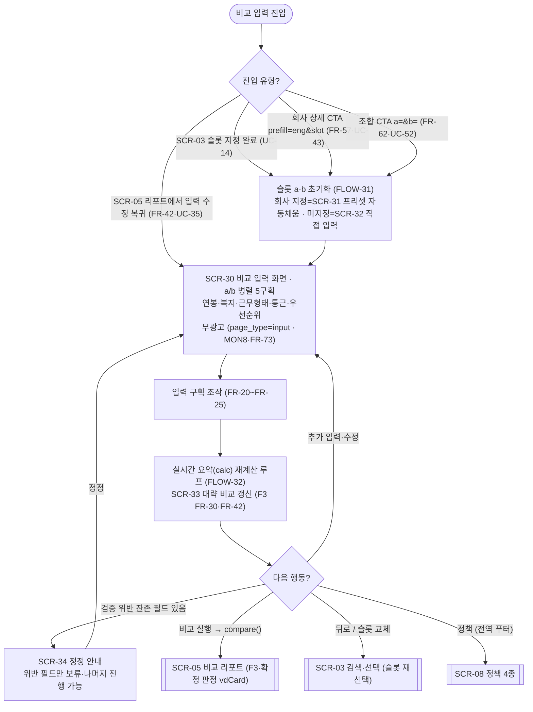
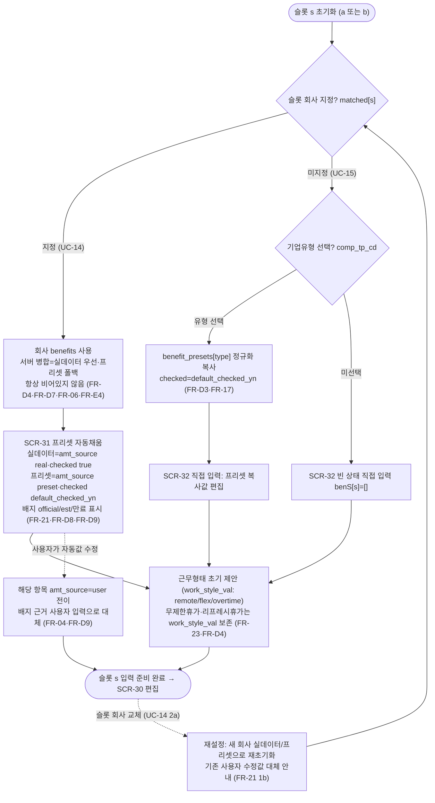
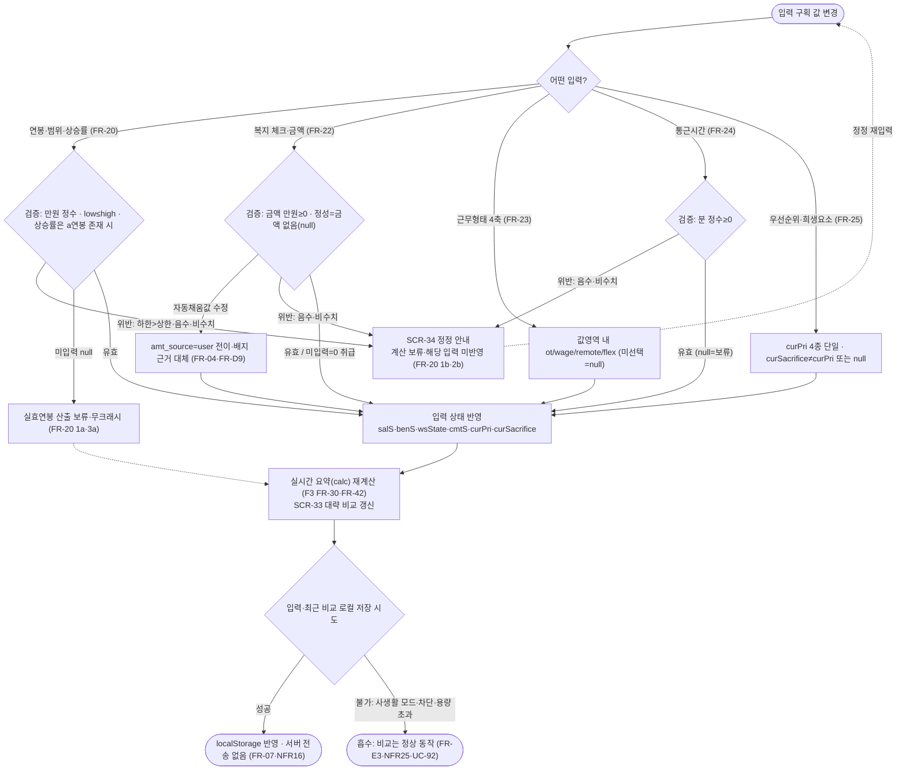

# 비교 입력 화면·플로우 (FLOW)

**문서 목적**: 비교 툴 SPA(`/compare`, SCR-02 셸) 안의 **비교 입력 뷰(`page_type=input`)**의 화면 구성·구획·상태·진입/이탈 전이·표시 데이터·광고 배치와, 두 직장(현직 a / 이직처 b)을 병렬 입력하고 실시간 요약(`calc`)을 갱신하다가 **비교 실행 또는 뒤로**로 갈라지는 사용자 플로우차트를 확정한다. 입력 뷰는 연봉·복지 프리셋/체크/금액·근무형태·통근·우선순위 5개 구획을 슬롯 a/b에 대해 병렬로 담고, 회사 지정 슬롯은 프리셋 자동 채움으로 초기화되며, 입력 변경은 즉시 대략 비교(`calc`)에 반영되고 확정 리포트(`compare`)는 F3(SCR-05)가 생성한다. **입력 화면은 광고를 최소화한다**(무광고 강제, §2-6·MON8·FR-73).

**상위 추적**: FLOW → FRD → USECASE → PRD → 브리프. 상위 근거 = FRD [04-비교입력](../FRD/04-비교입력.md)(FR-20·FR-21·FR-22·FR-23·FR-24·FR-25, F2 입력 상태 변수 요약·의사코드), FRD.md FR 마스터표(FR-06 프리셋 폴백·FR-30·FR-42 `calc`/재계산·FR-04 만원·`amt_source`·FR-07 로컬·FR-D3·FR-D4·FR-D5·FR-D8·FR-D9 데이터 계약·FR-14·FR-15·FR-17 슬롯 지정·FR-57·FR-62 프리필·FR-E3·FR-E4 엣지), FLOW [01-사이트맵과-네비](01-사이트맵과-네비.md)(SCR-02 셸·SCR-03 검색·선택·**SCR-04 비교 입력 뷰**·SCR-05 리포트·§5.1 `page_type=input` 무광고 배치), FLOW [02-랜딩](02-랜딩.md)(비교 시작 CTA 진입). USECASE [03-비교입력](../USECASE/03-비교입력.md)(UC-20~UC-25)·USECASE.md(UC-14·UC-15·UC-30·UC-35·UC-36·UC-43·UC-52·UC-92·UC-93). 브리프 §7(`calc`/`compare`·`getSalRange`/`getOfferRange`·`getBenTotal`·`getWSHours`·`getOTPay`)·§4(만원 단위·데이터 모델)·§2-3(프로파일러 제외·직접 선택)·§2-6(입력 화면 광고 최소화). 전역 불변식(비로그인·서버 무쓰기·클라 계산)은 FR-01을 인용하며 재정의하지 않는다.

**범위 경계**: 본 문서는 **비교 입력 뷰의 화면 구성·상태·입력 조작 전이와 입력에서 시작하는 플로우**만 소유한다. (1) 회사를 찾아 슬롯에 지정하는 상호작용은 F1 FLOW(SCR-03, UC-10~15)가 소유하며 본 문서는 **진입 지점·슬롯 초기화 트리거**로만 참조한다. (2) `calc` 실시간 요약과 `compare` 확정 리포트의 **계산식·리포트 표현**은 F3(FR-30~FR-45, SCR-05)가 소유하고 본 문서는 입력 뷰에 **표시되는 요약 패널·재계산 트리거·비교 실행 전이**만 규정한다(브리프 §7: 값 지정까지만 F2 담당). (3) 참조 번들·복지 객체 스키마·프리셋 폴백 병합은 F8/FR-Dx가 소유한다. 로그인/회원/프로파일러/서버측 사용자 쓰기 화면은 제품 범위에서 영구 제외이므로 어떤 구획·상태·전이에도 등장하지 않는다(FR-01). 우선순위는 프로파일러 산출이 아니라 사용자 직접 선택이다(§2-3, FR-25). 입력값·최근 비교는 클라이언트 메모리·localStorage에만 존재하고 서버로 전송·저장되지 않는다(NFR16, FR-07·FR-E3).

**ID 대역**: 본 문서는 화면 **SCR-3x**(SCR-30~SCR-34), 플로우 **FLOW-3x**(FLOW-30~FLOW-32)를 소유한다(안정 ID, 재사용·중복 금지, 브리프 §9). SCR-30은 사이트맵이 부여한 **SCR-04(비교 입력 뷰)의 상세 화면**이며(랜딩 문서 SCR-10↔SCR-01 관계와 동일 규약), SCR-31~SCR-34는 SCR-30 위에 겹쳐지는 **상태**로 별도 라우트가 아니다. 하위 문서(WIREFRAME/SPEC/TASK)가 이 ID를 인용한다.

---

## 화면 인덱스

| 화면 ID | 화면명 | `page_type` | 성격 | 주 커버 UC | 소유 FR |
| --- | --- | --- | --- | --- | --- |
| SCR-30 | 비교 입력 화면(a/b 병렬 5구획) | `input` | SPA 뷰(SCR-04 상세) · 무광고 | UC-20~UC-25 | FR-20~FR-25 |
| SCR-31 | 복지 프리셋 자동채움 상태(회사 지정 슬롯) | `input` | 슬롯 초기화 상태 | UC-21 | FR-21 |
| SCR-32 | 직접 입력 모드 상태(회사 미지정 슬롯) | `input` | 슬롯 초기화 상태 | UC-15·UC-21 | FR-17·FR-21 |
| SCR-33 | 실시간 요약(`calc`) 패널 상태 | `input` | 향상(JS) 표시 상태 | UC-30·UC-35 | FR-30·FR-42(표시) |
| SCR-34 | 입력 검증·정정 안내 상태 | `input` | 오류·검증 상태 | UC-20·UC-24 | FR-04·FR-20·FR-24 |

> SCR-31·SCR-32·SCR-33·SCR-34는 SCR-30 위에 겹쳐지는 **상태**다(별도 URL 아님). 슬롯 a·b는 각각 독립적으로 초기화되므로 한 화면에서 슬롯 a=SCR-31(회사 지정), 슬롯 b=SCR-32(직접 입력)가 동시에 성립할 수 있다. 다섯 상태 모두 `page_type=input`으로 광고를 마운트하지 않는다(무광고 강제).

## 플로우 인덱스

| 플로우 ID | 플로우명 | 다루는 경로 |
| --- | --- | --- |
| FLOW-30 | 비교 입력 진입 → 구획 입력 → 실시간 요약 → 비교 실행 / 뒤로 | 정상(슬롯 지정·프리필 진입→입력→`calc`→`compare` 실행) + 대안(리포트 수정 복귀·슬롯 교체) + 오류(검증 실패로 실행 보류) |
| FLOW-31 | 슬롯 a·b 초기화(프리셋 자동채움 · 직접 입력 · 슬롯 교체) | 정상(회사 지정=실데이터/프리셋 채움) + 대안(직접 입력=유형 프리셋 복사·빈 상태) + 엣지(실데이터 없음 폴백·슬롯 교체 재설정) |
| FLOW-32 | 입력 변경 → 검증 → 실시간 요약(`calc`) 재계산 루프 | 정상(유효 입력→`calc` 갱신) + 대안(자동값 수정 `amt_source=user`·미입력 보류) + 오류(범위·음수·비수치 정정, localStorage 불가 흡수) |

---

## [SCR-30] 비교 입력 화면 (a/b 병렬 5구획) — `/compare`(SPA 뷰, `page_type=input`)

**목적**: 두 직장(현직 a / 이직처 b)의 연봉·복지·근무형태·통근·우선순위를 사용자가 **직접 입력**하고, 입력 즉시 대략 비교(`calc`)를 확인하며, 만족하면 **비교 실행**으로 확정 리포트(SCR-05)에 진입하는 F2 입력 뷰. 우선순위는 프로파일러 없이 사용자가 직접 고른다(§2-3). 입력 몰입을 보호하기 위해 광고를 마운트하지 않는다(§2-6·MON8).

**주요 요소(구획)**

| 구획 | 내용 | 슬롯 범위 | 소유 FR |
| --- | --- | --- | --- |
| C1 슬롯 헤더 | 현직 a / 이직처 b 라벨, 지정 회사명·유형·로고, 슬롯 교체·해제(→ SCR-03) | 슬롯별 | FR-14·FR-15 |
| C2 연봉·범위·상승률 | 단일/범위 모드, 하한·상한(만원), b 파생 상승률(`selectedRate`) | 슬롯별 | FR-20 |
| C3 복지 프리셋·체크·금액 | 9개 카테고리 그룹, 항목 `checked` 토글, 정량 금액(만원), 정성 서술, 배지(공식/추정/만료) | 슬롯별 | FR-21·FR-22 |
| C4 근무형태 | 재택(remote)·유연(flex)·야근(ot)·임금유형(wage=포괄/비포괄) 4축 | 슬롯별 | FR-23 |
| C5 통근시간 | 편도 통근시간(분, 정수 ≥ 0) | 슬롯별 | FR-24 |
| C6 우선순위·희생요소 | 우선순위 단일 선택(연봉/워라밸/복지/브랜드, 기본 워라밸), 희생요소 직접 선택(또는 없음) | **공용**(비교 판정 축) | FR-25 |
| C7 실시간 요약(`calc`) 패널 | 입력 변경마다 갱신되는 대략 비교(총보상·시간가치·워라밸 근사) — 계산은 F3 소유, 여기선 표시(SCR-33) | 공용 | FR-30·FR-42(표시) |
| C8 액션 바 | **비교 실행**(`compare` → SCR-05) · **뒤로/슬롯 교체**(→ SCR-03) | 공용 | FR-30(전이)·FR-15 |
| 전역 헤더·푸터 | 사이트맵 §4 전역 구성(로고·비교하기·정책 4종 링크) | 전역 | FR-80(푸터) |

- **슬롯 a/b 병렬 입력**: C2~C5는 슬롯 a·b에 대해 독립적으로 존재하며 나란히(병렬) 편집한다. 각 상태 변수는 슬롯 접미 `.a`/`.b`를 갖는다(`salS`·`benS`·`wsState`·`cmtS`, FRD 04 F2 입력 상태 변수 요약). C6 우선순위·희생요소(`curPri`·`curSacrifice`)는 슬롯 공용 판정 축이다.
- **렌더 안전**: 회사·복지 문자열과 사용자 입력값은 `textContent`/이스케이프로 삽입하며 `innerHTML` 직접 삽입은 금지한다(NFR21).

**진입 경로**

| 트리거 | 출발 화면 | 진입 계약 | 근거 |
| --- | --- | --- | --- |
| 슬롯 a/b 지정 완료 | SCR-03 검색·선택 | 슬롯에 회사 지정 후 입력 뷰로 전이(슬롯 초기화 FLOW-31) | FR-14·UC-14 |
| 회사 상세 CTA 프리필 | SCR-06 → SCR-02 셸 | `?prefill={COMP_ENG_NM}&slot=a\|b`, 검색 단계 생략 | FR-57·UC-43 |
| 인기 조합 CTA 프리필 | SCR-07 → SCR-02 셸 | `?a={식별자}&b={식별자}`, 양사 a/b 프리필 | FR-62·UC-52 |
| 리포트에서 입력 수정 복귀 | SCR-05 비교 리포트 | 기존 입력 상태 유지한 채 입력 뷰 복귀 | FR-42·UC-35 |
| 비교 시작(신규 세션) | SCR-01/10 랜딩 → SCR-02 → SCR-03 | 회사 미지정 신규 세션은 검색(SCR-03) 경유 후 진입 | UC-A1 |

**이탈·전이(다음 화면)**

| 트리거 | 다음 화면 | 전이 계약 | 근거 |
| --- | --- | --- | --- |
| 비교 실행(C8) | SCR-05 비교 리포트 | `compare()` 확정 리포트 생성·표시(입력 상태를 F3 입력으로 전달) | FR-30·UC-30 |
| 뒤로 / 슬롯 교체(C1·C8) | SCR-03 검색·선택 | 슬롯 재선택. 교체 시 해당 슬롯 복지·근무형태 재설정 안내(FLOW-31) | FR-15·UC-14 2a |
| 정책 링크(전역 푸터) | SCR-08 정책 4종 | 순수 `<a href>` 정적 링크(전역 접근) | FR-80 |

**표시 데이터**

- 슬롯 초기값: 회사 지정 슬롯은 회사 실데이터(`amt_source=real`)∪기업유형 프리셋 폴백(`amt_source=preset`)으로 병합된 `benefits`(서버 병합, 항상 비어 있지 않음)·`work_style_val` 제안값(FR-D4·FR-06). 미지정 슬롯은 유형 선택 시 `benefit_presets[type]` 복사 또는 빈 상태(FR-D3·FR-17).
- 사용자 입력: `salS`·`benS`(체크·금액)·`wsState`·`cmtS`·`curPri`·`curSacrifice`. 자동값 수정 시 해당 항목 `amt_source=user` 전이(FR-04·FR-D9).
- 실시간 요약: F3 `calc` 산출 대략 비교(C7·SCR-33). 확정 리포트는 아니며 비교 실행 시 `compare`로 확정.
- 모든 입력·최근 비교는 메모리·localStorage 한정(서버 전송 없음, NFR16·FR-07).

**관련 FR·UC 추적**: FR-20·FR-21·FR-22·FR-23·FR-24·FR-25(입력 구획)·FR-06·FR-D3·FR-D4·FR-D8(프리셋·초기값)·FR-04·FR-D9(만원·`amt_source`)·FR-30·FR-42(`calc`·재계산, F3)·FR-14·FR-15·FR-57·FR-62(진입·슬롯)·FR-07·FR-E3(로컬)·FR-E4(폴백) / UC-20~UC-25·UC-14·UC-15·UC-30·UC-35·UC-43·UC-52·UC-92·UC-93.

**광고 배치**: **없음(무광고 강제)**. `page_type=input`은 자동광고 OFF·수동 슬롯 없음·제휴 없음(사이트맵 §5.1 FR-73 배치 표·MON8). 본 대역의 어떤 구획도 광고를 요구하지 않는다(FRD 04 공통 규약 "광고 최소화").

---

## [SCR-31] 복지 프리셋 자동채움 상태 (회사 지정 슬롯)

**목적**: 슬롯에 회사가 지정되면(UC-14) 해당 회사의 복지·근무형태로 슬롯 입력을 자동 초기화하여, 사용자가 빈 폼이 아니라 **수정 가능한 기준값**에서 시작하게 한다(FR-21). 실데이터가 없는 회사는 기업유형 프리셋으로 폴백된다(서버 병합, FR-06·FR-E4).

**주요 요소(구획)**: SCR-30의 C3 복지 구획이 자동 채워진 상태 — 실데이터 항목(`amt_source=real`, `checked=true`)과 프리셋 폴백 항목(`amt_source=preset`, `checked=default_checked_yn`)이 배지(공식 official / 추정 est, 만료 파생 포함)와 함께 9개 카테고리로 표시된다. C4 근무형태는 `work_style_val`(remote/flex/overtime) 제안값으로 초기화되며 무제한휴가·리프레시휴가는 `work_style_val` 경로로 보존된다(FR-23·FR-D4).

**진입 경로**: SCR-03에서 슬롯에 회사 지정(UC-14) / 회사 상세·조합 CTA 프리필로 슬롯 지정(FR-57·FR-62) 직후 슬롯 초기화(FLOW-31).

**이탈·전이**: 사용자가 개별 항목 수정 → SCR-30 편집(수정 항목 `amt_source=user` 전이, FR-04·FR-D9) / 슬롯 회사 교체 → 새 회사 실데이터·프리셋으로 재설정, 기존 사용자 수정값 대체 안내(FR-21 1b) / 그대로 두고 비교 실행 → SCR-05.

**표시 데이터**: 서버 병합 `benefits`(실데이터∪프리셋, 항상 비어 있지 않음, FR-D4·FR-D7), 각 항목 `benefit_nm`·`benefit_amt`(만원, 정성이면 null)·`benefit_ctgr_cd`(9종)·`badge_cd`·`amt_source`·`checked`. `normalizeCompany` 폴백(카테고리 미상→`perks`, 배지 미상→`est`)이 동일 규약으로 적용(FR-D8).

**관련 FR·UC 추적**: FR-21·FR-06·FR-D3·FR-D4·FR-D8·FR-D9·FR-E4 / UC-21·UC-14·UC-93.

**광고 배치**: 없음(무광고, `page_type=input`).

---

## [SCR-32] 직접 입력 모드 상태 (회사 미지정 슬롯)

**목적**: 회사를 지정하지 않은 슬롯(UC-15)에서, 기업유형을 선택하면 유형 프리셋을 복사해 채우고, 유형도 선택하지 않으면 빈 상태에서 사용자가 복지를 직접 입력하게 한다(FR-17·FR-21 1a). 프로파일러·서버 조회 없이 클라이언트에서만 구성된다.

**주요 요소(구획)**: SCR-30의 C1 슬롯 헤더에 회사 미지정 표시 + 기업유형 선택(6종 `comp_tp_cd`). 유형 선택 시 C3 복지가 `benefit_presets[type]` 정규화 복사값(`checked=default_checked_yn`, `amt_source=preset`)으로 채워지고, 미선택이면 `benS[s]=[]` 빈 상태로 사용자가 항목을 직접 입력한다. C4 근무형태·C5 통근·C2 연봉은 사용자가 직접 입력한다.

**진입 경로**: SCR-03 직접 입력 모드 진입(UC-15, `matched[s]=null` 유지) / 슬롯 회사 해제 후.

**이탈·전이**: 유형 선택 → 프리셋 복사 채움(FLOW-31) → SCR-30 편집 / 슬롯에 회사 지정 → SCR-31 자동채움으로 전환 / 비교 실행 → SCR-05.

**표시 데이터**: `benefit_presets[comp_tp_cd]`(FR-D3) 또는 사용자 직접 입력 항목. 서버 사용자 쓰기 없음(FR-01·NFR16).

**관련 FR·UC 추적**: FR-17·FR-21(1a)·FR-D3·FR-D8 / UC-15·UC-21.

**광고 배치**: 없음(무광고, `page_type=input`).

---

## [SCR-33] 실시간 요약(`calc`) 패널 상태

**목적**: 입력을 바꿀 때마다 확정 리포트를 열지 않고도 **대략적인 비교 방향**을 즉시 확인하게 한다. 계산(`calc`)은 F3 소유이며(FR-30), 본 뷰는 입력 옆/아래에 그 결과를 표시하는 **패널**만 규정한다. 확정 리포트(`compare`)는 비교 실행 시 SCR-05가 생성한다(브리프 §7: `calc`=실시간 요약, `compare`=확정 리포트).

**주요 요소(구획)**: SCR-30의 C7 요약 패널 — 두 슬롯의 총보상·시간조정 가치·워라밸의 근사 비교와 현재 우선순위(`curPri`) 기준 대략 방향. 미입력(`null`) 필드는 "입력 대기"로 표시하고 계산에서 보류한다(무크래시). 확정 판정(vdCard)은 여기서 표시하지 않고 비교 실행 후 SCR-05에서 제공한다.

**진입 경로**: SCR-30에서 임의 입력 구획(C2~C6) 값 변경 시 갱신(FLOW-32).

**이탈·전이**: 계속 입력 → SCR-30 / 비교 실행 → SCR-05(확정 리포트) / 뒤로·슬롯 교체 → SCR-03.

**표시 데이터**: F3 `calc` 산출 근사값(총보상·시간가치·워라밸). 입력 상태(`salS`·`benS`·`wsState`·`cmtS`·`curPri`)를 입력으로 하며 서버 조회 없음. 문자열 이스케이프 적용(NFR21).

**관련 FR·UC 추적**: FR-30·FR-42(계산·재계산, F3)·FR-20~FR-25(입력) / UC-30·UC-35.

**광고 배치**: 없음(무광고, `page_type=input`). 요약 패널 주변에 광고를 삽입하지 않는다(§2-6).

---

## [SCR-34] 입력 검증·정정 안내 상태

**목적**: 잘못된 입력(연봉 범위 하한>상한, 음수·비수치 금액/시간)을 거부·정정 안내하고, 미입력은 계산을 보류하되 화면을 크래시시키지 않는다(FR-04·FR-20·FR-24). 유효 입력만 실시간 요약에 반영된다.

**주요 요소(구획)**: SCR-30의 해당 입력 필드(C2 연봉·C3 금액·C5 통근) 옆 정정 안내 메시지(한국어) — "하한은 상한 이하", "0 이상 정수만 입력" 등. 위반 입력은 상태에 반영하지 않고 계산을 보류한다. 미입력(`null`) 필드는 오류가 아니라 "입력 대기"로 보류한다.

**진입 경로**: SCR-30에서 검증 위반 입력 발생 시(FLOW-32의 검증 분기).

**이탈·전이**: 정정 재입력 → 유효화 → SCR-33 실시간 요약 반영 → SCR-30. 위반 지속 시에도 다른 유효 슬롯·구획 입력·비교 실행은 가능(위반 필드만 보류, 무크래시).

**표시 데이터**: 검증 규칙 위반 항목·정정 문구. 금액은 만원 단위 정수 ≥ 0, 통근은 분 단위 정수 ≥ 0, 연봉 범위는 `low ≤ high`, 상승률 모드는 a 연봉 존재 시에만 b 파생(FR-20 3a·FR-04).

**관련 FR·UC 추적**: FR-04·FR-20(1a·1b·2b·3a)·FR-24(1a·1b) / UC-20·UC-24.

**광고 배치**: 없음(무광고, `page_type=input`).

---

## [FLOW-30] 비교 입력 진입 → 구획 입력 → 실시간 요약 → 비교 실행 / 뒤로

비교 입력 뷰에 진입해 슬롯 a·b를 초기화하고, 5개 구획을 병렬 입력하며 실시간 요약(`calc`)을 갱신하다가 **비교 실행(→ 리포트) 또는 뒤로(→ 검색·선택)**로 갈라지는 핵심 플로우. 슬롯 초기화 상세는 FLOW-31, 입력→요약 재계산 상세는 FLOW-32가 소유한다.

**경로 요약**

- **정상**: 슬롯 지정/프리필 진입 → 슬롯 초기화 → a/b 병렬 입력 → `calc` 실시간 요약 갱신 → 비교 실행으로 확정 리포트(SCR-05) 진입.
- **대안**: 리포트(SCR-05)에서 입력 수정 복귀 시 기존 입력 유지한 채 재편집(UC-35); 뒤로·슬롯 교체로 검색(SCR-03) 복귀.
- **오류**: 검증 위반 필드는 SCR-34에서 정정 안내로 보류하되 나머지 유효 입력·비교 실행은 진행 가능(무크래시). 입력 화면 전 구간 무광고 유지(§2-6).

---

## [FLOW-31] 슬롯 a·b 초기화 (프리셋 자동채움 · 직접 입력 · 슬롯 교체)

슬롯 s(a 또는 b) 하나의 복지·근무형태 초기화 절차. 회사 지정 슬롯은 실데이터/프리셋 병합값으로 자동 채우고(SCR-31), 미지정 슬롯은 유형 프리셋 복사 또는 빈 상태로 시작한다(SCR-32). 슬롯 a·b는 각각 이 절차를 독립적으로 거친다.

**경로 요약**

- **정상**: 회사 지정 슬롯 → 서버 병합 `benefits`로 자동채움(SCR-31), 실데이터/프리셋 항목별 `checked`·배지·`amt_source` 부여.
- **대안**: 미지정 슬롯 → 유형 선택 시 프리셋 복사(SCR-32), 미선택 시 빈 상태 직접 입력.
- **엣지**: 실데이터 없는 회사는 서버가 프리셋으로 폴백 병합(FR-06·FR-E4); 슬롯 회사 교체 시 재설정 안내(FR-21 1b); 자동값 수정 시 `amt_source=user` 전이(FR-04·FR-D9).

---

## [FLOW-32] 입력 변경 → 검증 → 실시간 요약(`calc`) 재계산 루프

임의 입력 구획 값 변경이 검증을 거쳐 입력 상태에 반영되고, F3 `calc`가 실시간 요약(SCR-33)을 갱신한 뒤 로컬 저장을 시도하는 루프. 검증 위반은 SCR-34로 정정 안내하고 계산을 보류하며, localStorage 불가는 흡수한다.

**경로 요약**

- **정상**: 유효 입력 → 상태 반영 → `calc` 재계산으로 SCR-33 실시간 요약 갱신 → 로컬 저장 성공(FR-07).
- **대안**: 자동채움값 수정 시 `amt_source=user` 전이(FR-04·FR-D9); 정량 항목 미입력은 0 취급, 연봉·통근 미입력은 보류(무크래시).
- **오류**: 범위 하한>상한·음수·비수치는 SCR-34 정정 안내로 계산 보류(FR-20·FR-24); localStorage 불가는 흡수하고 비교는 정상 동작(FR-E3·NFR25·UC-92).

---

## 추적 요약 (본 문서)

| 화면/플로우 | 충족·연동 UC | 관련 FR | 상위 F | 근거 |
| --- | --- | --- | --- | --- |
| SCR-30 비교 입력 화면 | UC-20~UC-25·UC-14·UC-15·UC-30·UC-35 | FR-20~FR-25·FR-30·FR-42·FR-06·FR-04 | F2(→F3) | §2-6·MON8·FR-73(무광고) |
| SCR-31 프리셋 자동채움 | UC-21·UC-14·UC-93 | FR-21·FR-06·FR-D4·FR-D8·FR-D9·FR-E4 | F2(F1·F3) | 서버 병합 실데이터∪프리셋 |
| SCR-32 직접 입력 모드 | UC-15·UC-21 | FR-17·FR-21·FR-D3·FR-D8 | F2(F1) | 유형 프리셋 복사·빈 상태 |
| SCR-33 실시간 요약(calc) | UC-30·UC-35 | FR-30·FR-42·FR-20~FR-25 | F3(F2 입력) | `calc`≠`compare`(§7) |
| SCR-34 입력 검증·정정 | UC-20·UC-24 | FR-04·FR-20·FR-24 | F2 | 만원·분 정수·범위 검증 |
| FLOW-30 진입→요약→실행/뒤로 | UC-20~25·UC-14·UC-35·UC-43·UC-52 | FR-20~FR-25·FR-30·FR-57·FR-62 | F2(→F3·F1) | 비교 실행→SCR-05·뒤로→SCR-03 |
| FLOW-31 슬롯 초기화 | UC-21·UC-14·UC-15·UC-93 | FR-21·FR-06·FR-17·FR-D3·FR-D4·FR-D8·FR-E4 | F2(F1·F3) | 프리셋 자동채움·교체 재설정 |
| FLOW-32 입력→검증→calc 루프 | UC-20~25·UC-35·UC-92 | FR-04·FR-20~FR-25·FR-30·FR-42·FR-07·FR-E3 | F2(→F3) | 검증·`amt_source`·로컬 흡수 |

**커버리지 메모**: 본 문서는 신규 UC를 창설하지 않고 F2 입력 UC(UC-20~UC-25)를 화면·상태·전이로 1:1 충족하며, 연동 지점에서 슬롯 지정(UC-14·UC-15), 재계산·리포트(UC-30·UC-35), 프리필 진입(UC-43·UC-52), 로컬 엣지(UC-92·UC-93)를 참조한다. 어떤 화면·상태·전이도 로그인·회원·프로파일러·서버 측 사용자 쓰기를 도입하지 않으며(FR-01), 입력 화면 전 구간에서 광고를 마운트하지 않는다(§2-6·MON8·FR-73). `calc`(실시간 요약)와 `compare`(확정 리포트)의 계산식·리포트 표현 상세는 F3 FLOW/FRD가 소유한다.
