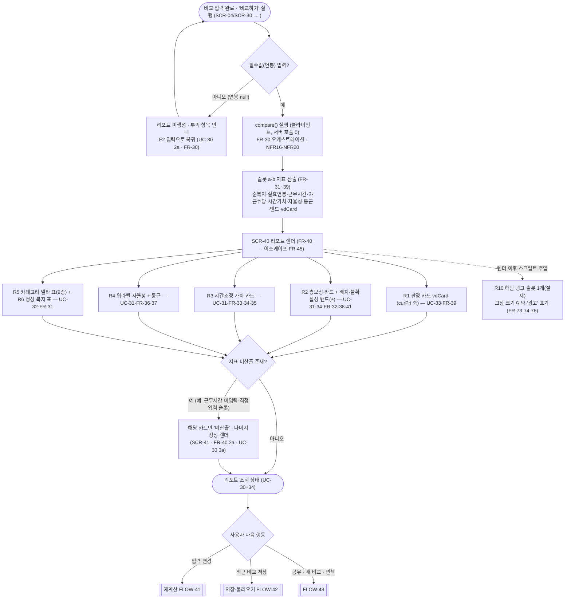
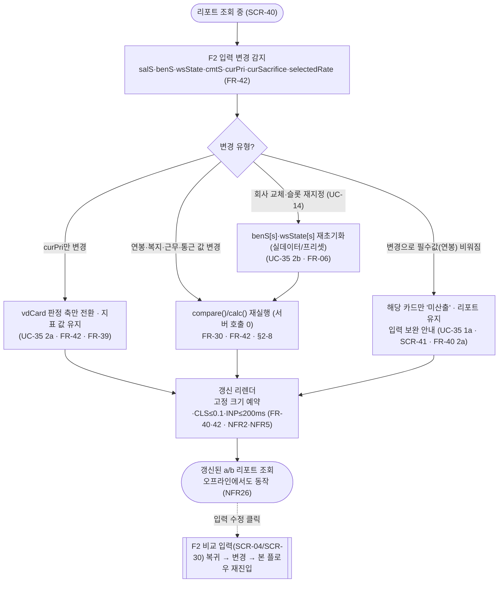
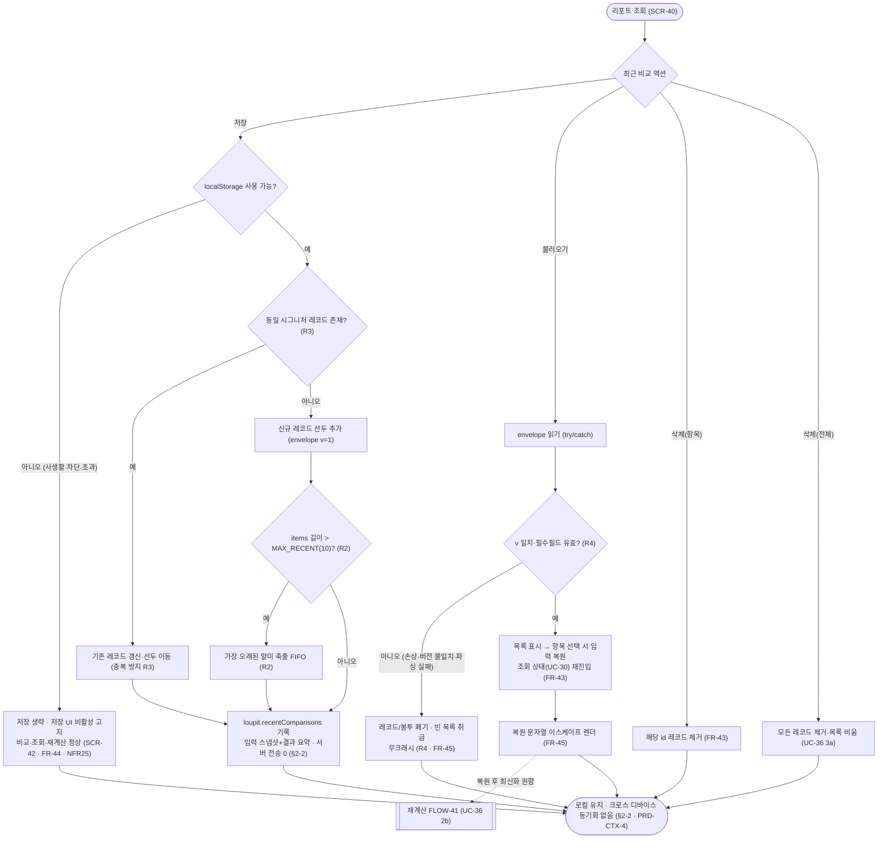
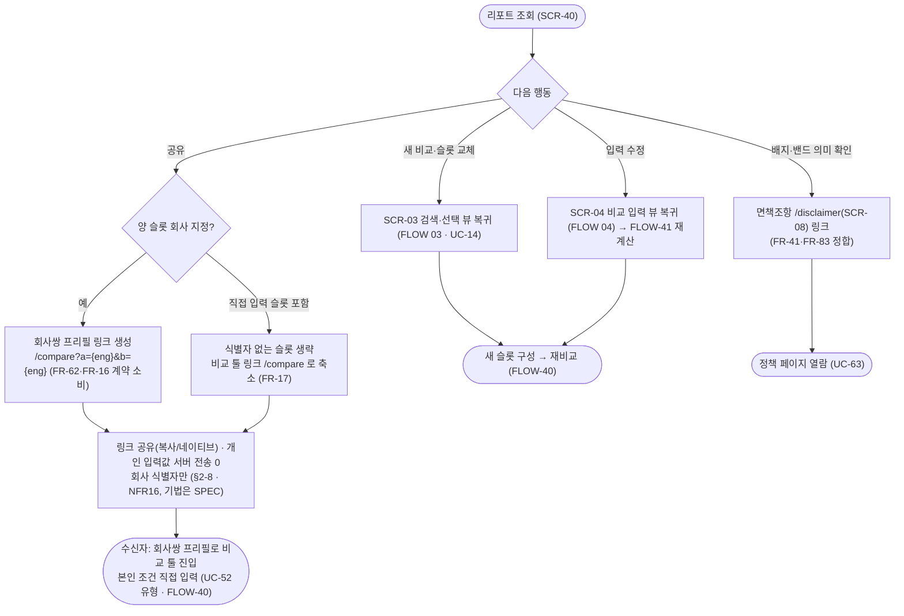

# 비교 리포트 화면·플로우 (FLOW)

**문서 목적**: 비교 툴의 **리포트(결과) 화면(`page_type=result`)**의 화면 구성·구획, 진입/이탈·전이, 표시 데이터, 광고 배치를 확정하고, "리포트 생성 → 조회 → 재계산 → 최근 비교 저장/불러오기/삭제 → 공유/새 비교"로 이어지는 사용자 플로우차트를 그린다. 구체적으로 (1) 판정 카드(vdCard)·총보상·시간조정 가치·워라밸/자율성·카테고리별 복지 델타·정성 복지·배지/불확실성 밴드로 구성되는 결과 화면, (2) F2 입력 변경 시 재계산·리렌더(입력 수정 복귀 포함), (3) 최근 비교의 localStorage 저장·불러오기·삭제 UI와 저장 불가 폴백, (4) 결과 화면 하단의 절제된 광고 슬롯 1개(콘텐츠 위주 정책), (5) 회사쌍 프리필 링크를 이용한 공유를 다룬다. 리포트 지표의 **계산식은 재정의하지 않고** F3 계산 FR(FR-3x, FRD 05)의 출력을 표시하며, 표현·저장 계층 규칙은 FRD 06(FR-4x)을 인용한다.

**상위 추적**: FLOW → FRD → USECASE → PRD → 브리프. 상위 근거 = FRD [05-비교엔진](../FRD/05-비교엔진.md)(FR-30~FR-39 계산 출력), FRD [06-리포트-표현](../FRD/06-리포트-표현.md)(FR-40~FR-45 표현·재계산·로컬 저장·이스케이프), USECASE [04-비교리포트](../USECASE/04-비교리포트.md)(UC-30~UC-36). 연동 근거 = FLOW [01-사이트맵과-네비](01-사이트맵과-네비.md)(SCR-05 리포트 뷰·§5.1 광고 배치 정본), FLOW [04-비교-입력](04-비교-입력.md)(F2 입력·`calc` 실시간 요약 SCR-33), FRD.md FR 마스터표(FR-07 로컬 지속성·FR-06 프리셋 폴백·FR-16/FR-57·FR-62 프리필 URL 계약·FR-73/FR-74/FR-76 광고 게이팅·FR-83 면책 정합·FR-E3 localStorage 불가·FR-E7 무크래시). 전역 규약(비로그인·서버 무쓰기·클라 계산·읽기 전용 API)은 FR-01을 인용하며 재정의하지 않는다.

**범위 경계**: 본 문서는 **F3 리포트 화면(결과 뷰)의 화면·상태·전이와 이를 시작하는 플로우**만 소유한다. (1) 실효연봉·시간가치·워라밸 요인·카테고리 합산·vdCard 판정·밴드 계수의 **계산 로직**은 F3 계산 FR(FR-3x, FLOW 없음·FRD 05)이 소유하고, 본 문서는 그 출력을 **표시·전이**로만 다룬다. (2) 연봉·복지·근무형태·통근·우선순위·희생요소의 **입력 수집·검증·프리셋 폴백 UI**는 F2(FLOW [04-비교-입력](04-비교-입력.md), SCR-30~SCR-34)가 소유하며, 본 문서는 입력 **변경 이벤트**를 재계산 트리거로, 입력 화면으로의 **복귀 전이**만 명세한다. (3) 결과 화면 광고 슬롯의 **콘텐츠·게이팅 구현**은 F6(FR-7x)이 소유하고, 본 문서는 배치 위치·개수·"광고" 표기·CLS 방지 고정 크기 예약만 규정한다. (4) 회사 검색·선택은 F1(FLOW [03-비교-검색선택](03-비교-검색선택.md), SCR-20~SCR-24)이 소유하며, "새 비교"는 그 화면으로의 복귀 전이로만 다룬다. 로그인/회원/프로파일러/서버 측 사용자 쓰기 화면은 제품 범위에서 영구 제외이므로 어떤 구획·전이·저장 경로에도 등장하지 않는다(FR-01). 리포트 생성·조회·재계산·공유 전 과정에서 계산 입력·결과가 서버로 전송·저장되지 않으며(§2-8, NFR16), 지속 저장은 브라우저 localStorage에만 발생한다(§2-2, NFR17, FR-07).

**ID 대역**: 본 문서는 화면 **SCR-4x**(SCR-40~SCR-43), 플로우 **FLOW-4x**(FLOW-40~FLOW-43)를 소유한다(안정 ID, 재사용·중복 금지, 브리프 §9). SCR-40은 사이트맵이 부여한 **SCR-05(비교 리포트 뷰)의 상세 화면**이며(랜딩 문서 SCR-10↔SCR-01, 입력 문서 SCR-30↔SCR-04와 동일 규약), SCR-41~SCR-43은 SCR-40 위에 겹쳐지는 **상태/패널**로 별도 라우트가 아니다. 하위 문서(WIREFRAME/SPEC/TASK)가 이 ID를 인용한다.

---

## 화면 인덱스

| 화면 ID | 화면명 | `page_type` | 성격 | 주 커버 UC / FR |
| --- | --- | --- | --- | --- |
| SCR-40 | 비교 리포트 결과 화면(판정·총보상·시간가치·워라밸·복지 델타·정성·배지/밴드) | `result` | SPA 뷰(SCR-05 상세) · 절제 슬롯 1 | UC-30·31·32·33·34 / FR-40·41·45 (표시: FR-30~39) |
| SCR-41 | 리포트 재계산·부분 미산출 상태 | `result` | SCR-40 위 갱신/부분 상태 | UC-35 / FR-42·FR-40(2a) |
| SCR-42 | 최근 비교 저장·목록 패널(로컬) + 저장 불가 폴백 | `result` | SCR-40 위 로컬 저장 패널/상태 | UC-36 / FR-43·FR-44 |
| SCR-43 | 리포트 공유(회사쌍 프리필 링크) | `result` | SCR-40 위 공유 액션/상태 | UC-30(공유)·UC-52(수신) / FR-62·FR-16(계약 소비) |

> SCR-41·SCR-42·SCR-43은 SCR-40 위에 겹쳐지는 **상태/패널**이며 별도 URL이 아니다. 세 상태는 모두 `page_type=result`로 동일 광고 게이팅(하단 절제 슬롯 1)을 공유하고, 리렌더·패널 표시로 인한 레이아웃 이동을 방지하기 위해 광고·동적 영역은 고정 크기를 예약한다(FR-74, NFR5). 판정 카드(vdCard)·총보상·시간가치·워라밸·카테고리 델타·정성·배지/밴드는 별도 화면이 아니라 **SCR-40의 구획**이다.

## 플로우 인덱스

| 플로우 ID | 플로우명 | 다루는 경로 |
| --- | --- | --- |
| FLOW-40 | 비교하기 실행 → 리포트 생성 → 구획 조회 | 정상(compare 산출→a/b 대비 렌더→조회) + 대안(회사 미선택 직접입력 슬롯·부분 미산출) + 오류/예외(연봉 필수값 누락 → F2 복귀) |
| FLOW-41 | 입력 변경 → 재계산·리렌더 (입력 수정 복귀) | 정상(값 변경→compare/calc 재실행→갱신) + 대안(curPri만=축 전환·회사 교체=전체 재계산) + 예외(필수값 비워짐=부분 미산출, 오프라인 동작) |
| FLOW-42 | 최근 비교 저장 → 불러오기 → 삭제 (localStorage) | 정상(저장·복원·삭제) + 대안(중복 갱신 R3·FIFO 축출 R2) + 오류(저장 불가 폴백·손상/버전 불일치 폐기 R4) |
| FLOW-43 | 리포트에서 다음 행동: 공유 · 새 비교 · 면책 확인 | 정상(회사쌍 프리필 링크 공유·새 비교 복귀) + 대안(직접입력 슬롯=링크 축소) + 연동(배지·밴드→면책조항) |

---

## [SCR-40] 비교 리포트 결과 화면

**목적**: F2 입력을 받아 클라이언트가 산출한 a(현직)·b(이직처) 두 관점의 비교 리포트를 한 화면에 구성·표시한다. 판정 카드(vdCard)·총보상·시간조정 가치·워라밸/자율성·카테고리별 복지 델타·정성 복지·복지 배지/불확실성 밴드를 두 관점 대비 레이아웃으로 렌더하고, 최근 비교 저장·공유·입력 수정 진입점을 제공하며, 리포트 하단에 절제된 광고 슬롯 1개를 배치한다(콘텐츠 위주 정책). 지표 값은 F3 계산 FR(FR-30~39)의 출력을 **표시**만 하며 재정의하지 않는다(표현·계산 분리, FR-40).

**주요 요소(구획)**

| 구획 | 내용 | 표시 값 소유(계산) | 근거 |
| --- | --- | --- | --- |
| R0 리포트 헤더·요약 | a·b 슬롯 라벨(현직/이직처)·회사명(또는 "직접 입력"), 선택 우선순위(`curPri`) 표기 | — | FR-40, UC-30 |
| R1 판정 카드(vdCard) | 우선순위(`curPri`) 4축(연봉/워라밸/복지/브랜드) 기준 "누가 유리/무엇을 택할지" 두 관점 판정·근거, 희생요소(`curSacrifice`) 포기비용, 근소 차이 시 과잉 단정 회피 표기 | FR-39 | FR-40, UC-33 |
| R2 총보상 카드 + 배지·밴드 | 실효연봉(연봉+순복지) a·b·델타를 **range(min~max)**로, 각 금액에 출처 배지(공식/추정/만료)·금액 신뢰도(`amt_source`)·불확실성 밴드(±)를 병기 | FR-32·FR-31·FR-38 | FR-40·FR-41, UC-31·34 |
| R3 시간조정 가치 카드 | 주간 근무시간·야근수당(포괄/비포괄) 반영 시간당 가치 a/b 대비·차이·승자 | FR-33·FR-34·FR-35 | FR-40, UC-31 |
| R4 워라밸·자율성 카드 | 재택 절약(REMOTE_SAVE)·유연근무·무제한휴가 반영 자율성, 편도 통근시간 a/b 대비 | FR-36·FR-37 | FR-40, UC-31 |
| R5 카테고리별 복지 델타 표 | 9카테고리(compensation/flexibility/work_env/time_off/health/family/growth/leisure/perks) a·b 합산·델타를 `<table>`로 | FR-31 | FR-40, UC-32 |
| R6 정성 복지 표 | 정성 항목(`qual_yn=true`, 금액 없음) a/b를 금액 델타 대신 설명(`qual_desc`) 대비로 | FR-31 | FR-40·FR-45, UC-32 |
| R7 최근 비교 저장 액션 | "최근 비교 저장" 버튼 → 로컬 저장 패널(SCR-42) 진입. 기기 내 저장·비로그인 고지 | — | FR-43, UC-36 |
| R8 공유 액션 | 회사쌍 프리필 링크 공유 진입(SCR-43). 개인 입력값 서버 전송 없음 고지 | — | FR-62·FR-16, UC-30 |
| R9 입력 수정·새 비교 진입 | "입력 수정"(→F2 비교 입력) · "새 비교/슬롯 교체"(→F1 검색·선택) 진입점 | — | FR-42, UC-35·UC-14 |
| R10 하단 광고 슬롯(절제) | 리포트 본문 하단 수동 슬롯 정확히 1개. "광고" 표기·고정 크기 예약. 콘텐츠 소유는 F6 | — | FR-73·74·76, §5.1 |

**진입 경로**

- **비교 입력 계산 실행(주 경로)**: 비교 입력(F2, SCR-30/SCR-04)에서 "비교하기" 실행 → `compare()` 산출 → 리포트 렌더(FLOW-40). UC-30.
- **입력 변경 재계산**: 리포트 조회 중 F2 입력 변경 시 재계산·리렌더로 갱신 진입(SCR-41, FLOW-41). UC-35.
- **최근 비교 복원**: 재방문·재진입 시 최근 비교 목록(SCR-42)에서 항목 선택 → 저장 시점 입력으로 리포트 복원해 조회 상태로 재진입(FLOW-42). UC-36·UC-A2.
- **프리필 진입 후 계산**: 회사 상세 CTA(`?prefill=&slot=`, FR-57)·인기 조합(`?a=&b=`, FR-62)·공유 링크로 비교 툴에 진입해 입력을 채운 뒤 계산 실행하면 본 화면에 도달(간접).

**이탈·전이(다음 화면·상태)**

| 트리거 | 다음 화면/상태 | 전이 계약 | 근거 |
| --- | --- | --- | --- |
| F2 입력 하나 이상 변경 | SCR-41(재계산·갱신) | 클라이언트 재계산, 서버 호출 0 | FR-42, UC-35 |
| "최근 비교 저장" | SCR-42(저장·목록 패널) | 입력 스냅샷+결과 요약을 localStorage 기록 | FR-43, UC-36 |
| "공유" | SCR-43(공유 링크) | 회사쌍 프리필 링크 생성(개인 입력 서버 전송 없음) | FR-62·FR-16, §2-8 |
| "입력 수정" | 비교 입력(F2, SCR-04/SCR-30) | F2 상태로 복귀, 수정 후 재계산(FLOW-41) | FR-42, UC-35 |
| "새 비교·슬롯 교체" | 검색·선택 뷰(F1, SCR-03/SCR-20) | 슬롯 재지정 후 재비교 | UC-14, FLOW 03 |
| 배지·밴드 의미 확인 | 데이터 정확성 면책조항(`/disclaimer`, SCR-08) | 밴드 의미를 면책 문안과 정합 | FR-41·FR-83 |
| 헤더 로고·홈 | 랜딩(SCR-01) | 정적 링크 | UC-A1 |

**표시 데이터**

- `compare()` 리포트 출력 객체(두 관점 지표 + vdCard + 밴드 범위). 클라이언트 메모리에만 존재하며 서버로 전송·저장하지 않는다(NFR16·NFR20). 사용자가 명시적으로 저장할 때만 localStorage에 기록(FR-07·FR-43).
- 금액은 만원 정수 계산값을 한국어 "만/억" 포맷으로 표시(예: `12000` → "1억 2,000만원", FR-04·FR-40 공통 규약). 통근시간은 분 단위. 총보상은 단일값이 아닌 range + 밴드(±)로 제시(FR-32·FR-41).
- 배지 파생: `official`(미만료)="공식", `official`+만료="만료·재확인 필요", `est`/그 외="추정". 금액 신뢰도(`amt_source ∈ {stated, estimated, none}`)를 배지와 독립 축으로 표기해 "공식·추정치" 조합을 정직하게 노출(DEC-2, FR-41·FR-D9). 프리셋 폴백 유래 항목은 "유형 기준" 추정 성격 병기(FR-06·FR-D3).
- 회사·복지·입력 문자열(`comp_nm`·`benefit_nm`·`qual_desc`·`note_ctnt`·`aliases`·`industry_nm`)은 `textContent`/이스케이프로 삽입하고 데이터 보간 `innerHTML`을 금지한다(NFR21, FR-45). 배지는 색상만이 아니라 텍스트 라벨로 의미 전달(NFR15).
- 미산출 지표(입력 부족)는 해당 카드만 "미산출"로 표기하고 리포트 전체를 무효화하지 않는다(SCR-41, FR-40 2a).

**관련 FR·UC 추적**: FR-40(구성·렌더링)·FR-41(배지·밴드 표시)·FR-45(XSS 이스케이프), 표시 대상 계산 = FR-30~39(FRD 05) / UC-30(생성·조회)·UC-31(총보상·시간가치·워라밸)·UC-32(카테고리 델타·정성)·UC-33(vdCard)·UC-34(배지·밴드) / F3(F6 결과 슬롯·F7 면책 정합).

**광고 배치**(FLOW 01 §5.1 정본, FR-73 게이팅, `page_type=result`, MON7-5·MON9): 자동광고 **OFF**. 리포트 **본문 하단 수동 슬롯 정확히 1개**(절제)만 허용하며 판정 카드(R1) 상단·중간 삽입은 금지한다(콘텐츠 위주 정책, §2-6). 슬롯 콘텐츠·게이팅은 F6 소유이고 본 화면은 위치·개수·"광고" 표기(FR-76·NFR19)·고정 크기 예약(FR-74, CLS ≤ 0.1, NFR5)만 규정한다. 제휴 컴포넌트는 선택(저밀도). 광고는 리포트 렌더 이후 클라이언트 스크립트로 주입되어 판정·조회 흐름을 방해하지 않는다.

---

## [SCR-41] 리포트 재계산·부분 미산출 상태

**목적**: 리포트 조회 중 사용자가 F2 입력(연봉·복지 체크/금액·근무형태·통근·우선순위·희생요소)을 변경했을 때, 변경 입력으로 재계산된 최신 리포트를 SCR-40 위에 갱신 표시하는 상태다. 또한 필수값(연봉) 결측 등으로 특정 지표가 산출되지 않을 때 해당 카드만 "미산출"로 표기하고 나머지 리포트는 정상 유지하는 부분 상태를 표현한다. UC-35(입력 변경 재계산)와 FR-40(2a) 부분 미산출을 담당한다.

**주요 요소(구획)**

| 구획 | 내용 | 근거 |
| --- | --- | --- |
| U1 갱신 지표 표시 | 변경 입력을 반영해 총보상·시간가치·워라밸·카테고리 델타·판정·밴드를 재렌더(FR-40·FR-41 병기) | FR-42, UC-35 |
| U2 판정 축 전환 표시 | `curPri`만 변경 시 지표 값은 동일하고 vdCard 판정 축만 전환됨을 표시 | FR-42·FR-39, UC-35 2a |
| U3 회사 교체 재초기화 | 슬롯 재지정(UC-14) 시 새 회사의 실데이터/프리셋으로 `benS[s]`·`wsState[s]` 초기값이 바뀌고 전체 지표 재계산 | FR-06, UC-35 2b |
| U4 부분 미산출 카드 | 연봉 등 필수값 결측 시 해당 지표 카드만 "미산출" + 입력 보완 안내(리포트 전체 무효화 금지) | FR-40 2a, UC-35 1a |
| U5 오프라인 갱신 | 참조 번들 로드 성공 후에는 네트워크 없이도 재계산·리렌더 동작 | NFR26, FR-42 |

**진입 경로**: SCR-40 조회 중 F2 상태(`salS`/`benS`/`wsState`/`cmtS`/`curPri`/`curSacrifice`/`selectedRate`) 하나 이상 변경(FR-42). "입력 수정"으로 F2 화면 복귀 후 값 변경→계산 재실행으로 재진입(FLOW-41).

**이탈·전이(다음 화면·상태)**

| 트리거 | 다음 상태 | 근거 |
| --- | --- | --- |
| 재계산 완료 | SCR-40 갱신 조회 상태 | FR-42, UC-35 |
| 부분 미산출(입력 보완) | F2 입력(SCR-04/SCR-30)에서 필수값 보완 후 재계산 | FR-40 2a, UC-35 1a |
| 저장/공유/새 비교 | SCR-42 / SCR-43 / F1 검색·선택 | FR-43·FR-62·UC-14 |

**표시 데이터**: 변경 입력을 반영한 최신 `compare()`/`calc()` 출력. 재계산은 클라이언트에서만 발생(서버 호출·저장 0, §2-8·NFR16). `curPri` 변경은 vdCard 축만 전환하고 다른 지표를 재계산하지 않는다(효율·정합, UC-35 2a). 리렌더는 고정 크기 예약을 유지해 레이아웃 이동을 유발하지 않으며(CLS ≤ 0.1, NFR5) INP ≤ 200ms를 목표로 한다(NFR2). 모든 표시 문자열은 이스케이프(FR-45).

**관련 FR·UC 추적**: FR-42(입력 변경 재계산·리렌더 트리거)·FR-40(2a 부분 미산출)·FR-30(재계산 계약)·FR-06(회사 교체 프리셋 폴백) / UC-35 / F3(F2 입력 연동).

**광고 배치**: SCR-40과 동일(`page_type=result`, 하단 절제 슬롯 1). 재계산 리렌더 시 광고 슬롯은 고정 예약 높이를 유지해 재마운트로 인한 CLS를 유발하지 않는다(FR-74·NFR5). 추가 슬롯 없음.

---

## [SCR-42] 최근 비교 저장·목록 패널(로컬) + 저장 불가 폴백

**목적**: 사용자가 조회한 비교를 "최근 비교"로 **브라우저 localStorage에만** 저장하고, 재방문 시 목록에서 불러와 리포트를 복원하며, 항목별·전체 삭제를 제공하는 패널이다. 서버 계정·서버 저장은 존재하지 않고 저장·불러오기·삭제 전 과정이 로그인 없이 기기 내에서만 동작한다. localStorage가 비활성·차단·용량 초과이면 저장·복원만 생략하고 비교·조회·재계산은 정상 동작하는 폴백 상태를 함께 표현한다. UC-36을 담당한다.

**주요 요소(구획)**

| 구획 | 내용 | 근거 |
| --- | --- | --- |
| L1 저장 액션·시그니처 | "최근 비교 저장" 시 입력 스냅샷+결과 요약을 `loupit.recentComparisons` 봉투(`v:1`)의 `items` 선두에 기록. 동일 시그니처(양 슬롯 회사/직접입력 + 핵심 입력) 존재 시 갱신·선두 이동(중복 방지) | FR-43(R3), UC-36 |
| L2 최근 비교 목록 | 최신순 레코드 목록: `label`(예: "삼성전자 vs SK하이닉스", 미선택 슬롯 "직접 입력" 폴백)·`savedAt`·총보상 요약·판정 요약. 최대 보관 10건(MAX_RECENT), 초과 시 가장 오래된 항목 축출(FIFO) | FR-43(R1·R2), UC-36 |
| L3 불러오기·복원 | 항목 선택 시 저장 시점 입력을 공용 상태로 복원해 조회 상태(SCR-40/UC-30)로 재진입. 복원 후 원하면 재계산으로 최신화(FLOW-41) | FR-43, UC-36 2b |
| L4 삭제(항목/전체) | 특정 `id` 레코드 제거 / 전체 삭제로 목록 비움 | FR-43, UC-36 3a |
| L5 기기 내 저장 고지 | 저장·불러오기·삭제가 로그인·서버 통신 없이 이 기기 내에서만 유지됨(크로스 디바이스 동기화 없음) 고지 | §2-2, PRD-CTX-4 |
| L6 빈 상태 | 저장된 최근 비교가 없으면 목록 미표시(빈 상태) | UC-36 2a |
| L7 저장 불가 폴백 | localStorage 비활성/차단/`QuotaExceededError` 시 저장 UI 비활성·저장 불가 고지. 비교·조회·재계산은 정상 | FR-44, NFR25, UC-36 1a |

**최근 비교 저장 스키마(FR-43 인용, 재정의 아님)**: 최상위 키 `loupit.recentComparisons` 하나에 봉투 `{v:1, items:[…]}`(최신순, 길이 ≤ 10). 레코드 = `{id, savedAt, label, slots{a,b}, input(복원 스냅샷: salS·selectedRate·benS·wsState·cmtS·curPri·curSacrifice), result(요약: totalComp·band·verdict·priAxis)}`. 프로파일러 상태는 저장·복원 대상이 아니다(FR-D10). 읽기 시 `v` 불일치·필수 필드 결측·손상 레코드는 폐기하고 빈 목록으로 취급한다(R4, 무크래시).

**진입 경로**: SCR-40 "최근 비교 저장"(R7) 저장 액션. 재방문·재진입 시 목록 표시(불러오기). 삭제는 목록 항목·전체 컨트롤.

**이탈·전이(다음 화면·상태)**

| 트리거 | 다음 상태 | 근거 |
| --- | --- | --- |
| 저장 성공 | SCR-40 조회(레코드 목록에 반영) | FR-43 |
| 항목 불러오기 | SCR-40 복원 조회 상태(UC-30) | FR-43·FR-45(복원 이스케이프) |
| 항목/전체 삭제 | 목록 갱신·빈 상태 | FR-43, UC-36 3a |
| 저장 불가(폴백) | SCR-40 조회(저장 UI 비활성), 비교 정상 | FR-44, NFR25 |

**표시 데이터**: `loupit.recentComparisons`의 레코드 목록. 서버 저장·크로스 디바이스 동기화 없음(§2-1·§2-2, PRD-CTX-4). 저장·읽기 접근은 `try/catch`로 감싸 예외(접근 거부·`QuotaExceededError`)를 흡수하며 무크래시(NFR25·FR-E3). 복원된 모든 문자열(`label`·`comp_nm`·`benefit_nm`·`verdict` 등)은 신뢰 불가로 간주해 렌더 전 이스케이프·스키마 검증(FR-45·R4).

**관련 FR·UC 추적**: FR-43(저장·불러오기·삭제·스키마 R1~R4)·FR-44(저장 불가 폴백)·FR-45(복원 이스케이프)·FR-07(로컬 지속성 규약) / UC-36 / F3(UC-A2 공통 로컬 저장) / FR-E3.

**광고 배치**: SCR-40과 동일(`page_type=result`, 하단 절제 슬롯 1). 저장·목록 패널은 리포트 위에 겹쳐지는 로컬 저장 UI이며 별도 광고 슬롯을 추가하지 않는다.

---

## [SCR-43] 리포트 공유(회사쌍 프리필 링크)

**목적**: 조회 중인 비교를 다른 사람과 나눌 수 있도록, **두 회사(a/b)를 프리필하는 비교 툴 링크**를 생성·제공하는 상태다. 공유 링크는 인기 조합 진입과 동일한 프리필 URL 계약(`/compare?a={식별자}&b={식별자}`, FR-62)을 재사용하며, 수신자는 그 링크로 비교 툴에 진입해 양사가 채워진 상태에서 **본인 조건을 직접 입력**한다(UC-52 유형 진입). 공유는 공개 참조 데이터인 **회사 식별자만** 담고 사용자의 연봉·복지 등 개인 입력값을 서버로 전송·저장하지 않는다(§2-8, NFR16). 정확한 공유 UI 기법(링크 복사·네이티브 공유)과 클라이언트 URL에 입력을 부가 인코딩할지는 SPEC 확정 사항이며, 본 문서는 **회사쌍 프리필 링크**를 기본 계약으로 채택한다.

**주요 요소(구획)**

| 구획 | 내용 | 근거 |
| --- | --- | --- |
| H1 공유 링크 생성 | 양 슬롯 회사 지정 시 `/compare?a={COMP_ENG_NM}&b={COMP_ENG_NM}` 링크 생성(FR-62 계약 소비). 파라미터 순서=슬롯 a→b | FR-62·FR-16 |
| H2 직접 입력 슬롯 축소 | 회사 미선택(직접 입력) 슬롯은 공개 식별자가 없으므로 링크에서 생략, 비교 툴 링크(`/compare`)로 축소 | FR-17 |
| H3 링크 전달 | 링크 복사 또는 네이티브 공유로 전달(기법은 SPEC). 미리보기 필요 시 사이트 기본 OG 사용(회사 이미지 창작 금지) | FR-62, FR-55(OG 관례) |
| H4 프라이버시 고지 | 공유 링크는 회사쌍만 담고 개인 입력값(연봉·복지 등)은 서버로 전송되지 않음을 고지 | §2-8, NFR16 |

**진입 경로**: SCR-40 "공유"(R8) 액션.

**이탈·전이(다음 화면·상태)**

| 트리거 | 다음 상태 | 근거 |
| --- | --- | --- |
| 링크 생성·전달 | SCR-40 조회로 복귀 | FR-62 |
| 수신자가 링크 진입 | 비교 툴 셸(SCR-02) 부팅 → 양사 프리필 → 비교 입력(SCR-04) | FR-62·FR-16, UC-52 |
| 직접입력 슬롯 포함 | 비교 툴 링크(`/compare`)로 축소 진입 | FR-17 |

**표시 데이터**: 공유 링크 문자열(회사 식별자 `COMP_ENG_NM` 기반, 공개 참조 데이터). 개인 입력값은 링크·서버 어디에도 강제 인코딩하지 않는다(§2-8·NFR16). 링크·수신 진입은 클라이언트 URL 파라미터로만 동작하며 서버 사용자 쓰기가 없다(FR-01).

**관련 FR·UC 추적**: FR-62(조합 프리필 URL 계약 소비)·FR-16(프리필 지시자 소비 규약)·FR-17(직접입력 슬롯 처리) / UC-30(공유 진입점)·UC-52(수신자 프리필 진입) / §2-8·NFR16(무서버 전송). 별도 공유 기능 FR은 존재하지 않으므로 본 화면은 **기존 프리필 URL 계약의 소비**로만 공유를 구현한다(창작 금지).

**광고 배치**: SCR-40과 동일(`page_type=result`, 하단 절제 슬롯 1). 공유 상태는 별도 광고 슬롯을 추가하지 않는다.

---

## [FLOW-40] 비교하기 실행 → 리포트 생성 → 구획 조회

비교 입력(F2) 완료 후 "비교하기"를 실행해 클라이언트 `compare()`가 a/b 지표를 산출하고, 판정·총보상·시간가치·워라밸·카테고리 델타·정성·배지/밴드 구획으로 렌더해 조회에 이르는 핵심 플로우. 연봉 필수값 누락은 리포트 미생성·F2 복귀로, 지표 결측은 부분 미산출로 처리한다. 서버 호출·저장은 없다.

**경로 요약**

- **정상**: "비교하기" → 연봉 필수값 통과 → `compare()` 산출(FR-30이 FR-31~39 조립) → SCR-40에 6개 구획 렌더 → 조회. 하단 광고 1개는 렌더 이후 주입(콘텐츠 위주, §5.1).
- **대안**: 한 슬롯이 회사 미선택 직접 입력이면 프리셋 초기값 없이 사용자 입력값만으로 그 슬롯을 계산·표시(UC-30 3a). 근무시간 등 특정 입력 결측 시 해당 카드만 "미산출"이고 나머지 리포트는 정상(FR-40 2a).
- **오류/예외**: 연봉 필수값 누락은 리포트를 생성하지 않고 부족 항목을 안내하며 F2 입력으로 복귀(UC-30 2a). 리포트 전체를 무효화하지 않으며 앱은 크래시하지 않는다(FR-E7).

---

## [FLOW-41] 입력 변경 → 재계산·리렌더 (입력 수정 복귀)

리포트 조회 중 F2 입력을 변경(또는 "입력 수정"으로 F2 복귀 후 변경)하면 변경 입력으로 리포트를 재계산·리렌더하는 플로우. `curPri`만 변경은 판정 축만 전환, 회사 교체는 전체 재계산, 필수값 비워짐은 부분 미산출로 분기한다. 재계산은 클라이언트에서만 수행되며 로드 성공 후 오프라인에서도 동작한다.

**경로 요약**

- **정상**: 값 변경 → `compare()`/`calc()` 재실행 → 총보상·시간가치·워라밸·카테고리 델타·판정·밴드 갱신 리렌더(FR-42). 서버 호출 0(§2-8·NFR16).
- **대안**: `curPri`만 변경이면 지표 값은 그대로 두고 vdCard 축만 전환(효율, UC-35 2a). 회사 교체·슬롯 재지정이면 새 회사 실데이터/프리셋으로 초기값이 바뀌고 전체 지표 재계산(UC-35 2b, FR-06). "입력 수정"은 F2 화면 복귀 후 변경→본 플로우로 재진입.
- **예외**: 변경으로 필수값(연봉)이 비워지면 해당 지표 카드만 "미산출", 리포트 전체는 유지·크래시 없음(UC-35 1a, FR-40 2a). 리렌더는 고정 크기 예약으로 레이아웃 이동을 유발하지 않는다(NFR5).

---

## [FLOW-42] 최근 비교 저장 → 불러오기 → 삭제 (localStorage)

조회한 비교를 최근 비교로 저장(중복 갱신·FIFO 축출)하고, 재방문 시 불러와 복원하며, 항목·전체 삭제하는 로컬 지속성 플로우. localStorage 불가·손상/버전 불일치는 저장·복원만 생략하고 비교는 정상 유지한다(무크래시). 저장은 이 기기 localStorage에만 발생하고 서버로 전송되지 않는다.

**경로 요약**

- **정상**: 저장 시 신규 레코드를 봉투(`v:1`) `items` 선두 추가 → localStorage 기록(서버 전송 0). 불러오기는 목록 표시 후 선택 시 저장 시점 입력으로 복원해 조회 재진입. 삭제는 항목/전체 제거.
- **대안**: 동일 시그니처 레코드는 갱신·선두 이동(중복 방지 R3), MAX_RECENT(10) 초과 시 가장 오래된 항목 축출(FIFO R2). 복원 후 원하면 재계산(FLOW-41)으로 최신화(UC-36 2b). 저장분 없으면 빈 상태(UC-36 2a).
- **오류**: localStorage 비활성/차단/`QuotaExceededError`는 예외 흡수·저장 생략, 비교·조회·재계산은 정상(FR-44·NFR25). `v` 불일치·손상·파싱 실패 레코드는 폐기하고 빈 목록으로 취급(R4·무크래시). 복원 문자열은 신뢰 불가로 이스케이프(FR-45).

---

## [FLOW-43] 리포트에서 다음 행동: 공유 · 새 비교 · 면책 확인

리포트 조회 후 사용자가 취하는 화면 밖 전이: 회사쌍 프리필 링크로 공유, 새 비교(슬롯 교체)·입력 수정으로 복귀, 배지·밴드 의미를 면책조항에서 확인하는 경로. 공유는 기존 프리필 URL 계약(FR-62/FR-16)을 소비하며 개인 입력값을 서버로 전송하지 않는다.

**경로 요약**

- **정상**: 양 슬롯 회사 지정 시 `/compare?a=&b=` 프리필 링크를 생성해 복사·네이티브 공유로 전달(FR-62 계약 소비). 수신자는 그 링크로 비교 툴에 진입해 양사 프리필 상태에서 본인 조건을 입력한다(UC-52 유형, FLOW-40).
- **대안**: 직접 입력 슬롯(회사 미선택)은 공개 식별자가 없어 링크에서 생략되고 비교 툴 링크로 축소된다(FR-17). "새 비교·슬롯 교체"는 F1 검색·선택(SCR-03)으로, "입력 수정"은 F2 비교 입력(SCR-04)으로 복귀해 재비교(FLOW-40/41).
- **연동**: 배지·밴드 의미 확인은 데이터 정확성 면책조항(`/disclaimer`, SCR-08)으로 연결되며 밴드 의미가 면책 문안과 정합한다(FR-41·FR-83). 공유·전이 전 과정에서 개인 입력값의 서버 전송·저장이 없다(§2-8·NFR16).

---

## 추적 요약 (본 문서)

| 화면/플로우 | 충족·연동 UC | 관련 FR(표현 FR-4x) | 표시 대상 계산 FR(FR-3x) | 상위 F |
| --- | --- | --- | --- | --- |
| SCR-40 리포트 결과 화면 | UC-30·31·32·33·34 | FR-40·FR-41·FR-45 | FR-30~39 | F3(F6·F7 정합) |
| SCR-41 재계산·부분 미산출 | UC-35 | FR-42·FR-40(2a) | FR-30 | F3(F2 연동) |
| SCR-42 최근 비교 저장·목록 | UC-36 | FR-43·FR-44·FR-45·FR-07 | — | F3(UC-A2) |
| SCR-43 공유(회사쌍 프리필) | UC-30(공유)·UC-52(수신) | FR-62·FR-16·FR-17 | — | F3→F1·F5(계약 소비) |
| FLOW-40 생성→조회 | UC-30·31·32·33·34 | FR-40·FR-41·FR-45 | FR-30~39 | F3 |
| FLOW-41 재계산·리렌더 | UC-35 | FR-42·FR-40(2a) | FR-30 | F3(F2 연동) |
| FLOW-42 저장·불러오기·삭제 | UC-36 | FR-43·FR-44·FR-45 | — | F3(UC-A2) |
| FLOW-43 공유·새 비교·면책 | UC-30·UC-52·UC-63(연동)·UC-14 | FR-62·FR-16·FR-41·FR-83 | — | F3(F1·F5·F7) |

**커버리지 메모**: 본 문서는 F3 리포트 대역의 UC-30~UC-36을 화면·상태·플로우로 완전 커버한다(UC-30=SCR-40/FLOW-40, UC-31·UC-32·UC-33·UC-34=SCR-40 구획 R1~R6/FLOW-40, UC-35=SCR-41/FLOW-41, UC-36=SCR-42/FLOW-42). 지표 계산은 재정의하지 않고 F3 계산 FR(FR-3x, FRD 05)의 출력을 표시하며(표현·계산 분리, FR-40), 지속 저장은 클라이언트 localStorage에만 발생한다(FR-07·FR-43, NFR16·NFR17). 결과 화면(`page_type=result`) 광고는 리포트 하단 절제된 슬롯 1개로 제한한다(콘텐츠 위주 정책, FLOW 01 §5.1·MON9). 공유는 별도 공유 FR이 없으므로 기존 프리필 URL 계약(FR-62·FR-16)의 소비로만 구현하며 개인 입력값을 서버로 전송하지 않는다(§2-8·NFR16, 창작 금지). 로그인/회원/프로파일러/서버 측 사용자 쓰기 화면은 어떤 구획·전이·저장 경로에도 등장하지 않는다(FR-01).
