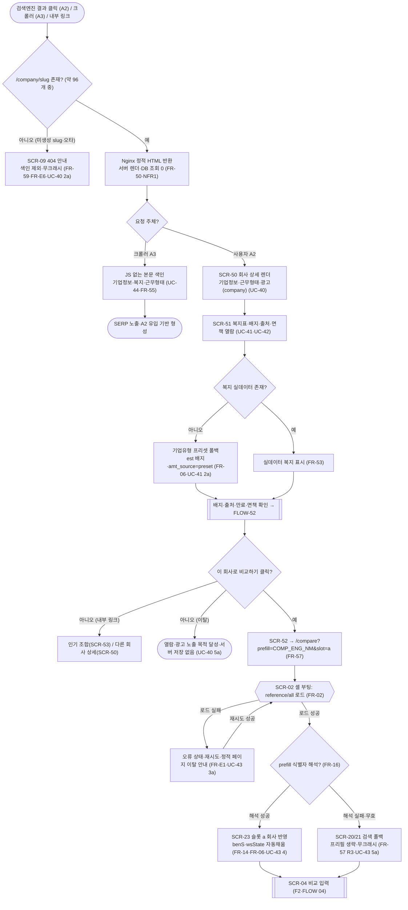
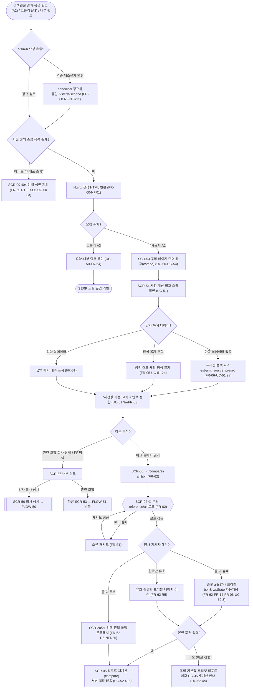
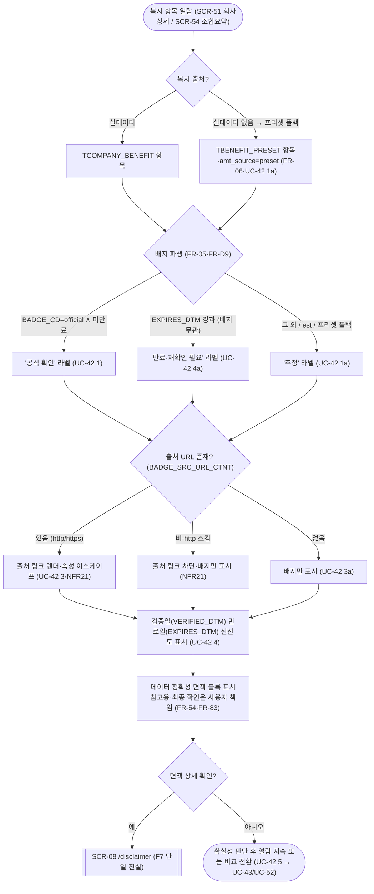

# 회사 상세·인기 조합 화면·플로우 (FLOW)

**문서 목적**: 정적 콘텐츠 두 유형 — **회사 상세 페이지(`/company/{slug}`, 복지 데이터 보유 회사 약 96개, `page_type=company`)**와 **인기 비교 조합 페이지(`/vs/{a}-{b}`, `page_type=combo`)** — 의 화면 구성(구획)·진입/이탈·표시 데이터·광고 배치를 확정하고, **검색 유입 → 콘텐츠 열람 → 비교 툴 진입(프리필)**으로 이어지는 사용자 플로우차트를 그린다. 두 페이지는 검색엔진 직접 유입이 주 경로인 SEO·AdSense 승인 콘텐츠의 뼈대이며(브리프 §2-7), 열람 후 비교 툴(SPA)로의 전환 허브 역할을 한다.

**상위 추적**: FLOW → FRD → USECASE → PRD → 브리프. 상위 근거 = FRD [07-회사페이지-정적생성](../FRD/07-회사페이지-정적생성.md)(FR-50~FR-59), [08-인기조합-정적생성](../FRD/08-인기조합-정적생성.md)(FR-60~FR-65), USECASE [05-회사상세페이지](../USECASE/05-회사상세페이지.md)(UC-40~UC-44), [06-인기비교조합](../USECASE/06-인기비교조합.md)(UC-50~UC-54). 연동 근거 = FRD.md FR 마스터표(FR-02 부팅 번들·FR-05/FR-D9 배지 파생·FR-06 프리셋 폴백·FR-14/FR-16 프리필 소비·FR-E1 번들 로드 실패·FR-E6 404), FLOW [01-사이트맵과-네비](01-사이트맵과-네비.md)(SCR-06·SCR-07·SCR-08·SCR-09·SCR-02, §5.1 광고 배치 표·전역 푸터/면책), FLOW [03-비교-검색선택](03-비교-검색선택.md)(SCR-20·SCR-23·FLOW-20 프리필 소비). 전역 규약(비로그인·서버 무쓰기·클라 계산·읽기 전용 API)은 FR-01을 인용하며 재정의하지 않는다.

**범위 경계**: 본 문서는 **F4(회사 상세)·F5(인기 조합) 두 정적 페이지의 화면·전이와 그 유입→열람→전환 플로우**만 소유한다.
- (1) 회사 상세 CTA 프리필(`?prefill=…&slot=a`)·조합 양사 프리필(`?a=…&b=…`) 링크의 **생성 규약**은 각각 FR-57·FR-62가 소유하고, 링크를 **소비**하는 비교 툴 진입 셸·슬롯 반영은 FLOW [03-비교-검색선택](03-비교-검색선택.md)(SCR-20·SCR-23·FLOW-20)이 소유한다. 본 문서는 CTA **발신 지점**과 진입 트리거까지만 그리며, 진입 이후 검색·입력·리포트는 F1·F2·F3(FLOW 03·04·05)로 넘긴다.
- (2) AdSense·제휴 슬롯의 **컴포넌트·클릭·동의** 상세는 F6이 소유하고, 본 문서는 정적 페이지 내 **슬롯 배치·고정 크기 예약·"광고" 표기**와 `page_type` 게이팅만 명세한다(FR-58·FR-65, FLOW 01 §5.1 정본 표 인용).
- (3) 사이트 전역 `sitemap.xml`·`robots.txt`·전역 헤더/푸터/동의 배너는 FLOW [01-사이트맵과-네비](01-사이트맵과-네비.md)이 소유하며, 본 문서는 두 페이지 유형이 그 전역 구획을 렌더한다는 사실과 canonical/sitemap 기여만 인용한다.
- (4) 배지 파생·불확실성 밴드 계수는 FR-05/FR-D9(전역)가 소유하고, 본 문서는 표시(라벨·출처·만료)만 그린다.

프로파일러(가치관 진단 설문)와 익명 서버 쓰기 화면은 제품 범위에서 영구 제외이며, 로그인·회원·계정은 복지 등록·수정 기여(SC14, 문서 09/13·SP-AUTH) 한정 In-scope이나 이 익명 플로우엔 어떤 구획·전이에도 등장하지 않는다(FR-01). 열람·CTA 진입 전 과정에서 사용자 데이터의 서버 전송·저장이 없으며, 프리필 등 상태는 URL 파라미터·클라이언트에만 존재한다(NFR16, §2-2).

**ID 대역**: 본 문서는 화면 **SCR-5x**(SCR-50~SCR-56), 플로우 **FLOW-5x**(FLOW-50~FLOW-52)를 소유한다(안정 ID, 재사용·중복 금지, 브리프 §9). 사이트맵(FLOW 01)의 화면 유형 **SCR-06(회사 상세)·SCR-07(인기 조합)**을 본 문서가 **상세 분해**한 관계이며(FLOW 03의 SCR-2x가 사이트맵 SCR-03을 분해한 것과 동일 패턴), 상위 SCR-06·SCR-07·SCR-02·SCR-08·SCR-09를 인용해 전이를 잇는다. 하위 문서(WIREFRAME/SPEC/TASK)가 본 문서의 ID를 인용한다.

---

## 화면 인덱스

| 화면 ID | 화면명 | 라우트·유형 | `page_type` | 사이트맵 상위 | 주 커버 UC / FR |
| --- | --- | --- | --- | --- | --- |
| SCR-50 | 회사 상세 페이지 | `/company/{slug}` · 정적 | `company` | SCR-06 | UC-40·UC-41·UC-44 / FR-50·FR-51·FR-52·FR-55·FR-56 |
| SCR-51 | 복지표·배지·출처·검증/만료·면책 섹션 | `/company/{slug}`(구획) · 정적 | `company` | SCR-06 | UC-41·UC-42 / FR-53·FR-54 |
| SCR-52 | "이 회사로 비교하기" CTA 프리필 진입점 | `/company/{slug}`(구획) · 정적→SPA | `company`→`input` | SCR-06→SCR-02 | UC-43 / FR-57 |
| SCR-53 | 인기 비교 조합 페이지 | `/vs/{a}-{b}` · 정적 | `combo` | SCR-07 | UC-50·UC-54 / FR-60·FR-64·FR-65 |
| SCR-54 | 사전 계산 비교 요약 대조 섹션 | `/vs/{a}-{b}`(구획) · 정적 | `combo` | SCR-07 | UC-51 / FR-61 |
| SCR-55 | 양사 프리필 "비교 툴에서 열기" 진입점 | `/vs/{a}-{b}`(구획) · 정적→SPA | `combo`→`input` | SCR-07→SCR-02 | UC-52 / FR-62 |
| SCR-56 | 관련 조합·양사 회사 상세 내부 링크 블록 | `/vs/{a}-{b}`(구획) · 정적 | `combo` | SCR-07 | UC-53 / FR-63 |

> SCR-51·SCR-52는 SCR-50 회사 상세 페이지의 **구획**이고, SCR-54·SCR-55·SCR-56은 SCR-53 조합 페이지의 **구획**이다(별도 라우트 아님). 각 구획을 별도 화면 ID로 식별하는 이유는 진입·이탈·표시 데이터·관련 UC가 구획별로 구별되기 때문이다(배지 확인 UC-42, CTA 전환 UC-43/UC-52, 내부 탐색 UC-53). 두 페이지 유형은 하나의 템플릿이 다수 URL 인스턴스(회사 약 96개·조합 N개)를 가지며, 각 인스턴스는 고유 `<title>`·canonical·sitemap 엔트리를 갖는다(FR-55·FR-64, NFR6·NFR11·NFR9).

## 플로우 인덱스

| 플로우 ID | 플로우명 | 다루는 경로 |
| --- | --- | --- |
| FLOW-50 | 회사 상세: 검색 유입 → 열람 → "이 회사로 비교하기" 비교 툴 진입 | 정상(유입·정적 서빙·열람·프리필 진입) + 대안(프리셋 폴백·크롤러 색인·CTA 미클릭 이탈) + 오류(미생성 slug 404·번들 로드 실패·프리필 해석 실패 폴백) |
| FLOW-51 | 인기 조합: 검색 유입 → 사전 요약 확인 → 양사 프리필 진입 / 내부 탐색 | 정상(유입·요약·양사 프리필·재계산) + 대안(역순 canonical·프리셋 폴백·정성 복지·본인 조건 미입력·내부 탐색) + 오류(미배포 조합 404·번들 실패·부분/무효 지시자 폴백) |
| FLOW-52 | 복지 배지·출처·검증/만료·데이터정확성 면책 확인 (두 페이지 공통 세부) | 정상(공식/추정 파생·출처 링크·검증일) + 대안(프리셋 폴백 est·출처 URL 없음·만료 경과) + 오류(비-http 출처 차단·문자열 이스케이프) |

---

## [SCR-50] 회사 상세 페이지 — `/company/{slug}` (정적, `page_type=company`)

**목적**: 복지 데이터 보유 회사 약 96개(브리프 §5·§6, 회사페이지·검색·API 대상 = 이 96개) 각각의 기업정보·근무형태·복지를 검색 유입 사용자(A2)·크롤러(A3)가 JS 실행 없이 열람·색인할 수 있는 정적 페이지로 제공하고, "이 회사로 비교하기" CTA로 비교 툴(SPA)에 연결하는 전환 허브다(UC-40·UC-44). 빌드타임 파이썬 스크립트가 완성된 HTML로 산출하며, 요청 시 서버 렌더·DB 조회가 0건이다(FR-50, NFR1).

**주요 요소(구획)**

| 구획 | 내용 | 근거 |
| --- | --- | --- |
| G1 전역 헤더 | 로고(→ `/`)·"비교하기"(→ `/compare`). 정적 마크업, 본문 색인 저해 없음 | FLOW 01 §4.1 |
| G2 기업정보 섹션 | 단일 `<h1>`=정식명(`COMP_NM`) 이하 산업(`INDUSTRY_NM`)·기업유형(`COMP_TP_NM`)·로고 표식(`LOGO_NM` 약어→텍스트/모노그램) | FR-52, UC-41(1), FR-D2·FR-D4 |
| G3 근무형태 섹션 | `WORK_STYLE_VAL`(JSON) 5키(remote·flex·unlimitedPTO·refreshLeave·overtime)를 라벨로 표기. 데이터 근거 있는 값만 "제공"(허위 표기 금지) | FR-52, UC-41(4·4a) |
| G4 복지·배지·출처·면책 섹션 | 카테고리별 복지표+배지+출처+검증/만료+데이터정확성 면책 블록 → **SCR-51** | FR-53·FR-54, UC-41·UC-42 |
| G5 "이 회사로 비교하기" CTA | 순수 `<a href>` 프리필 링크 → **SCR-52** | FR-57, UC-43 |
| G6 내부 링크 블록 | 이 회사가 포함된 인기 조합(SCR-53)·동일/인접 산업·유형의 다른 회사 상세(SCR-50)로의 내부 링크(빌드타임 큐레이션) | FR-63(정합)·§2-7(SEO 순회) |
| G7 광고/제휴 슬롯 | 본문 중간 1 + 하단 1 + 제휴, "광고" 표기, 고정 크기 예약 | FR-58, FLOW 01 §5.1 |
| G8 전역 푸터·면책 링크 | 정책 4종(SCR-08) 도달, 데이터 정확성 면책 요약(→ `/disclaimer`) | FLOW 01 §4.2 |

**진입 경로**
- **검색엔진 직접 유입(A2, 주 경로)**: SERP에서 회사 상세 URL 클릭(랜딩 경유 없음, UC-40 1·PRD-CTX-2).
- **크롤러 색인(A3)**: sitemap·링크 경유 요청 → JS 없는 본문 파싱·색인(UC-44).
- **내부 링크**: 랜딩(SCR-01)·인기 조합(SCR-53 G내부링크)·다른 회사 상세(SCR-50 G6)·비교 리포트(SCR-05) 내부 링크.

**이탈·전이(다음 화면)**

| 트리거 | 다음 화면 | 전이 계약 | 근거 |
| --- | --- | --- | --- |
| "이 회사로 비교하기" 클릭 | SCR-52 → `/compare?prefill={COMP_ENG_NM}&slot=a`(SCR-02 셸) | 슬롯 a(현직) 프리필. 검색 단계 생략 | FR-57, UC-43 |
| 인기 조합 내부 링크 | SCR-53(`/vs/{a}-{b}`) | 정적 링크 | FR-63(정합), UC-53(역방향) |
| 다른 회사 상세 내부 링크 | SCR-50(다른 `/company/{slug}`) | 정적 링크 | §2-7 |
| 데이터 정확성 면책 링크 | SCR-08(`/disclaimer`) | F7 면책조항 단일 진실 | FR-54·FR-83 |
| 푸터 정책 링크 | SCR-08(정책 4종) | 전역 푸터 | FLOW 01 §4.2 |
| 미생성 slug·오타 URL 요청 | SCR-09(404 안내) | 색인 제외·무크래시 | FR-59·FR-E6, UC-40(2a)·UC-44(2a) |
| 열람만 하고 이탈 | (종료) | 콘텐츠·광고 노출 목적 달성, 서버 저장 없음 | UC-40(5a) |

**표시 데이터**
- 본문(비-JS 완성 HTML): `TCOMPANY`(+`TCOMPANY_TYPE`) 기업정보·근무형태, 복지=`TCOMPANY_BENEFIT` 실데이터 → 없으면 `TBENEFIT_PRESET` 프리셋 폴백(FR-06, SCR-51 소유). 병합 규약은 `companies/{id}`(FR-D7)와 동일.
- `<head>` 메타(FR-55): 회사별 고유 `<title>`(예: `"{COMP_NM} 복지·연봉·근무조건 | jobcho.wiki"`)·`meta description`·OpenGraph·JSON-LD Organization(`name`=`COMP_NM`, `url`=canonical, `alternateName`=[`COMP_ENG_NM`, 별칭…], `industry`=`INDUSTRY_NM`)·자기참조 canonical(= `/company/{slug}`). 데이터에 없는 필드는 창작하지 않음(NFR8).
- 비화면 산출물 기여: 회사 canonical URL 약 96개가 `sitemap.xml`에 등재(FR-56·NFR9, 전역 병합은 FLOW 01 소유).
- 모든 사용자 문자열은 빌드타임 HTML 이스케이프(NFR21). 서버·localStorage 사용자 쓰기 없음.

**관련 FR·UC 추적**: FR-50(생성 파이프라인)·FR-51(slug URL)·FR-52(기업정보·근무형태)·FR-55(SEO 메타)·FR-56(sitemap 기여) / UC-40·UC-41(기업정보·근무형태)·UC-44(크롤러 색인) / FR-06(폴백)·FR-D2·FR-D4.

**광고 배치**(`page_type=company`, FR-58·FLOW 01 §5.1 정본): 자동광고 ON + 본문 중간 수동 슬롯 1 + 하단 1 + 제휴 O(밀도 상). 모든 슬롯에 "광고" 표기(FR-76·NFR19), 고정 크기 예약으로 CLS ≤ 0.1(FR-74·NFR5). 광고는 정적 본문 색인 이후 클라이언트 스크립트로 주입되며 비-JS 본문 가독·색인을 저해하지 않는다(FR-58·FR-E5, UC-44 4a).

---

## [SCR-51] 복지표·배지·출처·검증/만료·면책 섹션 — `/company/{slug}`(SCR-50 구획)

**목적**: 회사 복지를 9개 카테고리로 그룹화한 표로 표시하고, 각 항목에 신뢰도 배지(공식/추정/만료)·출처·검증/만료를 결합하며, 페이지에 데이터 정확성 면책 고지를 노출한다. 실데이터가 없으면 기업유형 프리셋으로 폴백해 항목을 채운다. UC-41(복지 확인)·UC-42(배지·출처)를 담당한다.

**주요 요소(구획)**

| 구획 | 내용 | 근거 |
| --- | --- | --- |
| B1 카테고리별 복지표 | 9종 카테고리(`compensation`/`flexibility`/`work_env`/`time_off`/`health`/`family`/`growth`/`leisure`/`perks`)로 그룹화한 `<table>`. 정렬 `SORT_ORDER_NO`→카테고리 순 | FR-53, UC-41(2) |
| B2 항목 명칭·금액/정성 | 명칭(`BENEFIT_NM`) + 금액형=`BENEFIT_AMT`(만원→"만/억" 포맷) / 정성형(`QUAL_YN=Y`)=`QUAL_DESC_CTNT`(금액 생략) | FR-53·FR-04, UC-41(3·3a) |
| B3 신뢰도 배지 | 공식(official)/추정(est)/만료(stale) 3파생, 색상 + **텍스트 라벨**("공식 확인"/"추정"/"만료·재확인 필요") | FR-54·FR-05·FR-D9, UC-42(1·2) |
| B4 출처 | `BADGE_SRC_CD`(scrape_official/scrape_fallback/ai_parse/manual/user_report)·출처 URL(`BADGE_SRC_URL_CTNT`, http/https만) 링크 | FR-54, UC-42(3·3a) |
| B5 검증·만료 표식 | 검증일(`VERIFIED_DTM`)·만료일(`EXPIRES_DTM`) 신선도 표시. 만료 경과 시 "만료·재확인 필요" | FR-54, UC-42(4·4a) |
| B6 데이터 정확성 면책 블록 | "복지·연봉·근무조건은 참고용이며 실제와 다를 수 있고 최종 확인은 사용자 책임" 고지 → `/disclaimer`(SCR-08) | FR-54, UC-42(F7 정합)·FR-83 |

**진입 경로**: SCR-50 본문 스크롤(복지 섹션 G4). 크롤러(A3)는 정적 표를 그대로 파싱(UC-44).

**이탈·전이(다음 화면·상태)**
- 출처 링크 클릭 → 외부 출처 URL(새 탭, http/https 스킴 한정).
- 면책 블록 링크 → SCR-08(`/disclaimer`, F7 단일 진실).
- 배지로 확실성 판단 후 → 열람 지속(SCR-50) 또는 비교 전환(SCR-52). 세부 판정 플로우는 **FLOW-52**.

**표시 데이터**
- 복지 항목(FR-D5): `BENEFIT_NM`·`BENEFIT_AMT`(만원|null)·`BENEFIT_CTGR_CD`·`QUAL_YN`/`QUAL_DESC_CTNT`·`NOTE_CTNT`·`SORT_ORDER_NO`·`amt_source`(real/preset).
- 배지·출처(FR-D9·D3): `BADGE_CD`·`BADGE_SRC_CD`·`BADGE_SRC_URL_CTNT`·`VERIFIED_DTM`·`EXPIRES_DTM`, 빌드 기준시각(만료 판정).
- **대안·엣지**: 실데이터 복지 없음(UC-41 2a) → 프리셋 폴백(주로 `est` 배지, amt_source=`preset`). 금액 NULL(UC-41 3a) → 정성 설명·비고로 대체. 프리셋도 빈 유형(예: freelance) → "등록된 복지 정보 없음" 명시(빈 표 렌더 실패 금지, FR-53·FR-59).
- 모든 복지·출처 문자열 이스케이프, 출처 URL 속성값 이스케이프·스킴 제한(NFR21).

**관련 FR·UC 추적**: FR-53(복지 섹션)·FR-54(배지·출처·검증/만료·면책) / UC-41(복지 확인)·UC-42(배지·출처) / FR-05·FR-06·FR-D5·FR-D9·FR-83(F7 면책 정합).

**광고 배치**: 본 구획 내부에는 광고 슬롯을 두지 않는다(복지 표·배지 가독 보호). 페이지 수준 슬롯은 SCR-50 G7이 소유(섹션 사이·본문 하단).

---

## [SCR-52] "이 회사로 비교하기" CTA 프리필 진입점 — `/company/{slug}`(SCR-50 구획) → SPA

**목적**: 회사 상세 열람 사용자를 비교 툴(SPA)로 전환시키는 단일 슬롯 프리필 진입점이다. CTA는 JS 없이도 이동 가능한 순수 링크이며, 클릭 시 해당 회사를 슬롯 a(현직)에 프리필한 상태로 비교 툴에 진입시킨다. UC-43을 담당한다(진입 지시자 소비·슬롯 반영은 FLOW 03 소유).

**주요 요소(구획)**

| 구획 | 내용 | 근거 |
| --- | --- | --- |
| C1 CTA 링크 | 순수 `<a href="/compare?prefill={COMP_ENG_NM}&slot=a">` "이 회사로 비교하기". JS 실행 없이 이동 | FR-57, UC-43·UC-44(4a 정합) |
| C2 프리필 파라미터 계약 | `prefill`=`COMP_ENG_NM`(slug와 동일 소스, FR-51), `slot`=`a`(기본, `a`\|`b` 허용) | FR-57 |

**진입 경로**: SCR-50 열람 중 CTA 클릭(UC-40 5·UC-43 1). UC-41/UC-42 열람 후 비교 의도 발생 시.

**이탈·전이(다음 화면)**

| 트리거 | 다음 화면·상태 | 전이 계약 | 근거 |
| --- | --- | --- | --- |
| CTA 클릭 | SCR-02 비교 툴 셸(`/compare?prefill=…&slot=a`) | 셸 부팅 → reference/all 로드(FR-02) | FR-57, UC-43(2·3) |
| 부팅 성공·프리필 해석 성공 | SCR-23(슬롯 a 회사 반영, FLOW 03) → SCR-04 비교 입력 | `matched.a`=회사, `benS.a`/`wsState.a` 자동채움(실데이터→프리셋 폴백) | FR-14·FR-06, UC-43(4·4a) |
| 부팅 성공·프리필 해석 실패·무효 | SCR-20/SCR-21(검색 폴백, FLOW 03) | 프리필만 생략, 비교 툴 정상 진입(무크래시) | FR-57 R3·FR-06, UC-43(5a) |
| 부팅 실패(reference/all 로드 실패) | SCR-02 오류 상태(재시도·안내) | 참조 확보 전 비교 기능 제한 | FR-E1, UC-43(3a) |

**표시 데이터**: URL 파라미터(`prefill`·`slot`)만 전달. 클릭 후 상태는 URL 파라미터·클라이언트(REF·`matched`)에만 존재하며 서버로 전송·저장되지 않는다(NFR16, FR-01). 상세 페이지의 프리필은 초기값일 뿐 고정이 아니다(사용자 슬롯 교체 가능, UC-43 5a).

**관련 FR·UC 추적**: FR-57(CTA·프리필 파라미터) / UC-43 / FR-02·FR-14·FR-16·FR-06·FR-D4 / 연계 SCR-02·SCR-20·SCR-23(FLOW 03 프리필 소비), FLOW-50.

**광고 배치**: CTA는 본문 콘텐츠 요소이며 광고가 아니다("광고" 표기 대상 아님). 진입 후 비교 입력 화면(`page_type=input`)은 UX 보호를 위해 무광고이며(FLOW 01 §5.1·MON8), 본 CTA는 콘텐츠 페이지(company)에서 무광고 입력 흐름으로의 전환 지점이다.

---

## [SCR-53] 인기 비교 조합 페이지 — `/vs/{a}-{b}` (정적, `page_type=combo`)

**목적**: 자주 찾는 회사쌍("A vs B", 예: 삼성전자 vs SK하이닉스)의 사전 계산 비교 요약을 정적 페이지로 제공하고, 양사(a/b) 프리필로 비교 툴에 연결하며, 관련 조합·양사 회사 상세로 내부 탐색을 잇는다(UC-50·UC-54). 사전 정의된 인기 조합 목록(코드 무수정 교체 가능한 빌드타임 데이터 파일) 기준으로 빌드타임에 정적 HTML을 산출하고, 두 회사 slug를 사전식 정규 순서로 배치한 단일 canonical URL을 부여한다(FR-60).

**주요 요소(구획)**

| 구획 | 내용 | 근거 |
| --- | --- | --- |
| V1 전역 헤더 | 로고(→ `/`)·"비교하기"(→ `/compare`) | FLOW 01 §4.1 |
| V2 조합 제목·개요 | `<h1>`="A vs B"(두 `COMP_NM`). "사전값 기준" 고지 안내 | FR-64·FR-61, UC-50·UC-51 |
| V3 사전 계산 비교 요약 대조 | 기업정보·근무형태·복지 카테고리 양사 대조 → **SCR-54** | FR-61, UC-51 |
| V4 "비교 툴에서 열기" CTA(양사 프리필) | 순수 링크 → **SCR-55** | FR-62, UC-52 |
| V5 관련 조합·양사 회사 상세 내부 링크 | → **SCR-56** | FR-63, UC-53 |
| V6 광고/제휴 슬롯 | 본문 중간 1 + 하단 1 + 제휴, "광고" 표기 | FR-65, FLOW 01 §5.1 |
| V7 전역 푸터·면책 링크 | 정책 4종(SCR-08) 도달, 면책 정합 | FLOW 01 §4.2, FR-83 |

**진입 경로**
- **검색엔진 유입(A2, 주 경로)**: SERP·공유 링크에서 "A vs B" 조합 URL 직접 클릭(UC-50 1·2).
- **크롤러 색인(A3)**: sitemap·내부 링크 경유 → JS 없는 요약·내부 링크 색인(UC-50·UC-A3).
- **내부 링크**: 랜딩(SCR-01)·회사 상세(SCR-50 G6)·다른 조합(SCR-53 V5).

**이탈·전이(다음 화면)**

| 트리거 | 다음 화면 | 전이 계약 | 근거 |
| --- | --- | --- | --- |
| "비교 툴에서 열기" 클릭 | SCR-55 → `/compare?a={식별자}&b={식별자}`(SCR-02 셸) | 첫→슬롯 a, 둘→슬롯 b 양사 프리필 | FR-62, UC-52 |
| 양사 회사 상세 링크 | SCR-50(각 `/company/{slug}`) | 정적 링크(F4) | FR-63, UC-53(3·3a) |
| 관련 조합 링크 | SCR-53(다른 `/vs/…`) | 정적 링크(존재 조합만) | FR-63, UC-53(4·4a) |
| 푸터·면책 링크 | SCR-08(정책 4종/`/disclaimer`) | 전역 푸터·F7 정합 | FLOW 01 §4.2·FR-83 |
| 역순·변형 경로 요청 | canonical 정규화 → 동일 `/vs/{first}-{second}` | 중복 색인 흡수 | FR-60 R2·NFR11 |
| 미배포 조합·오타 요청 | SCR-09(404 안내) | 색인 제외·무크래시 | FR-60 R1·FR-E6, UC-50(3a) |

**표시 데이터**
- 사전 계산 대조(SCR-54 소유): 두 회사 참조·복지(실데이터→프리셋 폴백)의 정적 대조. 방문자 개인 입력 미포함.
- `<head>` 메타(FR-64): 조합명·두 회사명 반영 고유 `<title>`(예: `"삼성전자 vs SK하이닉스 복지·연봉 비교 | jobcho.wiki"`)·`meta description`·OpenGraph·자기참조 canonical(= 정규 `/vs/{first}-{second}`). JSON-LD는 필수 아님(회사 상세 F4 소유, 선택적 추가 가능).
- 비화면 산출물 기여: 정규 조합 URL이 `sitemap.xml`에 등재(FR-64·NFR9, 역순 중복 URL 0). 개인화 판정(vdCard)은 표시하지 않음(FR-61 R1).
- 모든 사용자 문자열 이스케이프(NFR21). 서버·localStorage 사용자 쓰기 없음.

**관련 FR·UC 추적**: FR-60(조합 선정·URL·생성)·FR-64(SEO·canonical·sitemap 기여)·FR-65(광고) / UC-50(유입·열람)·UC-54(광고 노출) / FR-D4·NFR11·FR-E6.

**광고 배치**(`page_type=combo`, FR-65·FLOW 01 §5.1 정본): 자동광고 ON + 본문 중간 1 + 하단 1 + 제휴 O(밀도 상). "광고" 표기(FR-76·NFR19), 고정 크기 예약(CLS ≤ 0.1, FR-74·NFR5). 광고는 비교 요약 열람을 해치지 않는 위치에 절제 배치(FR-65 R2, 비교 툴 입력 화면 무광고 정책과 구분 — 조합 페이지는 콘텐츠 페이지로 배치 대상).

---

## [SCR-54] 사전 계산 비교 요약 대조 섹션 — `/vs/{a}-{b}`(SCR-53 구획)

**목적**: 두 회사(A/B)의 핵심 비교 요약을 빌드타임에 사전 계산해 대조 렌더한다. 요약은 방문자 개인 입력이 없는 **기본 가정** 하의 데이터 대조이며, 개인 조건 반영 계산(실효연봉·시간가치·우선순위 판정)은 비교 툴 진입(SCR-55)으로 안내한다. UC-51을 담당한다.

**주요 요소(구획)**

| 구획 | 내용 | 근거 |
| --- | --- | --- |
| M1 기업정보 대조 | 정식명·기업유형(`COMP_TP_NM`)·산업(`INDUSTRY_NM`)·로고(`LOGO_NM`) 양사 대조 | FR-61, UC-51(2) |
| M2 근무형태 대조 | `WORK_STYLE_VAL` 5축(remote/flex/unlimitedPTO/refreshLeave/overtime) 나란히 대조 | FR-61, UC-51(2) |
| M3 복지 카테고리 대조 | 9종 카테고리별 항목 수·대표 복지·정량 금액(`BENEFIT_AMT` 만원) 대조. 각 금액에 배지 상태(공식/추정/만료) 병기 | FR-61·FR-05, UC-51(2·2b) |
| M4 "사전값 기준" 고지 | 요약이 개인 입력 없는 사전값임을 명시 + 비교 툴 진입 안내 | FR-61, UC-51(4·3a) |
| M5 면책 정합 | 복지 데이터 정확성 한계는 면책조항(F7, `/disclaimer`)과 정합 고지 | FR-61 R2, UC-51(3a)·FR-83 |

**진입 경로**: SCR-53 본문 스크롤(V3). 크롤러(A3)는 정적 대조를 그대로 파싱·색인(UC-50).

**이탈·전이(다음 화면·상태)**
- 개인 조건 반영 원함 → SCR-55("비교 툴에서 열기") → 비교 툴 양사 프리필.
- 면책 정합 고지 링크 → SCR-08(`/disclaimer`).
- 배지 확인 세부 → **FLOW-52**.

**표시 데이터**
- 회사 A/B 참조 객체(FR-D4): 기업정보·`WORK_STYLE_VAL`·`benefits[]`(실데이터 또는 프리셋 병합). 기업유형 참조(`TCOMPANY_TYPE`: `COMP_TP_CD`·`COMP_TP_NM`). 복지 객체(카테고리·금액·배지·만료·정성).
- **대안·엣지**: 한 회사 실데이터 없음(UC-51 2a) → 기업유형 프리셋 폴백(amt_source=`preset`, 배지 주로 `est`, FR-06·FR-D3). 정성 복지(`QUAL_YN=Y`, 금액 없음)(UC-51 2b) → 금액 대조·합산 제외, 정성 항목(`QUAL_DESC_CTNT`) 별도 표기.
- **미표시**: 개인화 지표(개인 실효연봉·시간조정 가치·vdCard 판정)는 조합 페이지에 렌더하지 않음(FR-61 R1). 배지·불확실성 밴드 계수는 FR-05(전역) 그대로 인용(재정의 없음).
- 모든 문자열 이스케이프(NFR21). 초기 HTML에 존재(비-JS 가독, NFR12·NFR24).

**관련 FR·UC 추적**: FR-61(사전 계산 요약) / UC-51 / FR-05·FR-06·FR-D3·FR-D4·FR-83(F7 면책 정합).

**광고 배치**: 본 대조 구획 내부에는 광고 슬롯을 두지 않는다(요약 가독 보호). 페이지 수준 슬롯은 SCR-53 V6이 소유.

---

## [SCR-55] 양사 프리필 "비교 툴에서 열기" 진입점 — `/vs/{a}-{b}`(SCR-53 구획) → SPA

**목적**: 조합 페이지의 두 회사를 슬롯 a(현직)·b(이직처)에 **동시에** 사전 지정한 상태로 비교 툴(SPA)에 진입시키는 양사 프리필 진입점이다. 회사 상세의 단일 슬롯 CTA(SCR-52)를 양사 프리필로 확장한 것이며, 회사 지시는 경로 파싱이 아니라 명시적 파라미터로 전달한다(FR-62 R2). UC-52를 담당한다(진입 지시자 소비·슬롯 반영은 FLOW 03 소유).

**주요 요소(구획)**

| 구획 | 내용 | 근거 |
| --- | --- | --- |
| W1 CTA 링크 | 순수 `<a href="/compare?a={식별자}&b={식별자}">` "비교 툴에서 열기" | FR-62, UC-52(1) |
| W2 양사 지시자·슬롯 배정 계약 | `a`=정규 첫 회사→슬롯 a, `b`=둘째 회사→슬롯 b. 식별자=`COMP_ID` 또는 `COMP_ENG_NM`/회사명 | FR-62(입력·R2) |

**진입 경로**: SCR-53 열람 중 CTA 클릭. SCR-54 사전 요약 확인 후 개인 조건 반영 의도(UC-51 4 → UC-52).

**이탈·전이(다음 화면)**

| 트리거 | 다음 화면·상태 | 전이 계약 | 근거 |
| --- | --- | --- | --- |
| CTA 클릭 | SCR-02 셸(`/compare?a=…&b=…`) | 셸 부팅 → reference/all 로드(FR-02) | FR-62, UC-52(2) |
| 부팅 성공·양 지시자 유효 | SCR-23×2(슬롯 a·b 양사 반영, FLOW 03) → SCR-04 비교 입력 | `matched.a`/`matched.b`=각 회사, `benS`/`wsState` 자동채움(실데이터→프리셋) | FR-62 R1·R3·FR-14·FR-06, UC-52(3) |
| 본인 조건 입력·재계산 | SCR-05 비교 리포트(vdCard 포함) | 클라이언트 `compare()` 재계산, 서버 호출·저장 없음 | UC-52(4·5·6, F2·F3) |
| 본인 조건 미입력 진행 | SCR-05(조합 기본값·프리셋 리포트) | 이후 UC-35 재계산 안내 | UC-52(4a) |
| 슬롯 회사 교체 | SCR-20/SCR-21(검색·재지정, FLOW 03) | 검색 → 슬롯 재지정 후 재계산 | UC-52(3a) |
| 한쪽만 유효한 지시자 | 유효 슬롯만 프리필, 나머지 검색 진입(SCR-21) | 부분 프리필 폴백 | FR-62 R5 |
| 둘 다 무효·해석 불가 | SCR-20/SCR-21 검색 진입 폴백(무크래시) | 미선택 유지·정상 진입 | FR-62 R5·FR-D11·NFR26 |
| 부팅 실패(reference/all) | SCR-02 오류 상태(재시도) | 참조 확보 전 제한 | FR-E1 |

**표시 데이터**: URL 파라미터(`a`·`b` 식별자·슬롯 배정)만 전달. 진입 후 상태(`matched.a`/`matched.b`, `benS`, `wsState`)는 클라이언트에만 존재하며 F2 입력·F3 재계산도 클라이언트에서 수행, 서버 전송·저장 없음(NFR16, FR-01). 로컬 보관은 localStorage 한정(UC-52 6a, UC-A2).

**관련 FR·UC 추적**: FR-62(양사 프리필) / UC-52 / FR-02·FR-06·FR-07·FR-14·FR-16·FR-D6·FR-D7·FR-D11 / 연계 SCR-02·SCR-20·SCR-23(FLOW 03), SCR-04·SCR-05(F2·F3), FLOW-51.

**광고 배치**: CTA는 콘텐츠 요소(광고 아님). 진입 후 비교 입력(`page_type=input`)은 무광고(FLOW 01 §5.1·MON8), 비교 리포트(`page_type=result`)만 하단 절제 슬롯 1개 허용(MON9). 조합 페이지 자체 광고는 SCR-53 V6.

---

## [SCR-56] 관련 조합·양사 회사 상세 내부 링크 블록 — `/vs/{a}-{b}`(SCR-53 구획)

**목적**: 조합 페이지에 관련 인기 조합(다른 회사쌍)과 양사 개별 회사 상세(F4)로 이어지는 내부 링크를 제공해 콘텐츠 순회·검색 색인·유입 확대(§2-7)에 기여한다. 링크 대상은 실제 생성된 페이지로만 한정해 404 유입을 방지한다. UC-53을 담당한다.

**주요 요소(구획)**

| 구획 | 내용 | 근거 |
| --- | --- | --- |
| L1 양사 회사 상세 링크 | 조합의 두 회사 각각의 `/company/{slug}`(SCR-50) 링크(항상 존재) | FR-63, UC-53(3) |
| L2 관련 조합 링크 | 두 회사 중 하나를 공유하거나 동일/인접 산업(`INDUSTRY_NM`)·동일 기업유형의 다른 조합(SCR-53) | FR-63, UC-53(4) |
| L3 미존재·무관련 처리 | 미생성 대상은 링크 미노출, 관련 조합 없으면 영역 미표시(회사 상세 링크는 유지) | FR-63 R1, UC-53(4a·1a) |

**진입 경로**: SCR-53 본문 하부(V5). 크롤러(A3)는 내부 링크를 색인해 순회 경로 형성(UC-53·UC-A3).

**이탈·전이(다음 화면)**

| 트리거 | 다음 화면 | 전이 계약 | 근거 |
| --- | --- | --- | --- |
| 양사 회사 상세 링크 클릭 | SCR-50(`/company/{slug}`) | 회사 상세 열람·CTA(F4) → FLOW-50 반복 | FR-63, UC-53(3·3a) |
| 관련 조합 링크 클릭 | SCR-53(다른 `/vs/…`) | UC-50/UC-51 흐름 반복 → FLOW-51 반복 | FR-63, UC-53(4) |
| 대상 미존재 | (링크 미노출) | 404 유입 방지 | FR-63 R1, UC-53(4a) |

**표시 데이터**: 현재 조합(A,B), 사전 정의 조합 목록(관련 조합 후보), 양사 회사 상세 URL(F4 소유 규칙). 링크는 초기 HTML에 존재(비-JS 가독, NFR12·NFR24). 관련 조합 선정은 빌드타임 정적 계산(런타임 서버 조회 없음, NFR1). 서버 사용자 저장 없음.

**관련 FR·UC 추적**: FR-63(내부 링크) / UC-53 / FR-60(유효 목록 정합)·NFR6·NFR9·NFR12·NFR24.

**광고 배치**: 내부 링크 블록 내부에는 광고를 두지 않는다. 페이지 수준 슬롯은 SCR-53 V6.

---

## [FLOW-50] 회사 상세: 검색 유입 → 열람 → "이 회사로 비교하기" 비교 툴 진입

검색엔진 유입(A2)·크롤러(A3)가 회사 상세 정적 페이지를 요청·열람하고, 사용자가 "이 회사로 비교하기" CTA로 비교 툴에 프리필 진입하는 핵심 플로우. 정상(정적 서빙·열람·프리필) + 대안(프리셋 폴백·크롤러 색인·CTA 미클릭 이탈) + 오류(미생성 slug 404·번들 로드 실패·프리필 해석 실패 폴백)를 포함한다.

**경로 요약**
- **정상**: 유입 → slug 존재 → 정적 HTML 서빙 → 열람(기업정보·근무형태·복지·배지) → CTA 클릭 → 셸 부팅·프리필 해석 성공 → 슬롯 a 반영·복지 자동채움 → 비교 입력(F2).
- **대안**: 크롤러(A3)는 JS 없는 본문을 색인해 SERP 노출·유입 기반 형성(UC-44). 복지 실데이터 없으면 프리셋 폴백(est). CTA 미클릭 시 내부 링크 순회 또는 이탈(콘텐츠·광고 노출 목적 달성).
- **오류**: 미생성 slug·오타 URL은 404(SCR-09) 색인 제외. 번들 로드 실패는 재시도·안내(FR-E1). 프리필 식별자 해석 실패·무효는 프리필만 생략하고 검색 진입으로 폴백(무크래시, FR-57 R3).

---

## [FLOW-51] 인기 조합: 검색 유입 → 사전 요약 확인 → 양사 프리필 진입 / 내부 탐색

검색엔진 유입(A2)·크롤러(A3)가 조합 정적 페이지를 요청·열람하고, 사전 계산 요약을 확인한 뒤 "비교 툴에서 열기"로 양사 프리필 진입하거나 관련 조합·회사 상세로 내부 탐색하는 플로우. 정상(양사 프리필·재계산) + 대안(역순 canonical·프리셋 폴백·정성 복지·본인 조건 미입력·내부 탐색) + 오류(미배포 조합 404·번들 실패·부분/무효 지시자 폴백)를 포함한다.

**경로 요약**
- **정상**: 유입 → (정규 경로·존재) 정적 서빙 → 사전 요약 확인 → "비교 툴에서 열기" → 셸 부팅·양사 지시자 유효 → 슬롯 a·b 양사 프리필 → 본인 조건 입력·리포트 재계산(클라이언트).
- **대안**: 역순·변형 경로는 canonical 정규화(NFR11). 한쪽 실데이터 없으면 프리셋 폴백(est), 정성 복지는 금액 제외·정성 표기. 내부 탐색은 양사 회사 상세(FLOW-50)·관련 조합(FLOW-51 반복)으로 순회. 본인 조건 미입력 진행 시 조합 기본값 리포트 후 재계산 안내(UC-52 4a). 한쪽 지시자만 유효하면 부분 프리필.
- **오류**: 미배포 조합·오타는 404(SCR-09) 색인 제외. 번들 로드 실패는 재시도(FR-E1). 양 지시자 모두 무효는 검색 진입 폴백(무크래시, FR-62 R5·NFR26).

---

## [FLOW-52] 복지 배지·출처·검증/만료·데이터정확성 면책 확인 (두 페이지 공통 세부)

회사 상세(SCR-51)·조합 요약(SCR-54)에서 복지 항목의 신뢰도 배지(공식/추정/만료)를 전역 규약(FR-05·FR-D9)으로 파생·표시하고, 출처·검증/만료·데이터 정확성 면책으로 이어지는 세부 플로우. 정상(공식/추정 파생·출처 링크·검증일) + 대안(프리셋 폴백 est·출처 URL 없음·만료 경과) + 오류(비-http 출처 차단·문자열 이스케이프)를 포함한다.

**경로 요약**
- **정상**: 실데이터 항목 → 배지 파생(공식 확인/추정) → 출처 URL 있으면 링크 렌더 → 검증일·만료일 표시 → 데이터 정확성 면책 블록 → (원하면) `/disclaimer` 확인 → 확실성 판단.
- **대안**: 실데이터 없으면 프리셋 폴백 항목은 est 배지(회사 공식 확인 아님 고지). 출처 URL 없으면 배지만 표시. `EXPIRES_DTM` 경과 시 배지와 무관하게 "만료·재확인 필요"로 표기(정확성 한계 고지).
- **오류·엣지**: 출처 URL이 http/https 아니면 링크 차단(스킴 제한). 배지·라벨은 색상만이 아니라 텍스트로 의미 전달(NFR15). 모든 복지·출처 문자열은 빌드타임 이스케이프(NFR21). 면책 문안은 F7 정책이 단일 진실이며 두 페이지는 참조·링크한다.

---

## 추적 요약 (본 문서)

| 화면/플로우 | 라우트·유형 | `page_type` | 충족·연동 UC | 관련 FR | 상위 F |
| :---: | --- | --- | --- | --- | --- |
| SCR-50 회사 상세 페이지 | `/company/{slug}` 정적 | company | UC-40·UC-41·UC-44 | FR-50·FR-51·FR-52·FR-55·FR-56·FR-06 | F4 |
| SCR-51 복지·배지·출처·면책 | (SCR-50 구획) | company | UC-41·UC-42 | FR-53·FR-54·FR-05·FR-D5·FR-D9·FR-83 | F4(F7 정합) |
| SCR-52 CTA 프리필 진입점 | (SCR-50 구획)→SPA | company→input | UC-43 | FR-57·FR-02·FR-14·FR-16·FR-06 | F4(→F2) |
| SCR-53 인기 조합 페이지 | `/vs/{a}-{b}` 정적 | combo | UC-50·UC-54 | FR-60·FR-64·FR-65·FR-D4 | F5 |
| SCR-54 사전 계산 요약 | (SCR-53 구획) | combo | UC-51 | FR-61·FR-05·FR-06·FR-D3·FR-83 | F5(F7 정합) |
| SCR-55 양사 프리필 진입점 | (SCR-53 구획)→SPA | combo→input | UC-52 | FR-62·FR-02·FR-14·FR-16·FR-06·FR-07 | F5(→F2·F3) |
| SCR-56 내부 링크 블록 | (SCR-53 구획) | combo | UC-53 | FR-63·FR-60 | F5(F4 연동) |
| FLOW-50 회사 상세 유입→열람→진입 | — | company→input | UC-40·UC-41·UC-42·UC-43·UC-44 | FR-50·FR-53·FR-54·FR-57·FR-59·FR-E1·FR-E6 | F4(→F2) |
| FLOW-51 조합 유입→요약→진입/탐색 | — | combo→input | UC-50·UC-51·UC-52·UC-53·UC-54 | FR-60·FR-61·FR-62·FR-63·FR-64·FR-E1·FR-E6 | F5(→F2·F3, F4) |
| FLOW-52 배지·출처·만료·면책 확인 | — | company·combo | UC-42(·UC-51 정합) | FR-54·FR-05·FR-D9·FR-83 | F4·F5(F7 정합) |

**UC 커버리지**: 회사 상세 UC-40(SCR-50/FLOW-50)·UC-41(SCR-50·SCR-51)·UC-42(SCR-51/FLOW-52)·UC-43(SCR-52/FLOW-50)·UC-44(SCR-50/FLOW-50 크롤러 분기), 인기 조합 UC-50(SCR-53/FLOW-51)·UC-51(SCR-54/FLOW-51)·UC-52(SCR-55/FLOW-51)·UC-53(SCR-56/FLOW-51)·UC-54(SCR-53·SCR-54 광고 배치/FLOW-51 광고 노드). USECASE 05·06의 UC-40~UC-54 전부가 ≥1 화면·플로우로 커버된다.

**FR 커버리지**: FR-5x(FR-50~FR-59)·FR-6x(FR-60~FR-65)가 모두 화면 구획 또는 플로우 분기로 인용된다(FR-56·FR-59·FR-64의 비화면 산출물·검증은 표시 데이터·오류 경로로 반영). 프리필 소비(FR-14·FR-16)·부팅(FR-02)·폴백(FR-06)·오류(FR-E1·FR-E6)는 타 문서 소유 FR을 전이 계약으로 인용하며 재정의하지 않는다.

**하위 문서 연결**: WIREFRAME은 각 SCR의 구획을 픽셀·컴포넌트로, SPEC/TASK는 정적 생성기·템플릿·검증 테스트를 본 문서의 SCR-5x·FLOW-5x ID를 인용해 상세화한다. 프로파일러·익명 서버 측 사용자 쓰기 화면은 어떤 구획·전이에도 없다; 로그인·회원 화면은 복지 기여 SC14 한정이라 이 익명 흐름엔 비등장(FR-01).
