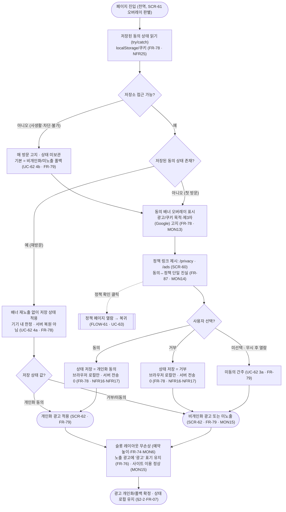
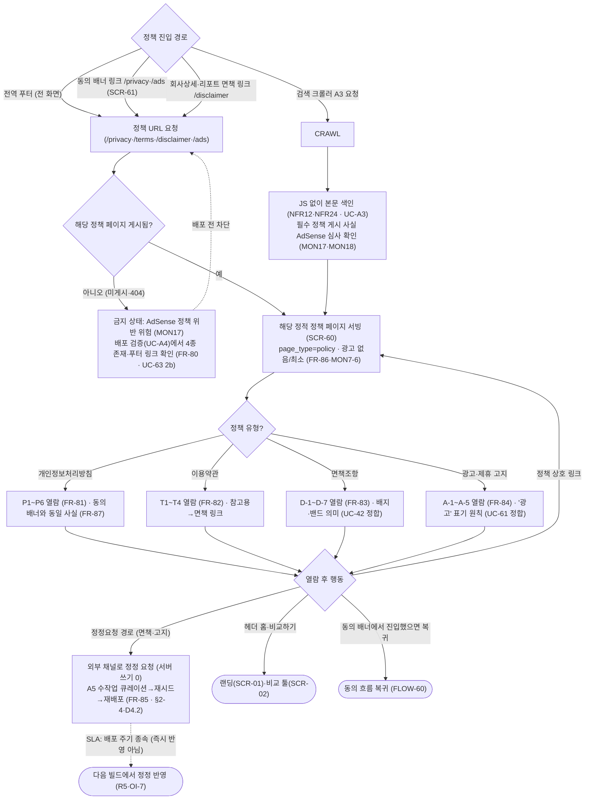
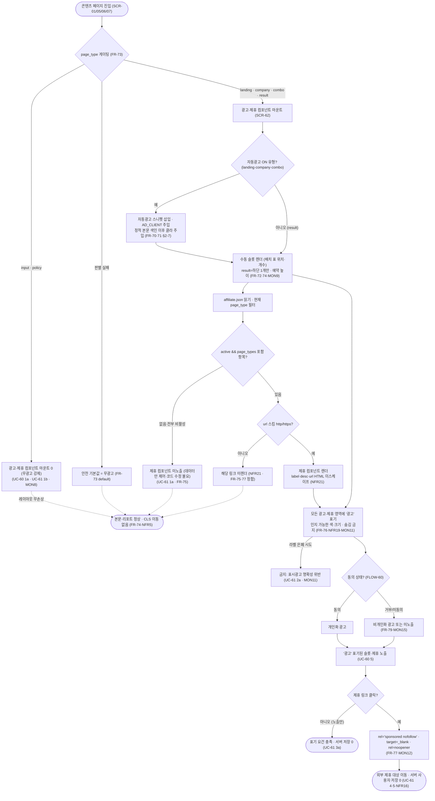

# 정책·광고·동의 흐름 (FLOW)

**문서 목적**: 수익화·규정 준수 대역의 **화면 구성·전이·플로우차트**를 확정한다. 구체적으로 (1) 정책·고지 페이지 4종(개인정보처리방침·이용약관·데이터 정확성 면책조항·광고/제휴 고지)의 공통 셸·전역 접근(푸터)·정정요청 경로, (2) 광고·쿠키 개인화 동의 배너의 **상태 머신**(최초 방문 → 고지·정책 링크 → 동의/거부/미선택 → 개인화/비개인화/미노출 폴백 → 재방문 적용), (3) 콘텐츠 페이지 위에 마운트되는 광고·제휴 컴포넌트의 노출·"광고" 표기·제휴 링크 클릭(광고성 속성 외부 이동)을 화면·전이로 다룬다. 정책 **본문(필수 항목)의 문안**과 광고·동의의 **저장·개인화 메커니즘·계산식**은 재정의하지 않고 담당 FRD(F7=FRD 10, F6=FRD 09)의 출력을 화면·전이로만 표시한다.

**상위 추적**: FLOW → FRD → USECASE → PRD → 브리프. 상위 근거 = FRD [09-광고-제휴](../FRD/09-광고-제휴.md)(FR-70~FR-79: AdSense 설정·자동/수동 슬롯·게이팅·CLS·`affiliate.json`·"광고" 표기·링크 속성·동의·폴백), FRD [10-정책페이지](../FRD/10-정책페이지.md)(FR-80~FR-87: 4종 집합·전역 접근·필수 항목·정정 경로·색인 정합·동의↔정책 연결), USECASE [07-광고와정책](../USECASE/07-광고와정책.md)(UC-60·UC-61·UC-62·UC-63). 연동 근거 = FLOW [01-사이트맵과-네비](01-사이트맵과-네비.md)(SCR-08 정책 4종·§4.2 전역 푸터·§4.3 동의 배너·§5.1 광고 배치 정본), FRD.md FR 마스터표(FR-73 배치 정본·FR-74 CLS·FR-76 표기·FR-87 단일 진실·FR-E5 비-JS·FR-E6 404). 전역 규약(비로그인·서버 무쓰기·클라 계산·읽기 전용 API·로컬 지속성)은 FR-01·FR-07을 인용하며 재정의하지 않는다.

**범위 경계**: 본 문서는 **정책 페이지 화면·동의 배너·광고/제휴 컴포넌트의 구성·상태·전이와 이를 시작하는 플로우**만 소유한다.
1. **정책 본문의 필수 항목(문안)** — 개인정보처리방침 P1~P6·이용약관 T1~T4·면책조항 D-1~D-7·광고/제휴 고지 A-1~A-5 — 은 FRD 10(FR-81~FR-85)이 소유한다. 본 문서는 그 항목을 화면의 **표시 데이터**로 인용·배치하되 법률 문안·연락처 실값을 창작하지 않는다(플레이스홀더 규약).
2. **광고·제휴 컴포넌트의 배치(위치·개수) 정본**은 FLOW 01 §5.1·FR-73 게이팅 표가 소유하고, 각 콘텐츠 페이지 슬롯 위치는 랜딩(FLOW 02)·회사 상세/조합(FLOW 5x)·리포트(FLOW 05, 하단 절제 1)가 소유한다. 본 문서는 그 위에서 마운트되는 **컴포넌트 자체의 노출·"광고" 표기·제휴 링크 속성·클릭 전이**를 소유하고 배치 표를 어기지 않는다.
3. **동의 상태의 저장·개인화/폴백 메커니즘 구현**(localStorage/쿠키 키·개인화 신호)은 FRD 09(FR-78·FR-79)가 소유한다. 본 문서는 그 동작을 **배너 화면 상태와 전이(상태 머신)**로 표현한다.
4. **배지·불확실성 밴드의 산출 규약**(DEC-2·`amt_source` 기준)은 FRD 05 FR-38·FRD 02 FR-D9가 소유한다. 면책조항 화면은 그 **의미의 고지**만 표시한다.
5. 프로파일러(가치관 진단 설문)와 익명 서버 쓰기 화면은 제품 범위에서 영구 제외이며, 로그인·회원·계정은 복지 등록·수정 기여(SC14, 문서 09/13·SP-AUTH) 한정 In-scope이나 이 익명 플로우엔 어떤 구획·전이·저장 경로에도 등장하지 않는다(FR-01). 정책 열람·동의·제휴 클릭·정정요청 전 과정에서 사용자 데이터의 서버 전송·저장이 없고(NFR16), 동의 상태는 브라우저(localStorage/쿠키)에만 존재한다(§2-2, FR-07).

**ID 대역**: 본 문서는 화면 **SCR-6x**(SCR-60~SCR-62), 플로우 **FLOW-6x**(FLOW-60~FLOW-62)를 소유한다(안정 ID, 재사용·중복 금지, 브리프 §9). 사이트맵 매핑: **SCR-60**은 사이트맵이 부여한 **SCR-08(정책·고지 페이지 4종)**의 상세 화면이고, **SCR-61**은 사이트맵 §4.3 **전역 동의 배너**의 상세(오버레이, 별도 라우트 아님)이며, **SCR-62**는 콘텐츠 페이지(SCR-01/05/06/07) 위에 마운트되는 **광고·제휴 컴포넌트**(별도 라우트 아님)다. 하위 문서(WIREFRAME/SPEC/TASK)가 이 ID를 인용한다.

---

## 화면 인덱스

| 화면 ID | 화면명 | `page_type` | 성격 | 주 커버 UC / FR |
| --- | --- | --- | --- | --- |
| SCR-60 | 정책·고지 페이지(4종 공통 셸·전역 푸터 접근·정정 경로) | `policy` | 정적(SCR-08 상세) · 4 URL 인스턴스 · 광고 없음/최소 | UC-63·UC-62(정책 측) / FR-80~86·FR-87 |
| SCR-61 | 광고·쿠키 개인화 동의 배너(오버레이) | — | 첫 방문 전역 오버레이(§4.3 상세) · 별도 라우트 아님 | UC-62 / FR-78·FR-79·FR-87 |
| SCR-62 | 광고·제휴 컴포넌트(슬롯·제휴 링크·"광고" 표기) | (호스트 페이지 유형) | 콘텐츠 페이지 위 마운트 컴포넌트 · 별도 라우트 아님 | UC-60·UC-61 / FR-70~77 |

> SCR-60의 4종(개인정보처리방침·이용약관·면책조항·광고/제휴 고지)은 **동일 화면 유형·동일 `page_type=policy`·동일 셸**의 URL 인스턴스이며, 본문 필수 항목만 다르다(FRD 10 FR-81~FR-85 소유). SCR-61·SCR-62는 별도 URL이 아니라 각각 첫 방문 오버레이·호스트 페이지 마운트 컴포넌트다. 광고 게이팅 축(`page_type`, FR-73)은 **호스트 화면**이 결정하며 SCR-62는 그 결정에 따라 마운트·구성된다.

## 플로우 인덱스

| 플로우 ID | 플로우명 | 다루는 경로 |
| --- | --- | --- |
| FLOW-60 | 광고·쿠키 개인화 동의 배너 상태 머신 | 정상(최초 방문→고지·정책 링크→동의/거부→상태 저장→개인화/비개인화 폴백) + 대안(미선택=미동의 폴백·재방문 저장 상태 적용) + 오류(localStorage/쿠키 불가=매 방문 고지·기본 폴백·레이아웃 무손상) |
| FLOW-61 | 정책·고지 페이지 진입 → 열람 → 상호 연결·정정요청 | 정상(푸터·동의·면책 링크 진입→4종 서빙→열람) + 대안(크롤러 JS 없이 색인·정정요청 오프라인 경로) + 오류(4종 미게시·404 방지·동의 링크 404 금지) |
| FLOW-62 | 광고 슬롯 노출·제휴 링크 클릭("광고" 표기·광고성 속성 외부 이동) | 정상(page_type 게이팅→슬롯·제휴 렌더→"광고" 표기→노출/클릭→외부 이동) + 대안(해당 항목 없음=미노출·개인화/폴백=동의 상태) + 오류(input/policy 무광고 강제·url 스킴 부적합 미렌더·라벨 숨김 금지) |

---

## [SCR-60] 정책·고지 페이지(4종 공통 셸·전역 접근·정정 경로)

**목적**: 개인정보처리방침·이용약관·데이터 정확성 면책조항·광고/제휴 고지 4종을 **각 고유 URL의 정적 페이지**로 게시하고, 전역 푸터·동의 배너·면책 링크로 도달 가능하게 하는 공통 셸을 구성한다. 4종은 동일 셸·`page_type=policy`를 공유하며 본문 필수 항목만 다르다. AdSense 승인·규정 준수의 전제 요건인 4종 게시·전역 접근을 화면 수준에서 보장한다(FR-80·MON17). 정책 **문안**은 FRD 10(FR-81~FR-85)이 소유하고 본 화면은 그 항목을 표시·배치한다.

**주요 요소(구획)**

| 구획 | 내용 | 근거 |
| --- | --- | --- |
| C0 전역 헤더 | 로고(→`/`)·"비교하기"(→`/compare`). JS 없이 이동 가능한 `<a href>` | FLOW 01 §4.1, NFR24 |
| C1 정책 본문(`<main>`·단일 `<h1>`) | 정책명 `<h1>` 이하 heading 위계로 필수 항목 서술. 시맨틱 landmark(`header`/`nav`/`main`/`footer`)·`lang="ko"`·UTF-8 | FR-86, NFR12·NFR13·NFR29 |
| C2 정정요청 연락 경로 | 면책조항·광고/제휴 고지 내 정정 요청 채널(이메일/문의 링크, 플레이스홀더 상수). 오프라인 접수→빌드타임 재반영, SLA(배포 주기 종속) 한계 고지 | FR-85, D4.2·R5 |
| C3 정책 상호 링크 | 이용약관→면책조항(참고용 상세), 면책·고지→개인정보처리방침 등 단일 진실 참조 링크 | FR-82(T3)·FR-87, MON14 |
| C4 전역 푸터(`<footer>`) | 4종 정책 링크 세트(모든 페이지 공통). 누락·404 0 | FR-80·FR-86, MON17 |

**4종 인스턴스와 표시 항목(FRD 10 소유, 본 화면 인용)**

| 인스턴스 | 라우트 | 표시 필수 항목(요지) | 소유 FR |
| --- | --- | --- | --- |
| 개인정보처리방침 | `/privacy` | P1 비로그인·서버 무저장 / P2 입력·최근비교 localStorage 한정 / P3 AdSense 광고 쿠키 / P4 제3자(Google)·개인화 동의/거부 선택권 / P5 거부해도 이용 가능 / P6 재직자 식별정보 미수집 | FR-81 |
| 이용약관 | `/terms` | T1 비교·정보 도구(비-채용 플랫폼) / T2 로그인·계정 없음 / T3 참고용·의사결정 책임(면책 링크) / T4 일반 이용 조건 | FR-82 |
| 데이터 정확성 면책조항 | `/disclaimer` | D-1 참고용·실제와 다를 수 있음 / D-2 배지(공식/추정) / D-3 출처·금액 신뢰도 분리 / D-4 밴드(`amt_source` 기준 ±5%/±20%/만료 +15%) / D-5 검증일·만료 / D-6 클라 계산·무단정 / D-7 정정 경로 | FR-83 |
| 광고·제휴 고지 | `/ads` | A-1 AdSense+제휴(무구독) / A-2 "광고" 표기(숨김 금지) / A-3 제휴 수수료 관계 / A-4 제3자 광고 쿠키·개인화 동의 / A-5 공정위 표시·광고 규정 정합 | FR-84 |

**진입 경로**
- **전역 푸터 링크(주 경로)**: 전 화면(랜딩·회사 상세·조합·비교 툴·404)의 푸터에서 4종 도달(FR-80·MON17, FLOW 01 §4.2).
- **동의 배너 링크**: 동의 배너(SCR-61)의 개인정보처리방침(`/privacy`)·광고/제휴 고지(`/ads`) 링크로 진입(FR-78·FR-87, UC-62→UC-63).
- **면책 링크**: 회사 상세(SCR-06) 면책 블록·리포트(SCR-05) 배지·밴드 표시에서 면책조항(`/disclaimer`)으로 진입(FR-54·FR-41·FR-83).
- **검색 크롤러(A3)**: 정적 HTML을 JS 없이 색인(NFR12·NFR24, UC-A3).

**이탈·전이(다음 화면·상태)**

| 트리거 | 다음 화면/상태 | 전이 계약 | 근거 |
| --- | --- | --- | --- |
| 정책 상호 링크 | 다른 정책 인스턴스(SCR-60) | 단일 진실 참조(동일 사실 재정의 금지) | FR-87, MON14 |
| 헤더 로고·비교하기 | 랜딩(SCR-01) · 비교 툴 셸(SCR-02) | 정적 링크 | FLOW 01 §4.1 |
| 정정요청 경로 이용 | (사이트 외부 채널) | 서버 쓰기 0 · 오프라인 접수→빌드타임 재배포 | FR-85, §2-4·NFR16 |
| 동의 배너 링크로 진입한 뒤 복귀 | 직전 화면·동의 흐름(SCR-61) | 배너 참조 사실과 정책 본문 동일(단일 진실) | FR-87, UC-62 |

**표시 데이터**: 정적 정책 문안 4종(운영자 확정·플레이스홀더 상수, 빌드타임 완성 HTML). 서버·DB 사용자 상태 변화 0건이며, 정정요청은 오프라인 채널→빌드타임 재생성으로만 반영된다(§2-4·D4.2). 각 페이지는 고유 `<title>`·`meta description`(NFR6)을 가지며 4종 URL이 `sitemap.xml`에 등록·`robots.txt`가 루트에 제공된다(FR-86, NFR9·NFR10). AdSense client id는 플레이스홀더를 유지하고 산출물에 시크릿을 포함하지 않는다(NFR22·MON5).

**관련 FR·UC 추적**: FR-80(4종·전역 접근·정적 배포)·FR-81~85(표시 항목 인용)·FR-86(얇은 페이지 색인 정합)·FR-87(동의↔정책 단일 진실, 정책 측) / UC-63(정책 열람)·UC-62(정책 측 요구)·연동 UC-42(면책 정합)·UC-A3(색인)·UC-A4(배포) / F7(F3·F6 정합).

**광고 배치**(FLOW 01 §5.1 정본, FR-73·`page_type=policy`, MON7-6): 자동광고 **OFF/최소**·**수동 슬롯 없음**·**제휴 없음**. 얇은 유틸리티 페이지로 클릭 유도·과도 광고 없이 AdSense 프로그램 정책에 정합한다(MON18·FR-86). 광고 밀도 "없음"이므로 광고로 인한 레이아웃 이동이 발생하지 않는다(NFR5).

---

## [SCR-61] 광고·쿠키 개인화 동의 배너(오버레이)

**목적**: AdSense가 쿠키를 사용하므로 첫 방문 시 광고/쿠키 사용 목적·제3자(Google) 사용 사실을 고지하고 개인화 동의/거부를 받는 전역 오버레이 배너를 구성한다. 배너는 개인정보처리방침·광고/제휴 고지(SCR-60)로 링크해 동의↔정책을 단일 진실로 연결하며(FR-87·MON14), 선택 상태를 **서버 저장 없이 브라우저(localStorage/쿠키)에만** 보관한다(FR-78·NFR16·NFR17). 동의 상태는 광고 종류(개인화/비개인화/미노출)를 결정할 뿐 사이트 이용을 막지 않는다(FR-79·MON15). 저장·개인화 메커니즘 구현은 FRD 09(FR-78·FR-79)가 소유하고 본 화면은 배너 UI 상태와 전이만 규정한다.

**주요 요소(구획)**

| 구획 | 내용 | 근거 |
| --- | --- | --- |
| B1 고지 문안 | 광고·쿠키 사용 목적·제3자(Google) 처리 사실을 한국어로 고지 | FR-78, MON13 |
| B2 정책 링크 | "개인정보처리방침"(→`/privacy`, SCR-60)·"광고·제휴 고지"(→`/ads`, SCR-60) 순수 `<a href>` 링크. 링크 대상 반드시 존재(404 금지) | FR-78·FR-87, MON14 |
| B3 동의/거부 선택 | 개인화 광고에 대한 동의 또는 거부 컨트롤. 선택 시 상태를 브라우저(localStorage/쿠키)에만 저장(서버 전송 0) | FR-78, NFR16·NFR17 |
| B4 재노출 억제 | 재방문 시 저장 상태를 읽어 배너 재노출 없이 적용(기기 내 한정, 서버 계정 복원 아님) | FR-78·FR-79, UC-62 4a |
| B5 폴백 고지·미선택 처리 | 미선택·거부·저장 불가 시 비개인화/미노출 폴백이며 사이트 이용은 정상임을 반영 | FR-79, UC-62 3a·4b |

**진입 경로**: 첫 방문(저장된 동의 상태 없음) 시 모든 화면 전역에서 오버레이로 표시(FLOW 01 §4.3). localStorage/쿠키 비활성·차단 시 저장이 불가하므로 매 방문 표시(UC-62 4b).

**이탈·전이(다음 화면·상태)**

| 트리거 | 다음 화면/상태 | 근거 |
| --- | --- | --- |
| "동의" 선택 | 상태 저장(개인화 동의) → 개인화 광고 적용(SCR-62), 배너 닫힘 | FR-78·FR-79, UC-62 3·5 |
| "거부" 선택 | 상태 저장(거부) → 비개인화 광고 또는 미노출 폴백(SCR-62), 배너 닫힘 | FR-79, UC-62 5·MON15 |
| 미선택·무시 후 계속 열람 | 미동의 간주 → 비개인화/미노출 폴백, 사이트 이용 정상 | FR-79, UC-62 3a |
| 정책 링크 클릭(B2) | 정책 페이지(SCR-60, `/privacy`·`/ads`) 열람 후 복귀 | FR-87, UC-62 2→UC-63 |
| 재방문(상태 기저장) | 배너 미노출, 저장 상태 적용(개인화/비개인화/미노출) | FR-78·FR-79, UC-62 4a |

**표시 데이터**: 고지 문안·정책 링크(정적)와 동의 선택 상태 = {개인화 동의 | 거부/미동의 | 미선택}. 상태는 브라우저(localStorage/쿠키)에만 존재하며 서버로 전송·저장되지 않고 크로스 디바이스 동기화가 없다(§2-2·NFR16·NFR17, FR-07). 저장·읽기는 예외를 흡수해 무크래시로 동작하고(FR-79·NFR25), 저장 실패 시 기본 비개인화/미노출로 폴백한다. 해외(EEA/UK) CMP 요건은 브리프 미확정으로 2차 재검토이며 본 화면은 미확정 항목을 단정하지 않는다(창작 금지).

**관련 FR·UC 추적**: FR-78(동의 고지·상태·정책 연결)·FR-79(미동의/비개인화 폴백·재방문 적용)·FR-87(동의↔정책 단일 진실, 배너 측 링크 대상 존재) / UC-62(동의/거부) / F6·F7(연계 UC-63·SCR-60).

**광고 배치**: 배너 자체는 광고 슬롯이 아니라 광고 개인화를 게이팅하는 오버레이다. 배너 결정에 따른 광고 종류(개인화/비개인화/미노출)는 SCR-62에서 적용되며, 폴백 상황에서도 슬롯 레이아웃은 예약 높이로 무손상 유지된다(FR-74·FR-79·MON6).

---

## [SCR-62] 광고·제휴 컴포넌트(슬롯·제휴 링크·"광고" 표기)

**목적**: 콘텐츠 페이지(랜딩·회사 상세·조합·리포트) 위에 마운트되는 광고 슬롯·제휴 링크 컴포넌트를 구성한다. 자동광고·수동 슬롯·제휴를 **호스트 화면의 `page_type` 하나로 게이팅**(FR-73)하고, 모든 광고·제휴 영역에 "광고" 표기(FR-76)를 부착하며, 제휴 링크에 광고성·안전 속성(FR-77)을 적용해 외부로 이동한다. 개별 제휴 링크는 코드가 아니라 `affiliate.json`에서만 온다(FR-75·MON10). 배치(위치·개수) 정본은 FLOW 01 §5.1·FR-73이 소유하며 본 화면은 컴포넌트 자체 노출·표기·링크 속성·클릭 전이를 소유한다.

**주요 요소(구획)**

| 구획 | 내용 | 근거 |
| --- | --- | --- |
| G1 게이팅 판별 | 호스트 `page_type`(landing/company/combo/input/result/policy)으로 마운트 결정. `input`·`policy`=컴포넌트 0, 판별 실패=무광고(안전 기본값) | FR-73, MON8 |
| G2 자동광고 스니펫 | ON 유형(landing·company·combo)에만 조건부 삽입, `AD_CLIENT`(플레이스홀더) 주입. 정적 본문 색인 이후 클라이언트 주입 | FR-70·FR-71, §2-7 |
| G3 수동 슬롯 | 배치 표 위치의 슬롯(예약 높이 확보). `result`=리포트 하단 1개만(판정 상단·중간 삽입 금지) | FR-72·FR-74, MON9 |
| G4 제휴 컴포넌트 | `affiliate.json`에서 `active===true && page_types.includes(page_type)`인 항목만 렌더. `label`·`desc`·`url` HTML 이스케이프, `url`은 `http`/`https`만 | FR-75, NFR21 |
| G5 "광고" 표기 | 모든 자동광고·수동 슬롯·제휴 영역에 인지 가능한 색·크기의 "광고"(또는 "유료 광고") 라벨. 숨김·은폐 금지 | FR-76, NFR19·MON11 |
| G6 제휴 링크 속성 | 외부 `<a>`에 `rel="sponsored nofollow"`, 새 탭 시 `target="_blank"`·`rel="noopener"` | FR-77, MON12 |
| G7 CLS·미노출 폴백 | 슬롯 컨테이너는 예약 높이/폴백으로 미승인·차단기·네트워크 실패·미동의에서도 레이아웃 무손상 | FR-74, NFR2·NFR5 |

**페이지 유형별 배치(FLOW 01 §5.1·FR-73 정본 인용, 재정의 아님)**

| 호스트 화면 | `page_type` | 자동광고 | 수동 슬롯 | 제휴 |
| --- | --- | :---: | --- | :---: |
| SCR-01 랜딩 | `landing` | ON | 콘텐츠 하단 1 | 선택 |
| SCR-06 회사 상세 | `company` | ON | 본문 중간 1 + 하단 1 | O |
| SCR-07 인기 조합 | `combo` | ON | 본문 중간 1 + 하단 1 | O |
| SCR-04 비교 입력 | `input` | **OFF** | **없음** | **없음** |
| SCR-05 비교 리포트 | `result` | OFF | 리포트 하단 1(절제) | 선택 |
| SCR-60 정책 | `policy` | OFF/최소 | 없음 | 없음 |

**진입 경로**: 호스트 콘텐츠 페이지(SCR-01/05/06/07) 렌더 시 게이팅 결과에 따라 컴포넌트가 마운트된다. 제휴 항목은 페이지 로드 시 `affiliate.json`을 읽어 현재 `page_type` 활성 항목만 필터링해 렌더한다.

**이탈·전이(다음 화면·상태)**

| 트리거 | 다음 화면/상태 | 근거 |
| --- | --- | --- |
| 제휴 링크 클릭 | 외부 제휴 대상으로 이동(새 탭). `rel="sponsored nofollow"`·`noopener` 적용, 서버 사용자 저장 0 | FR-77, UC-61 4·5·NFR16 |
| 노출만(클릭 없이 이탈) | 표기 요건 충족(노출만으로 "광고" 표기 완료), 서버 저장 없음 | FR-76, UC-61 3a |
| 해당 `page_type` 제휴 항목 없음·전부 비활성 | 제휴 컴포넌트 미노출(데이터만으로 제어, 코드 수정 불요) | FR-75, UC-61 1a |
| 광고 미노출(미승인·차단기·실패·미동의) | 예약 높이/폴백으로 레이아웃 유지, 본문·리포트 정상 표시 | FR-74·FR-79, UC-60 3a |

**표시 데이터**: `affiliate.json`(정적 자원, 서버 쓰기 없음)의 활성 항목 `{id, label, url, desc, page_types, active}`과 AdSense 슬롯 컨테이너. `page_types`에 `input`·`policy`가 포함된 항목은 게이팅 위반이므로 렌더 제외한다(FR-75·FR-73 정합). `label`·`desc`·`url`은 렌더 시 HTML 이스케이프하고 `url`은 `http`/`https` 스킴만 허용한다(NFR21). client id·슬롯 id는 단일 설정 위치에서 플레이스홀더로 관리되고 승인 전에는 예약 슬롯만 유지한다(FR-70·MON18). 개인화 여부는 동의 상태(SCR-61)만을 따르고 서버 상태에 의존하지 않는다(NFR16).

**관련 FR·UC 추적**: FR-70(설정 단일 주입)·FR-71(자동광고 조건부)·FR-72(수동 슬롯)·FR-73(게이팅)·FR-74(CLS)·FR-75(`affiliate.json` 렌더)·FR-76("광고" 표기)·FR-77(링크 속성) / UC-60(슬롯 노출·표기)·UC-61(제휴 클릭) / F6(F4·F5·F3 배치는 각 소유 문서, 본 화면은 컴포넌트).

**광고 배치**: 본 화면 자체가 광고·제휴 컴포넌트이며, 위치·개수는 위 정본 표를 따른다. 모든 영역에 "광고" 표기·예약 높이를 적용하고 배치 표 외 위치·개수 추가를 금지한다(FR-73·FR-74·FR-76).

---

## [FLOW-60] 광고·쿠키 개인화 동의 배너 상태 머신

첫 방문에서 광고/쿠키 고지·정책 링크를 제시하고 동의/거부/미선택에 따라 개인화·비개인화·미노출을 결정하며, 재방문 시 저장 상태를 재노출 없이 적용하는 상태 머신. localStorage/쿠키 불가는 매 방문 고지·기본 폴백으로 흡수한다. 동의 상태는 브라우저(localStorage/쿠키)에만 저장되고 서버로 전송되지 않으며, 어느 상태에서도 사이트 이용은 정상이고 슬롯 레이아웃은 무손상이다.

**경로 요약**

- **정상**: 첫 방문 → 배너 고지·정책 링크(`/privacy`·`/ads`) → "동의"/"거부" 선택 → 상태를 브라우저 로컬에만 저장 → 동의=개인화, 거부=비개인화/미노출. 재방문 시 저장 상태를 재노출 없이 적용(기기 내 한정, UC-62 4a).
- **대안**: 미선택·무시 후 계속 열람은 미동의로 간주해 비개인화/미노출로 폴백하며 사이트 이용은 정상이다(UC-62 3a·MON15). 정책 링크 클릭은 정책 열람(FLOW-61) 후 복귀한다.
- **오류**: localStorage/쿠키 비활성·차단·불가 시 상태를 보관하지 못해 매 방문 고지하고 기본은 비개인화/미노출 폴백이다(UC-62 4b·FR-79). 저장·읽기 예외는 흡수해 무크래시로 동작하고(NFR25), 어느 상태에서도 슬롯은 예약 높이로 레이아웃 이동이 없다(FR-74·MON6). 동의 상태는 서버로 전송·저장되지 않는다(NFR16·NFR17).

---

## [FLOW-61] 정책·고지 페이지 진입 → 열람 → 상호 연결·정정요청

전역 푸터·동의 배너·면책 링크로 정책 4종에 진입해 정적 페이지를 서빙·열람하고, 정책 상호 링크·정정요청 오프라인 경로로 이어지는 플로우. 4종 미게시·404는 배포 단계 생성물 검증으로 방지하고, 동의 배너 링크가 404를 향하지 않도록 보장한다. 크롤러는 JS 없이 본문을 색인한다. 열람·정정요청 전 과정에서 서버 사용자 쓰기가 없다.

**경로 요약**

- **정상**: 전역 푸터·동의 배너·면책 링크로 4종 URL 요청 → 게시 확인 → 해당 정적 정책 페이지 서빙(SCR-60) → 유형별 필수 항목 열람 → 상호 링크·헤더로 이탈. 정책 페이지는 광고 없음/최소의 얇은 유틸리티 페이지다(FR-86·MON7-6).
- **대안**: 크롤러(A3)는 JS 없이 본문을 색인하고 필수 정책 게시 사실이 AdSense 심사에서 확인된다(MON17·MON18·UC-A3). 정정요청은 면책·고지의 오프라인 채널로 접수되어 서버 쓰기 없이 A5 수작업 큐레이션→재시드→재배포로 반영되며(FR-85·D4.2), SLA는 배포 주기에 종속됨을 고지한다(R5·OI-7).
- **오류**: 4종 중 하나라도 미게시·404이면 AdSense 정책 위반 위험이므로 배포 단계(UC-A4) 생성물 검증에서 4종 존재·푸터 링크·sitemap 등록을 확인해 방지한다(FR-80·NFR9·UC-63 2b). 동의 배너의 정책 링크가 404를 향하지 않도록 링크 대상 존재를 보장한다(FR-87).

---

## [FLOW-62] 광고 슬롯 노출·제휴 링크 클릭("광고" 표기·광고성 속성 외부 이동)

호스트 페이지 진입 시 `page_type` 게이팅으로 광고·제휴 컴포넌트 마운트를 결정하고, 자동광고·수동 슬롯·제휴를 배치 표대로 렌더해 "광고" 표기를 부착하며, 제휴 링크 클릭 시 광고성·안전 속성으로 외부 이동하는 플로우. 비교 입력·정책은 무광고를 강제하고, `affiliate.json`에 항목이 없거나 url 스킴이 부적합하면 미렌더한다. 개인화 여부는 동의 상태(FLOW-60)를 따르고 외부 이동은 서버 사용자 저장이 없다.

**경로 요약**

- **정상**: 콘텐츠 페이지 진입 → `page_type` 게이팅으로 마운트 결정 → 자동광고(ON 유형)·수동 슬롯(배치 표)·제휴(`affiliate.json` 활성 항목) 렌더 → 모든 영역에 "광고" 표기 → 동의 상태에 따른 개인화/폴백으로 노출 → 제휴 링크 클릭 시 `rel="sponsored nofollow"`·`noopener`로 외부 이동(서버 저장 0).
- **대안**: 해당 `page_type` 제휴 항목이 없거나 전부 비활성이면 제휴 컴포넌트를 미노출하며, 노출·미노출·링크 교체가 데이터만으로 제어되어 코드 수정이 불요하다(UC-61 1a·FR-75). 노출만으로도(클릭 없이) 표기 요건은 충족된다(UC-61 3a). 개인화 여부는 동의 상태(FLOW-60)를 따른다.
- **오류/금지**: `input`·`policy`는 자동·수동·제휴 컴포넌트를 마운트 자체에서 게이팅해 무광고를 강제하고(MON8·FR-73), 판별 실패는 안전 기본값 무광고로 폴백한다(FR-73 default). `url` 스킴이 `http`/`https`가 아니면 링크를 렌더하지 않는다(NFR21·FR-75·FR-77). "광고" 라벨을 은폐하려는 배치는 표시광고 명확성 요건 위반으로 금지된다(UC-61 2a·MON11). 광고 미노출·무광고 상태에서도 본문·리포트는 예약 높이로 레이아웃 무손상이다(FR-74·NFR5).

---

## 추적 요약 (본 문서)

| 화면/플로우 | 충족·연동 UC | 관련 FR | 상위 F | 근거 |
| :---: | --- | --- | :---: | --- |
| SCR-60 정책·고지 페이지(4종) | UC-63·UC-62(정책 측)·UC-42(면책) | FR-80·81·82·83·84·85·86·87 | F7 | MON17·NFR12·NFR24·§2-6 |
| SCR-61 동의 배너 | UC-62 | FR-78·79·87 | F6·F7 | MON13·14·15·NFR16·17 |
| SCR-62 광고·제휴 컴포넌트 | UC-60·UC-61 | FR-70·71·72·73·74·75·76·77 | F6 | §5.1 배치 정본·NFR19·21 |
| FLOW-60 동의 배너 상태 머신 | UC-62 | FR-78·79·87·74 | F6·F7 | MON13·14·15·MON6 |
| FLOW-61 정책 진입·열람·정정 | UC-63·UC-A3·UC-A4·UC-42 | FR-80·81~85·86·87 | F7 | MON17·18·D4.2·R5 |
| FLOW-62 광고 노출·제휴 클릭 | UC-60·UC-61 | FR-70~77·73·79 | F6 | MON8·9·11·12·§5.1 |

**커버리지 메모**: 본 문서는 수익화·규정 준수 대역의 UC-60·UC-61·UC-62·UC-63을 화면·상태·플로우로 커버한다 — UC-60(광고 슬롯 노출·표기)=SCR-62/FLOW-62, UC-61(제휴 클릭)=SCR-62/FLOW-62, UC-62(개인화 동의/거부)=SCR-61/FLOW-60, UC-63(정책 열람)=SCR-60/FLOW-61. 정책 본문 문안(FR-81~85 필수 항목)은 FRD 10이, 동의 저장·개인화 메커니즘(FR-78·79)과 배치 정본(FR-73·FLOW 01 §5.1)은 각 소유 문서가 소유하며 본 문서는 그 출력을 화면·전이로만 표시한다(표현·소유 분리). 동의 상태를 포함한 모든 사용자 상태는 브라우저(localStorage/쿠키)에만 존재하고 서버로 전송·저장되지 않으며(FR-01·FR-07·NFR16·NFR17), 정책 페이지는 광고 없음/최소의 얇은 유틸리티 페이지다(FR-86·MON7-6). 모든 광고·제휴 영역에 "광고" 표기를 부착하고(FR-76·NFR19) 슬롯은 예약 높이로 CLS를 억제한다(FR-74·NFR5). 프로파일러·익명 서버 측 사용자 쓰기 화면은 어떤 구획·전이·저장 경로에도 등장하지 않는다; 로그인·회원 화면은 복지 기여 SC14 한정이라 이 익명 흐름엔 비등장(FR-01).
