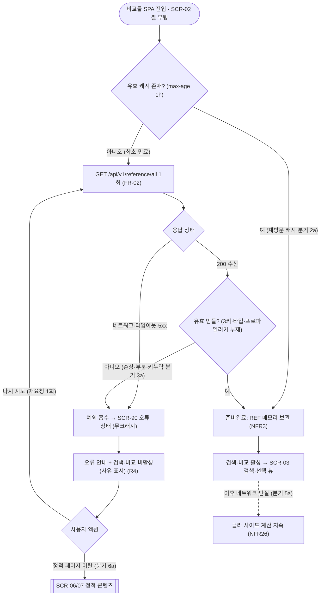
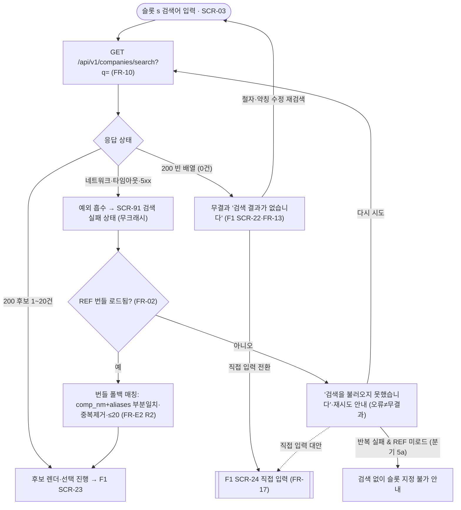
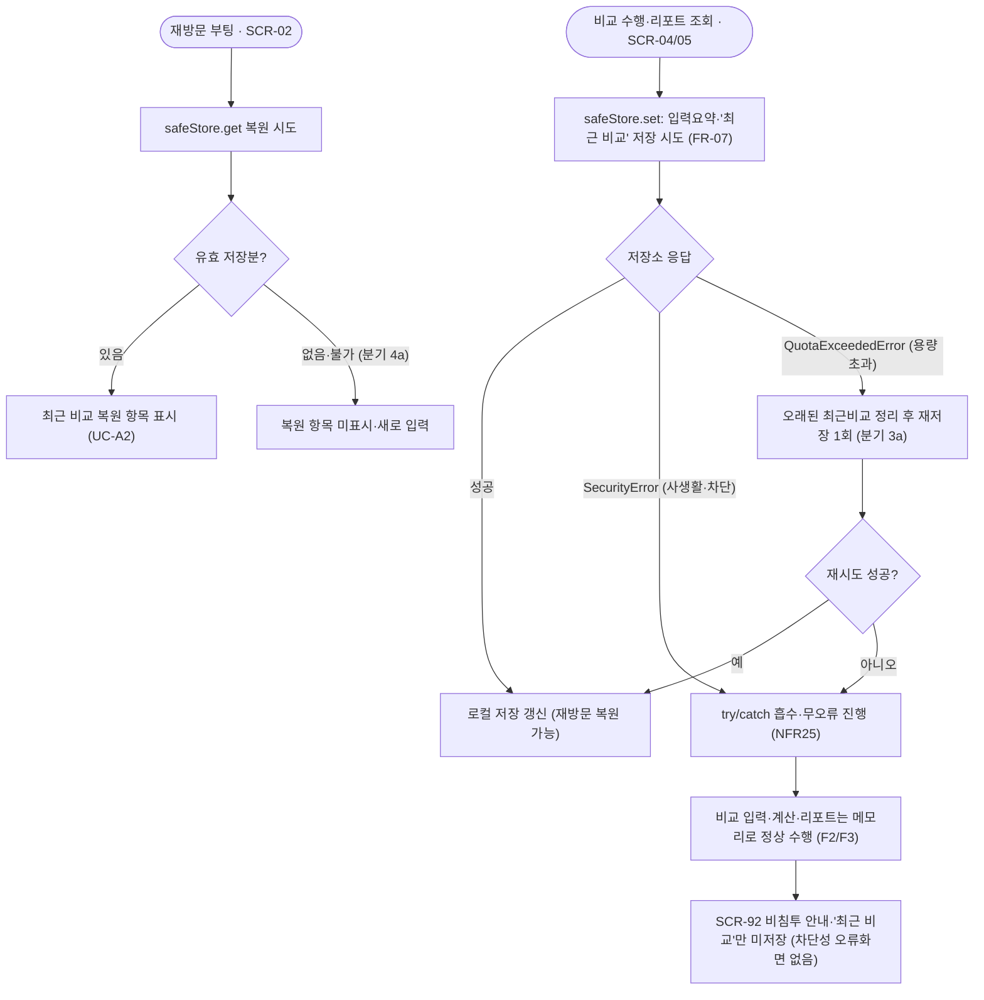
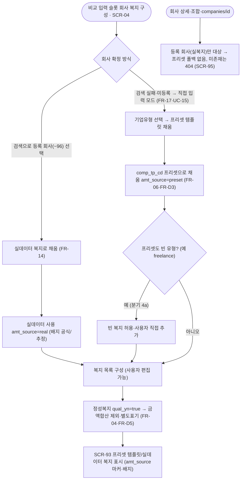
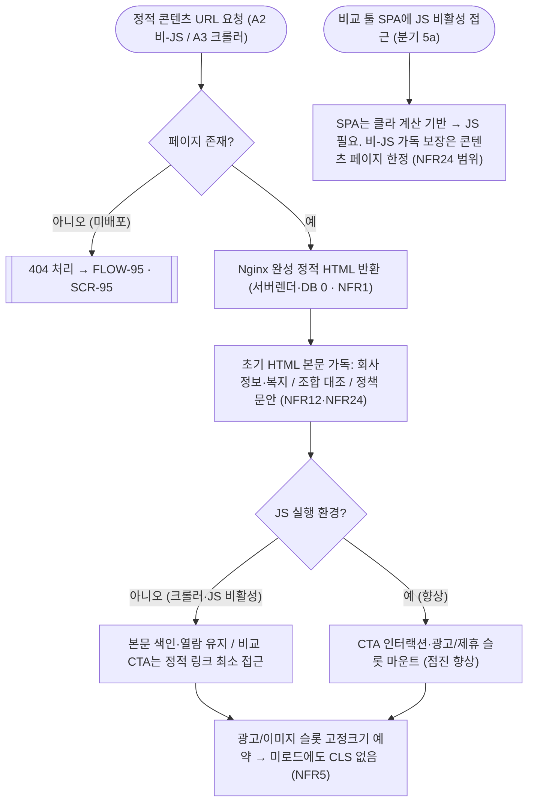
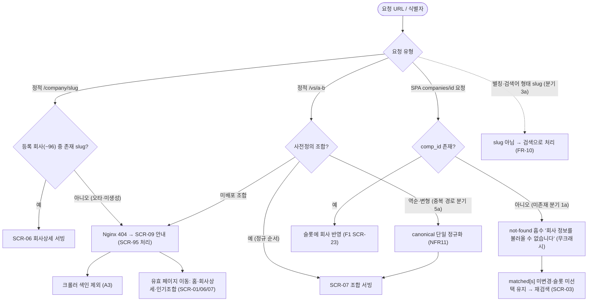
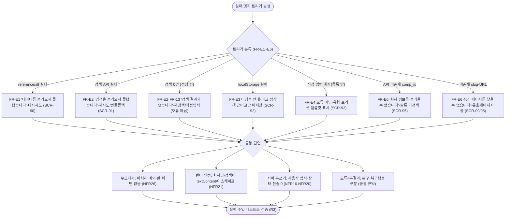

# 오류·엣지 화면·상태·복구 플로우 (FLOW)

**문서 목적**: loupit의 정상 경로가 아닌 **비정상·엣지 상황**의 화면·상태와 그 **복구 플로우차트**를 확정한다. 대상은 (1) 참조 번들 `reference/all` 로드 실패의 재시도 UX, (2) 회사 검색 API 실패·번들 폴백 매칭, (3) localStorage 사용 불가(사생활 모드·차단·용량 초과) 안내, (4) 비교 툴 직접 입력 모드에서 등록되지 않은(복지 데이터 보유 ~96개 밖) 회사의 기업유형 프리셋 기본 복지 템플릿 표시, (5) JavaScript 비활성·크롤러의 정적 본문 폴백(점진적 향상), (6) 존재하지 않는 회사 slug·잘못된 URL·미존재 식별자의 404·not-found, (7) 이들을 관통하는 사용자 안내 메시지·무크래시 검증 규약이다. 각 상태는 "오류를 사용자에게 알리되 앱이 크래시하지 않는다"(NFR26)와 "저장 실패를 흡수하고 비교는 정상 동작한다"(NFR25)를 검증 가능한 화면·전이로 구체화한다.

**상위 추적**: FLOW → FRD → USECASE → PRD → 브리프. 상위 근거 = FRD [12-오류-엣지](../FRD/12-오류-엣지.md)(FR-E1~FR-E7), USECASE [08-오류와엣지](../USECASE/08-오류와엣지.md)(UC-90~UC-95). 연동 근거 = FRD.md FR 마스터표(부팅 로드 FR-02·FR-92, API not-found FR-94, 검색 오류 UX FR-13, 프리셋 템플릿 규약 FR-06·FR-D3, 데이터 계약 FR-D1·FR-D6·FR-D7·FR-D11, 광고 게이팅·CLS FR-73·FR-74, 정적 본문 FR-50·FR-60), USECASE.md(UC-90~UC-95, 연동 UC-A1·UC-A2·UC-A3·UC-A4·UC-13·UC-52). 화면 골격·전역 네비·404 페이지·사이트 전이는 FLOW [01-사이트맵과-네비](01-사이트맵과-네비.md)(SCR-01~SCR-09·FLOW-04)를, 검색 무결과·오류 빈 상태 UX는 FLOW [03-비교-검색선택](03-비교-검색선택.md)(SCR-22)을 인용한다. 전역 규약(비로그인·서버 무쓰기·클라 계산·읽기 전용 API)은 FR-01을 인용하며 재정의하지 않는다. 브리프 §2-2(localStorage)·§2-4(서버 무쓰기)·§2-8(클라이언트 계산)·§4/§5(데이터 모델·프리셋 직접입력 모드)·§6(API·캐시 표면)·§8(정적 서빙 인프라).

**범위 경계**: 본 문서는 **오류·엣지 처리의 횡단 상태·복구 플로우**만 소유한다. 정상(해피패스) 화면·플로우는 각 기능 FLOW가 소유한다 — 사이트맵·전역 네비 FLOW 01, 랜딩 FLOW 02, 검색·선택 FLOW 03, 비교 입력 FLOW 04, 비교 리포트 FLOW 05, 회사 상세·인기 조합 FLOW 06. 본 문서는 그 정상 화면(SCR-01~SCR-09 및 각 기능 대역 SCR-1x~SCR-5x)이 **실패·부재·비활성 조건에서 어떻게 방어·폴백·안내되는가**의 상태·전이만 그리며, 담당 FLOW와 모순되지 않는다. 화면 문구·컴포넌트 레이아웃의 픽셀 수준·최종 카피는 WIREFRAME/SPEC로 미룬다. 응답 스키마·상한·오류 형태는 데이터 계약(FR-D1·FR-D6·FR-D7·FR-D11)이 확정하며 본 문서는 이를 **소비하는 화면 동작**을 그린다. 로그인/회원/계정/프로파일러/서버 측 사용자 데이터 쓰기 화면은 제품 범위에서 **영구 제외**이므로 어떤 오류·엣지 화면·상태·전이에도 등장하지 않는다(FR-01, 브리프 §2-1·§2-3·§2-4).

**ID 대역**: 본 문서는 화면·상태 **SCR-9x**(SCR-90~SCR-95), 플로우 **FLOW-9x**(FLOW-90~FLOW-96)를 소유한다(안정 ID, 재사용·중복 금지, 브리프 §9). 본 문서의 SCR-9x는 특정 라우트 하나가 아니라 여러 기능 화면을 가로지르는 **오류·엣지 상태/렌더 모드**이며(UC-9x·FR-Ex 대역과 정렬), 사이트맵이 소유한 화면(SCR-02 비교 툴 셸·SCR-03 검색 뷰·SCR-09 404 안내 페이지 등)과 검색 오류 빈 상태(SCR-22)를 **인용**하되 재정의하지 않는다. 하위 문서(WIREFRAME/SPEC/TASK)가 이 ID를 인용한다.

---

## 1. 공통 규약 (전 상태·전 플로우 적용)

USECASE 08 "공통 전제 1~3"과 FRD 12 "공통 규약"을 FLOW 검증 조건으로 고정한다. 아래는 SCR-90~SCR-95·FLOW-90~FLOW-96 전체에 적용되는 불변식이다.

- **무크래시 불변식(NFR26)**: 어떤 오류·엣지 상황에서도 앱은 **미처리 예외·흰 화면을 남기지 않는다**. 모든 실패 경로는 예외를 흡수(try/catch·방어적 파싱)한 뒤 정의된 오류 상태·안내로 전이한다.
- **오류 ≠ 무결과 구분**: 정상 응답의 "빈 결과"(검색 0건·저장분 없음)와 "실패"(네트워크·타임아웃·5xx·파싱 실패)는 **서로 다른 상태·문구·복구 행동**으로 구분한다(FR-13·FR-D11 정합). 실패를 무결과로 오인해 잘못된 다음 행동으로 넘기지 않는다.
- **서버 무쓰기(NFR16·NFR20, FR-01)**: 어떤 오류·재시도·폴백 경로도 사용자 입력·상태를 서버로 쓰기 전송하지 않는다. 사용자 상태는 브라우저 메모리·localStorage에만 존재한다.
- **로드 후 오프라인 계산(NFR26, §2-8)**: 참조 번들(REF)이 한 번 로드된 뒤에는 비교 계산이 100% 클라이언트 사이드이므로, 네트워크가 끊겨도 검색(번들 폴백 매칭)·입력·계산이 가능하다.
- **렌더 안전(NFR21)**: 모든 오류·안내 메시지와 삽입되는 회사명·검색어·복지 문자열은 `textContent`/이스케이프로 삽입하며 `innerHTML` 직접 삽입을 금지한다(오류 경로에서도 XSS 차단).
- **한정된 재시도**: 재시도는 사용자 트리거("다시 시도")를 기본으로 하며, 자동 재시도를 두더라도 횟수·지연이 한정된다. 무한 재시도·무한 로딩 스피너·응답 없는 대기 상태를 남기지 않는다.

---

## 2. 화면·상태 인덱스

| 화면 ID | 상태/화면명 | 성격(호스트 화면) | 광고 | 주 커버 UC / FR |
| --- | --- | --- | --- | --- |
| SCR-90 | 참조 번들 로드 실패 오류 상태 | 비교 툴 셸(SCR-02) 내 오류 상태 | 없음 | UC-90 / FR-E1 |
| SCR-91 | 검색 실패·번들 폴백 매칭 상태 | 검색·선택 뷰(SCR-03; F1 SCR-22) 내 실패/폴백 | 없음 | UC-91 / FR-E2 |
| SCR-92 | localStorage 불가 비침투 안내 상태 | 입력·리포트(SCR-04/05) 횡단 | 상속 | UC-92 / FR-E3 |
| SCR-93 | 기업유형 프리셋 직접입력 기본복지 표시 상태 | 비교 툴 직접 입력 모드(입력 SCR-04) | 상속 | UC-93 / FR-E4 |
| SCR-94 | 비-JS·크롤러 정적 본문 폴백 상태 | 회사상세·조합·정책(SCR-06/07/08) 렌더 모드 | 예약(비-JS 시 미표시) | UC-94 / FR-E5 |
| SCR-95 | 404·not-found 오류 상태 | 정적 404(SCR-09) + SPA API not-found(SCR-03/04) | 없음 | UC-95 / FR-E6 |

> **인용 규약**: SCR-90은 SCR-02 셸의 부팅 실패 상태, SCR-91은 SCR-03 검색 뷰(및 F1의 무결과·오류 빈 상태 SCR-22)의 실패/폴백 계층이다. SCR-95의 정적 404는 사이트맵이 소유한 SCR-09 페이지로 렌더되며, 본 문서는 그 404·not-found를 유발하는 오류·엣지 **처리 상태**를 SCR-95로 소유한다. "광고=상속"은 호스트 화면의 `page_type` 게이팅(FR-73)을 그대로 따른다는 의미다.

## 3. 플로우 인덱스

| 플로우 ID | 플로우명 | 다루는 경로(정상·대안·오류) |
| --- | --- | --- |
| FLOW-90 | `reference/all` 로드 실패 → 재시도 → 복구/지속 실패 | 정상(캐시·유효 응답 준비완료) + 대안(재시도 성공·로드 후 오프라인 계산) + 오류(손상 응답·반복 실패·정적 페이지 이탈) |
| FLOW-91 | 검색 실패 → 오류/무결과 구분 → 번들 폴백 → 재시도 | 정상(후보 렌더) + 대안(번들 폴백 매칭·직접 입력) + 오류(네트워크·5xx·REF 미로드) |
| FLOW-92 | localStorage 저장·복원 실패 흡수 → 비교 정상 진행 | 정상(저장 성공) + 대안(용량 초과 정리 후 재저장·복원분 없음) + 오류(사생활·차단 예외 흡수) |
| FLOW-93 | 비교 툴 직접 입력 모드 → 등록 밖 회사 기업유형 프리셋 기본복지 채움 | 정상(등록 회사 실데이터 채움) + 대안(직접 입력 시 프리셋 템플릿·사용자 편집) + 오류(프리셋도 빈 유형·빈 복지 무크래시) |
| FLOW-94 | 비-JS·크롤러 정적 본문 접근 → 점진적 향상 | 정상(정적 HTML 본문 가독·색인) + 대안(JS 향상 시 CTA·광고 마운트) + 오류(SPA 비-JS 접근 한계·미존재 페이지 404) |
| FLOW-95 | 정적 404·조합 정규화·SPA API not-found 흡수 | 정상(존재 slug·조합 서빙) + 대안(역순 canonical·별칭은 검색) + 오류(미배포 404·미존재 comp_id 흡수) |
| FLOW-96 | 오류·빈 상태 안내·무크래시 검증(횡단 카탈로그) | 전 실패 트리거의 메시지·복구·무크래시·렌더안전·무쓰기 단언 |

---

## [SCR-90] 참조 번들 로드 실패 오류 상태

**목적**: 비교 툴 셸(SCR-02)이 부팅 시 1회 로드하는 참조 번들(REF)의 로드가 실패하거나 손상 응답이 도착했을 때, 앱을 크래시시키지 않고 오류 상태로 전이하여 **재시도 수단**을 제공하고, 참조가 확보되기 전까지 검색(F1)·비교 입력(F2)·비교 계산(F3)을 제한한다. FR-02(부팅 로드)·FR-D1(번들 계약)의 실패 경로를 화면 상태로 확정한다. UC-90/FR-E1을 담당한다.

**주요 요소(구획)**

| 구획 | 내용 | 근거 |
| --- | --- | --- |
| X1 오류 안내 | "데이터를 불러오지 못했습니다. 다시 시도해 주세요." 손상·부분 응답도 동일 문구로 안내 | FR-E1(R3)·NFR26 |
| X2 다시 시도 버튼 | 클릭당 `reference/all` 재요청 1회(무한 자동 재시도 금지) | FR-E1(R1)·한정 재시도 |
| X3 기능 비활성 표시 | 검색 입력·슬롯·비교 진행을 disabled로 두고 사유("데이터를 불러오지 못해 비교를 시작할 수 없습니다") 표시 | FR-E1(R4)·UC-90 5 |
| X4 정적 페이지 이탈 안내 | 반복 실패 시 회사 상세·인기 조합(정적 콘텐츠) 열람으로의 이탈 링크 | UC-90 6a |

**진입 경로**: SCR-02 셸 부팅 중 `GET /api/v1/reference/all`이 네트워크 오류·타임아웃·5xx로 실패하거나(로드 오류), HTTP 200이라도 JSON 파싱 실패·최상위 3키(`company_types`/`benefit_presets`/`companies`) 누락·형 불일치·프로파일러 키 잔존일 때(손상·부분 응답, FR-D1·FR-D10). 유효 캐시(`max-age` 1시간 이내)가 있으면 본 오류 상태로 진입하지 않는다(FLOW-90 분기 2a).

**이탈·전이(다음 화면)**

| 트리거 | 다음 화면/상태 | 전이 계약 | 근거 |
| --- | --- | --- | --- |
| "다시 시도" → 유효 번들 수신 | SCR-03 검색·선택 뷰(준비완료) | REF 메모리 보관 후 정상 흐름(UC-A1) 복귀 | FR-E1(R5)·FR-02 |
| "다시 시도" → 재실패 | SCR-90 유지(오류 안내 지속) | 크래시 없이 상태 유지 | UC-90 6a·NFR26 |
| 정적 페이지 이탈 | SCR-06 회사 상세 / SCR-07 인기 조합 | 정적 링크(계산 불필요) | UC-90 6a |

**표시 데이터**: 오류 안내 문구(한국어)와 재시도·이탈 컨트롤만 표시한다. 유효 번들 수신 시 `REF = {company_types[], benefit_presets{type_cd:[…]}, companies[{…, aliases[], benefits[]}]}`를 메모리에 보관한다(FR-02·FR-D1). 로드 단계에서 서버·localStorage에 어떤 사용자 상태도 기록하지 않는다(NFR16). 로드 성공 후에는 네트워크가 끊겨도 계산이 가능하다(NFR26, 공통 규약).

**관련 FR·UC 추적**: FR-E1(로드 실패·재시도)·FR-02(부팅 로드)·FR-D1(번들 계약)·FR-D10(프로파일러 키 부재)·FR-D11(오류 계약) / UC-90(전제 UC-A1) / NFR26·NFR3·NFR16.

**광고 배치**: 없음. SCR-02 셸은 뷰별 게이팅 대상이며 부팅·오류 상태는 판별 실패 안전 기본값으로 무광고다(FR-73 default). 오류 화면에 광고·제휴 슬롯을 마운트하지 않는다.

---

## [SCR-91] 검색 실패·번들 폴백 매칭 상태

**목적**: 회사 검색 요청(`GET /api/v1/companies/search?q=`)이 실패했을 때, 앱을 크래시시키지 않고 **실패를 무결과와 구분**해 안내하며, 참조 번들(REF)이 이미 로드되어 있으면 `REF.companies[]`의 이름·별칭에 대한 클라이언트 매칭으로 검색을 계속할 수 있게 한다. 검색 무결과·오류 빈 상태의 화면 UX 자체는 F1의 SCR-22가 소유하고, 본 상태는 그 위에 실패의 **횡단 처리**(오류/무결과 구분·번들 폴백·무크래시)를 확정한다. UC-91/FR-E2를 담당한다.

**주요 요소(구획)**

| 구획 | 내용 | 근거 |
| --- | --- | --- |
| Y1 검색 실패 안내 | "검색을 불러오지 못했습니다." + 재시도 우선 안내. 0건 무결과("검색 결과가 없습니다")와 문구·행동을 구분 | FR-E2·FR-13·공통 규약 |
| Y2 다시 시도 | 동일 검색어로 재요청 1회 | FR-E2·한정 재시도 |
| Y3 번들 폴백 후보 리스트 | REF 로드 시 `comp_nm`+`aliases[]` 대소문자 무시 부분일치, `comp_id` 중복 제거, 최대 20건 → 축소 투영 `{comp_id, comp_nm, comp_tp_cd, industry_nm, logo_nm}` | FR-E2(R2)·FR-D6 |
| Y4 직접 입력 전환 | 검색 대신 직접 입력 모드로 진행(회사 미선택) | FR-17·UC-13 3b |

**진입 경로**: SCR-03 검색 뷰(F1 SCR-21)의 `companies/search` 요청이 네트워크 오류·타임아웃·5xx로 실패했을 때. 200 빈 배열(0건)은 실패가 아니라 무결과이므로 본 상태가 아닌 F1 무결과 빈 상태로 처리한다(FLOW-91 분기).

**이탈·전이(다음 화면)**

| 트리거 | 다음 화면/상태 | 전이 계약 | 근거 |
| --- | --- | --- | --- |
| REF 로드됨 → 폴백 매칭 | 폴백 후보 리스트 → 선택 시 슬롯 반영(F1 SCR-23) | 전용 엔드포인트 없이 검색 지속 | FR-E2 3a·FR-14 |
| "다시 시도" → 성공 | 후보 리스트(SCR-03) | 후보 렌더 후 슬롯 지정 | FR-E2·UC-91 6 |
| "다시 시도" → 반복 실패 & REF 미로드 | SCR-91 유지 | 검색 없이 슬롯 지정 불가 안내 | UC-91 5a |
| 직접 입력 전환 | 직접 입력 모드(F1 SCR-24) | `matched[s]=null` 유지 | FR-17·UC-15 |

**표시 데이터**: 검색 실패 안내 또는 REF 로드 시 폴백 후보 리스트. `matched[s]`는 후보 선택 전까지 미변경. 폴백 후보 텍스트(정식명·유형·산업)는 이스케이프하여 삽입한다(NFR21). 검색어·입력값을 서버로 쓰기 전송하지 않으며(NFR16·NFR20), 다른 슬롯·기능은 정상 동작한다(NFR26).

**관련 FR·UC 추적**: FR-E2(검색 API 실패·번들 폴백)·FR-13(무결과·오류 구분 UX)·FR-02(REF 전제)·FR-D6(검색 응답 스키마)·FR-D11(오류 계약) / UC-91(연동 UC-13) / NFR26·NFR16·NFR21.

**광고 배치**: 없음. 검색·선택은 비교 툴 입력 흐름으로 광고를 최소화한다(브리프 §2-6). 실패·폴백 상태에도 광고·제휴 슬롯을 두지 않는다.

---

## [SCR-92] localStorage 불가 비침투 안내 상태

**목적**: 브라우저 localStorage가 사용 불가(사생활/시크릿 모드, 저장소 차단 설정, 용량 초과 `QuotaExceededError`)한 상황에서, 저장·복원 실패를 예외로 흡수하여 **비교 기능은 정상 동작**시키고 "최근 비교"만 저장·복원되지 않게 한다. 차단성 오류 화면을 강제하지 않고 비침투적으로만 안내한다. FR-07(로컬 지속성 전역 규약)의 실패 경로를 확정한다. UC-92/FR-E3을 담당한다.

**주요 요소(구획)**

| 구획 | 내용 | 근거 |
| --- | --- | --- |
| Z1 비침투 안내(선택적) | "이 브라우저에서는 최근 비교가 저장되지 않습니다" 수준의 비차단 표시. 팝업·모달로 흐름을 막지 않음 | FR-E3(R3)·NFR25 |
| Z2 비교 기능 유지 | 입력·계산·리포트(F2/F3)는 메모리 상태만으로 정상 수행 | FR-E3(R2)·UC-92 5 |
| Z3 최근 비교 영역 미표시 | 저장 불가·복원분 없음이면 "최근 비교" 저장·불러오기·삭제 UI를 노출하지 않거나 비활성 | FR-E3·UC-A2 3a |

**진입 경로**: SCR-04 입력·SCR-05 리포트에서 `safeStore.set`(저장) 또는 재방문 부팅 시 `safeStore.get`(복원)이 `SecurityError`(사생활·차단)·`QuotaExceededError`(용량 초과)를 던질 때. 모든 localStorage 접근(`getItem`/`setItem`/`removeItem`)은 `try/catch`로 감싸 예외를 흡수한다.

**이탈·전이(다음 화면)**

| 트리거 | 다음 화면/상태 | 전이 계약 | 근거 |
| --- | --- | --- | --- |
| 저장 예외 흡수 | 현재 화면 유지(SCR-04/05) | 저장 생략·무오류 진행 | FR-E3(R1)·NFR25 |
| 용량 초과 정리 후 재저장 | 저장 성공 또는 Z1 안내 | 오래된 "최근 비교" 정리 1회 시도 | FR-E3 3a |
| 재방문 복원분 없음 | 새 입력으로 비교(SCR-03/04) | 복원 항목 미표시 | UC-A2 3a |

**표시 데이터**: 저장 성공 시 로컬 저장 레코드 갱신, 실패 시 저장 생략(세션 내 상태는 메모리에 유지). 저장 대상은 입력 요약(`benS`·`wsState`·`curPri`·`curSacrifice`·`selectedRate`·`matched` 요약)과 "최근 비교"이며, 어떤 경우에도 서버 전송·저장은 발생하지 않는다(NFR16·NFR17). 서버 저장·크로스 디바이스 동기화는 제공하지 않는다(PRD-CTX-4).

**관련 FR·UC 추적**: FR-E3(localStorage 불가 흡수)·FR-07(로컬 지속성) / UC-92(연동 UC-A2) / NFR25·NFR16·NFR17.

**광고 배치**: 호스트 화면 게이팅 상속. 입력 뷰(SCR-04, `page_type=input`)는 무광고, 리포트 뷰(SCR-05, `page_type=result`)는 하단 절제 슬롯 1개(FR-73). localStorage 안내 자체는 광고 영역과 무관한 비침투 요소다.

---

## [SCR-93] 기업유형 프리셋 직접입력 기본복지 표시 상태

**목적**: 비교 툴 **직접 입력 모드**에서 사용자가 등록 회사(복지 실데이터 보유 ~96개)에 없는 회사를 직접 입력하고 기업유형(`comp_tp_cd`)을 고르면, 대응하는 기본 복지 프리셋(TBENEFIT_PRESET)으로 초기 복지 템플릿을 채워 비교 입력이 정상 구성되게 한다(UC-15/21). **등록 회사는 모두 실복지를 보유하므로 회사 상세·조합·`companies/{id}` 응답에는 프리셋 폴백을 병합하지 않으며(회사페이지는 복지 실데이터가 있는 회사만 생성), 미존재 `comp_id`는 404·not-found로 처리한다(SCR-95).** FR-06·FR-D3·FR-D4가 프리셋 규약을 소유하며, 본 상태는 **직접 입력 시 유형 프리셋 템플릿 채움과 사용자 편집**을 확정한다. UC-93/FR-E4를 담당한다.

**주요 요소(구획)**

| 구획 | 내용 | 근거 |
| --- | --- | --- |
| W1 프리셋 템플릿 복지 목록 | 직접 입력 시 선택 유형의 프리셋 항목(`benefit_nm`·`benefit_amt`·`benefit_ctgr_cd`·`badge_cd`·`default_checked_yn`)으로 초기 복지 템플릿 구성 | FR-06·FR-D3 |
| W2 amt_source 마커·배지 | 각 항목에 amt_source(`real`=등록 회사 실데이터/`preset`=직접 입력 유형 프리셋) 표기, 프리셋 배지는 주로 `est`(추정) | FR-04·FR-D5 |
| W3 사용자 편집 | 직접 입력 프리셋 초기값을 사용자가 항목별로 수정·추가·삭제(등록 회사 선택 시에는 실데이터로 채움) | UC-93 3a·FR-E4 R1 |
| W4 빈 복지 안내 | 프리셋도 빈 유형(예: `freelance`)은 빈 복지를 허용하고, 입력 화면에서는 사용자가 직접 추가 | UC-93 4a·FR-17 |
| W5 정성 복지 별도 표기 | `qual_yn=true`·`benefit_amt=null`은 금액 합산 제외·정성 항목으로 표기 | FR-04·FR-D5 |

**진입 경로**: 비교 입력 F2에서 사용자가 검색으로 회사를 찾지 못해 **직접 입력 모드**로 전환하고(SCR-91 Y4·F1 SCR-24, FR-17), 기업유형을 선택해 프리셋 초기값을 채울 때(SCR-04, FR-14, UC-15). 등록 회사(~96)를 선택한 슬롯은 실데이터로 채운다. **회사 상세·조합 정적 페이지(SCR-06/07)와 `companies/{id}` API(FR-D7)는 등록 회사(실복지 보유)만 대상이므로 프리셋 폴백을 병합하지 않으며, 미존재 회사는 404·not-found로 처리한다(SCR-95).**

**이탈·전이(다음 화면)**

| 트리거 | 다음 화면/상태 | 전이 계약 | 근거 |
| --- | --- | --- | --- |
| 직접 입력 유형 선택 → 프리셋 채움 | SCR-04 입력(사용자 편집 가능) | 프리셋 초기값을 사용자가 수정 | UC-93 5·FR-14·UC-15 |
| 등록 회사 선택 슬롯 | SCR-04 입력(실데이터 채움) | 프리셋 폴백 없이 실복지 반영 | FR-14 |
| companies/{id} 미존재 comp_id | 404·not-found 흡수(SCR-95) | 프리셋 폴백 병합 없음 | FR-D7·FR-D11·SCR-95 |

**표시 데이터**: 직접 입력 모드에서는 선택 유형의 프리셋 템플릿 복지 목록(amt_source=`preset`), 등록 회사를 선택한 슬롯에서는 실데이터 복지 목록(amt_source=`real`). 등록 회사는 실복지를 보유하므로 회사페이지·API에 프리셋을 병합하지 않는다(FR-E4 R1). 복지 문자열은 이스케이프한다(NFR21). 서버에 사용자 상태를 저장하지 않는다.

**관련 FR·UC 추적**: FR-E4(프리셋 템플릿)·FR-06(프리셋 규약)·FR-D3(프리셋 항목)·FR-D4(회사 객체 복지 인라인)·FR-D7(회사 상세 응답=등록 회사 실데이터, 프리셋 폴백 없음)·FR-D11(오류·빈 응답) / UC-93(연동 UC-15·UC-21) / NFR1·NFR26.

**광고 배치**: 호스트 화면 게이팅 상속. 직접 입력 프리셋 템플릿은 비교 입력 뷰(SCR-04, `page_type=input`)에서 표시되며 무광고다(브리프 §2-6). 프리셋 템플릿 표시는 광고 영역과 무관하다.

---

## [SCR-94] 비-JS·크롤러 정적 본문 폴백 상태

**목적**: JavaScript를 실행하지 않는 방문자(브라우저 JS 비활성)·검색 크롤러가 정적 콘텐츠 페이지(회사 상세 F4·인기 조합 F5·정책 F7)에 접근했을 때, 초기 HTML만으로 **본문 콘텐츠가 가독·색인**되게 하고, 인터랙션(비교 CTA)·광고 슬롯은 JS 향상 요소로 분리한다. 정적 본문 구성 자체는 FR-5x·FR-6x가 소유하고, 본 상태는 그 **비-JS 렌더 모드와 점진적 향상 경계**를 확정한다. UC-94/FR-E5를 담당한다.

**주요 요소(구획)**

| 구획 | 내용 | 근거 |
| --- | --- | --- |
| V1 정적 본문(시맨틱 마크업) | 회사(기업정보·복지·근무형태) / 조합(두 회사 핵심 대조) / 정책(정책 문안)이 초기 HTML에 존재. `<header>`/`<main>`/`<footer>` landmark | FR-E5 R1·NFR12·NFR24 |
| V2 정적 링크형 CTA | "이 회사로 비교하기"는 `<a href>`로 최소 접근 가능(JS 없이 이동), JS 실행 시 프리필 인터랙션으로 향상 | FR-E5 R2·NFR24 |
| V3 광고/이미지 슬롯 예약 | 고정 크기 예약 자리. JS 미실행 시 미표시하나 본문 가독 유지, 레이아웃 이동 없음 | FR-E5 R3·NFR5 |

**진입 경로**: A2(JS 비활성 브라우저)·A3(검색 크롤러)가 배포된 정적 콘텐츠 페이지 URL을 요청하면 Nginx가 완성된 정적 HTML을 반환한다(요청 시 서버 렌더링·DB 조회 0, NFR1). 요청 페이지가 미배포면 404로 처리한다(SCR-95, FLOW-95).

**이탈·전이(다음 화면)**

| 트리거 | 다음 화면/상태 | 전이 계약 | 근거 |
| --- | --- | --- | --- |
| 크롤러 색인(A3) | 색인 반영 → 검색 유입 기반 | 본문 색인, JS 불필요 | UC-94 4·UC-A3 |
| JS 향상(비교 CTA) | SCR-02 셸 → 비교 입력(프리필) | 인터랙션은 JS 실행 시 향상 | FR-57·FR-62 |
| 비교 툴 SPA에 비-JS 접근 | 비교 툴 인터랙션 미동작 | 클라 계산 기반이라 JS 필요, 비-JS 가독 보장은 콘텐츠 페이지 한정 | UC-94 5a·NFR24 범위 |
| 미존재 페이지 | 404(SCR-95) | 미배포 slug·조합 | UC-94 2a·FR-E6 |

**표시 데이터**: 초기 HTML에 포함된 본문(가독·색인 가능). 인터랙션·광고는 JS 실행 환경에서만 향상 적용되고, 슬롯 자리는 예약되어 CLS를 유발하지 않는다(CLS ≤ 0.1, NFR5). 서버 사용자 저장 없음.

**관련 FR·UC 추적**: FR-E5(비-JS 정적 본문 접근)·FR-50/FR-55(회사 상세 본문·SEO)·FR-60(조합 본문)·FR-73/FR-74(광고 게이팅·CLS) / UC-94(연동 UC-A3) / NFR24·NFR12·NFR1·NFR5.

**광고 배치**: 호스트 화면 게이팅 상속. 회사 상세·조합(`page_type=company`/`combo`)은 자동광고 ON + 수동 슬롯, 정책(`policy`)은 OFF/최소. 광고·제휴는 점진적 향상 요소로 비-JS 시 미표시될 수 있으나 본문 가독에는 영향이 없으며, 슬롯은 고정 크기로 예약된다(FR-E5 R3·NFR5).

---

## [SCR-95] 404·not-found 오류 상태

**목적**: 존재하지 않는 회사 slug·미배포 조합·잘못된 URL 요청, 그리고 `companies/{id}` API의 미존재 식별자 요청을 **404/not-found**로 일관 처리하여 색인에서 제외하고, 앱을 크래시시키지 않으며, 유효 페이지로의 이동 경로를 안내한다. 중복 경로(조합 역순 등)는 canonical로 정규화한다. 정적 404 페이지는 사이트맵의 SCR-09로 렌더되며, 본 상태는 그 404·not-found를 유발하는 처리·흡수를 소유한다. UC-95/FR-E6을 담당한다.

**주요 요소(구획)**

| 구획 | 내용 | 근거 |
| --- | --- | --- |
| U1 정적 404 안내(SCR-09) | "페이지를 찾을 수 없습니다" + 유효 페이지(홈·대표 회사 상세·인기 조합) 이동 링크. 색인 제외 | FR-E6·UC-95 3·5 |
| U2 SPA API not-found 흡수 | `companies/{id}` 미존재 `comp_id` 응답을 흡수해 "회사 정보를 불러올 수 없습니다" 표시, 슬롯 미선택 유지 | FR-E6 1a·FR-D7·FR-D11 |
| U3 canonical 정규화 | 존재하는 조합의 역순·변형 URL은 자기 자신을 가리키는 단일 canonical로 정규화 | FR-E6·NFR11 |
| U4 slug ≠ 검색어 구분 | slug는 `COMP_ENG_NM` 기준 정적 경로. 별칭·통칭·검색어는 slug가 아니라 검색으로 처리 | FR-E6·UC-95 3a |

**진입 경로**: (정적) A2·A3가 미생성 slug·오타·미배포 조합 URL을 요청 → Nginx 404 → SCR-09 안내 페이지. (SPA) 슬롯 반영 중 `GET /api/v1/companies/{id}`에 미존재 `comp_id`가 요청될 때 → not-found 흡수(SCR-03/04 내).

**이탈·전이(다음 화면)**

| 트리거 | 다음 화면/상태 | 전이 계약 | 근거 |
| --- | --- | --- | --- |
| 정적 404 유효 페이지 이동 | SCR-01 홈 / SCR-06 회사 상세 / SCR-07 인기 조합 | 안내 페이지 링크 | FR-E6·UC-95 5 |
| 크롤러 404 색인 제외(A3) | 색인에서 제외 | 미존재 URL 비색인 | UC-95 4·UC-A3 4a |
| 조합 역순·변형 | canonical 정규화 → SCR-07 서빙 | 단일 정규화 | NFR11·UC-95 5a |
| SPA not-found 흡수 | 슬롯 미선택 유지 → 재검색(SCR-03) | `matched[s]` 미변경·무크래시 | FR-E6 1a·NFR26 |

**표시 데이터**: 정적 404는 안내 문구·유효 페이지 이동 링크(빌드타임 확정, 색인 제외). SPA not-found는 흡수 안내만 표시하고 `matched[s]`를 변경하지 않는다. 서버 사용자 저장 없음.

**관련 FR·UC 추적**: FR-E6(404·not-found)·FR-D7(회사 상세 응답)·FR-D11(오류 계약)·FR-94(API not-found)·FR-51/FR-60(slug·조합 규칙) / UC-95(연동 UC-A3·UC-50) / NFR26·NFR11·NFR1. (사이트맵 SCR-09·FLOW-04와 정합, 재정의 없음.)

**광고 배치**: 없음. 404 안내 페이지(SCR-09)는 판별 실패 안전 기본값으로 무광고이며(FR-73 default), SPA not-found 흡수 상태(검색 뷰)도 입력 흐름 무광고다(브리프 §2-6).

---

## 4. 오류·빈 상태 안내 카탈로그 (FR-E7)

FR-E1~FR-E6 전 실패 트리거가 (a) 사용자 메시지, (b) 복구 행동, (c) 무크래시 단언을 갖추는지를 검증 가능한 카탈로그로 고정한다. 문안은 SPEC/WIREFRAME에서 카피 조정 가능하되 의미는 고정한다.

| 트리거 | 소유 FR | 사용자 메시지(예) | 복구 행동 | 무크래시 단언 | 관련 화면 |
| --- | --- | --- | --- | --- | --- |
| `reference/all` 로드 실패 | FR-E1 | "데이터를 불러오지 못했습니다. 다시 시도해 주세요." | "다시 시도" / 정적 페이지 이탈 | 예외 흡수·검색·비교 비활성(사유 표시)·흰 화면 없음 | SCR-90 |
| `reference/all` 손상·부분 응답 | FR-E1 | (동일: 데이터 불러오기 실패) | "다시 시도" | 유효 번들 아님으로 처리·크래시 없음 | SCR-90 |
| 검색 API 실패 | FR-E2 | "검색을 불러오지 못했습니다." | "다시 시도" / REF 로드 시 번들 폴백 매칭 | 무결과와 구분·다른 슬롯·기능 정상 | SCR-91 |
| 검색 결과 0건 | FR-E2·FR-13 | "검색 결과가 없습니다." | 다른 검색어 재검색 / 직접 입력 | 오류 아님(정상 빈 상태) | SCR-91(F1 SCR-22) |
| localStorage 저장·복원 실패 | FR-E3 | (차단성 오류 없음·비침투 안내만) | 비교 정상 진행·"최근 비교"만 미저장 | 저장 예외 흡수·비교 흐름 무중단 | SCR-92 |
| 직접 입력(등록 밖) 회사 유형 선택 | FR-E4 | (오류 아님) 유형 프리셋 기본 복지 템플릿 표시 | 프리셋 초기값 채움·사용자 편집 가능 | 빈 복지에도 크래시 없음 | SCR-93 |
| API 미존재 `comp_id` | FR-E6 | "회사 정보를 불러올 수 없습니다." | 슬롯 미선택 유지 / 재검색 | not-found 흡수·크래시 없음 | SCR-95 |
| 미존재 slug·URL | FR-E6 | (404 안내) "페이지를 찾을 수 없습니다." | 유효 페이지(홈·회사·조합) 이동 링크 | 색인 제외·앱 무크래시 | SCR-95(SCR-09) |

- 렌더 안전: 모든 메시지·삽입 문자열(회사명·검색어·복지)은 `textContent`/이스케이프로 삽입한다(NFR21).
- 서버 무쓰기: 위 어떤 경로도 사용자 입력·상태를 서버로 전송하지 않는다(NFR16·NFR20).
- 검증: 실패 주입 테스트(네트워크 실패·손상 응답·저장소 예외 주입)로 무크래시·안내를 확인한다(FR-E7 R3).

---

## 5. 플로우차트

### [FLOW-90] `reference/all` 로드 실패 → 재시도 → 복구/지속 실패

부팅 시 참조 번들 로드의 캐시·성공·실패·손상 분기와 재시도·정적 페이지 이탈을 그린다. 로드 성공 후에는 네트워크가 끊겨도 계산이 지속된다.

**경로 요약**

- **정상**: 유효 캐시 또는 유효 응답 → 준비완료(REF 보관) → 검색·비교 활성(SCR-03).
- **대안**: "다시 시도" 재요청 성공 → 정상 복귀. 로드 성공 후 네트워크 단절 시에도 클라 사이드 계산 지속(NFR26).
- **오류**: 네트워크·5xx·손상 응답 → SCR-90 오류 상태(검색·비교 비활성·사유 표시). 반복 실패는 안내 유지·정적 페이지 이탈, 흰 화면 없음(FR-E1·NFR26).

### [FLOW-91] 검색 실패 → 오류/무결과 구분 → 번들 폴백 → 재시도

한 슬롯의 검색 응답을 오류/무결과/후보로 분기하고, REF 로드 시 번들 폴백 매칭으로 검색을 지속한다. 실패와 0건 무결과를 문구·행동으로 구분한다.

**경로 요약**

- **정상**: 200 후보 → 후보 렌더 → 슬롯 반영(F1 SCR-23).
- **대안**: REF 로드 시 번들 폴백 매칭으로 검색 지속. 0건 무결과·검색 실패 모두 직접 입력으로 진행 가능(FR-17).
- **오류**: 네트워크·5xx는 무결과와 구분되는 실패 상태(SCR-91)로 재시도 우선 안내. REF 미로드 반복 실패는 슬롯 지정 불가 안내, 앱·다른 슬롯 정상(NFR26·FR-E7).

### [FLOW-92] localStorage 저장·복원 실패 흡수 → 비교 정상 진행

저장·복원 시 저장소 예외를 `try/catch`로 흡수하고 비교는 메모리 상태로 정상 수행한다. 용량 초과는 정리 후 1회 재저장, 복원분 없음은 항목 미표시.

**경로 요약**

- **정상**: 저장 성공 → 로컬 저장 갱신 → 재방문 시 복원 표시.
- **대안**: 용량 초과는 정리 후 재저장 1회. 복원분 없음이면 항목 미표시·새 입력.
- **오류**: 사생활·차단 예외는 흡수(NFR25). 비교 흐름 무중단, "최근 비교"만 미저장·미복원, 서버 전송 0(NFR16·NFR17).

### [FLOW-93] 비교 툴 직접 입력 모드 → 등록 밖 회사 기업유형 프리셋 기본복지 채움

비교 입력에서 등록 회사(~96, 실복지 보유)를 선택하면 실데이터로 채우고, 검색으로 찾지 못한 회사는 **직접 입력 모드**에서 기업유형 프리셋 템플릿으로 채운다. 회사 상세·조합·`companies/{id}`는 등록 회사만 대상이라 프리셋 폴백이 없고 미존재는 404다. 프리셋도 빈 유형은 빈 복지를 허용한다.

**경로 요약**

- **정상**: 등록 회사(~96) 선택 → 실데이터 사용(amt_source=real).
- **대안**: 검색 실패·미등록 회사 → 직접 입력 모드에서 기업유형 프리셋 템플릿(preset)으로 채움·사용자 편집. 회사 상세·조합·`companies/{id}`는 등록 회사만 대상이라 프리셋 폴백 없음, 미존재는 404(SCR-95).
- **오류**: 프리셋도 빈 유형(freelance)은 빈 복지를 허용, 클라 계산·정적 생성 모두 크래시 없음(FR-D11·NFR26). 정성 복지는 금액 합산 제외.

### [FLOW-94] 비-JS·크롤러 정적 본문 접근 → 점진적 향상

정적 콘텐츠 페이지가 JS 없이 본문을 가독·색인시키고, 인터랙션·광고를 JS 향상 요소로 분리한다. 비교 툴 SPA는 JS가 필요하고, 미존재 페이지는 404로 넘긴다.

**경로 요약**

- **정상**: 정적 HTML 반환 → 초기 본문 가독·크롤러 색인(NFR12·NFR24·NFR1).
- **대안**: JS 실행 시 비교 CTA 인터랙션·광고 슬롯이 점진적으로 향상. CTA는 비-JS에서도 정적 링크로 최소 접근.
- **오류·경계**: 비교 툴 SPA는 클라 계산 기반이라 비-JS 시 인터랙션 미동작(가독 보장은 콘텐츠 페이지 한정). 미배포 페이지는 404(FLOW-95). 광고 미로드에도 슬롯 예약으로 CLS 없음.

### [FLOW-95] 정적 404 · 조합 정규화 · SPA API not-found 흡수

미존재 slug·미배포 조합·역순 URL·미존재 `comp_id`를 404/not-found로 일관 처리한다. 색인 제외·canonical 정규화·무크래시 흡수를 함께 그린다.

**경로 요약**

- **정상**: 존재 slug·정규 순서 조합 → 정적 서빙(SCR-06/07). 존재 `comp_id` → 슬롯 반영.
- **대안**: 조합 역순·변형은 canonical 정규화(NFR11). 별칭·검색어 형태는 slug 아님 → 검색으로 처리.
- **오류**: 미생성 slug·미배포 조합 → Nginx 404 → SCR-09 안내(색인 제외·유효 페이지 이동). 미존재 `comp_id` → not-found 흡수·슬롯 미선택 유지, 크래시 없음(FR-E6·NFR26).

### [FLOW-96] 오류·빈 상태 안내 · 무크래시 검증(횡단 카탈로그)

FR-E1~FR-E6 전 실패 트리거가 정의된 메시지·복구 행동으로 분기하고, 공통 단언(무크래시·렌더 안전·서버 무쓰기·오류≠무결과)을 만족함을 실패 주입 테스트로 검증한다.

**경로 요약**

- **정상(검증 통과)**: 각 트리거가 정의된 메시지·복구 행동을 표시하고 공통 단언(무크래시·렌더 안전·무쓰기·오류≠무결과)을 만족.
- **대안**: 정상 빈 상태(검색 0건·직접 입력 프리셋 채움)는 오류가 아닌 안내로 분기(FR-E2·FR-E4).
- **오류(검증 실패 시)**: 묵음 실패·흰 화면·미처리 예외·서버 쓰기는 금지이며 실패 주입 테스트로 회귀 검출한다(FR-E7 R1·R3).

---

## 6. 추적 요약 (본 문서)

| 화면/플로우 | 충족·연동 UC | 관련 FR | 상위 F | 핵심 NFR |
| --- | --- | --- | --- | --- |
| SCR-90 참조 로드 실패 | UC-90(UC-A1 전제) | FR-E1·FR-02·FR-D1·FR-D10·FR-D11 | F8→F1·F2·F3 | NFR26·NFR3·NFR16 |
| SCR-91 검색 실패·폴백 | UC-91(UC-13) | FR-E2·FR-13·FR-02·FR-D6·FR-D11 | F1 | NFR26·NFR16·NFR21 |
| SCR-92 localStorage 불가 | UC-92(UC-A2) | FR-E3·FR-07 | F2·F3 | NFR25·NFR16·NFR17 |
| SCR-93 직접입력 프리셋 템플릿 | UC-93(UC-15·UC-21) | FR-E4·FR-06·FR-D3·FR-D4·FR-D7·FR-D11 | F2·F3 | NFR1·NFR26 |
| SCR-94 비-JS 정적 폴백 | UC-94(UC-A3) | FR-E5·FR-50·FR-55·FR-60·FR-73·FR-74 | F4·F5·F7 | NFR24·NFR12·NFR1·NFR5 |
| SCR-95 404·not-found | UC-95(UC-A3·UC-50) | FR-E6·FR-D7·FR-D11·FR-94·FR-51·FR-60 | F4·F5·F8 | NFR26·NFR11·NFR1 |
| FLOW-90 로드 실패·재시도 | UC-90 | FR-E1·FR-02·FR-D1 | F8→F1·F2·F3 | NFR26·NFR3 |
| FLOW-91 검색 실패·폴백 | UC-91·UC-13 | FR-E2·FR-13·FR-D6 | F1 | NFR26·NFR21 |
| FLOW-92 localStorage 흡수 | UC-92·UC-A2 | FR-E3·FR-07 | F2·F3 | NFR25·NFR16 |
| FLOW-93 직접입력 프리셋 템플릿 | UC-93·UC-15·UC-21 | FR-E4·FR-06·FR-D3·FR-D4 | F2·F3 | NFR1·NFR26 |
| FLOW-94 비-JS 정적 접근 | UC-94·UC-A3 | FR-E5·FR-50·FR-60·FR-73 | F4·F5·F7 | NFR24·NFR12·NFR5 |
| FLOW-95 404·정규화·흡수 | UC-95·UC-A3·UC-50 | FR-E6·FR-D7·FR-D11·NFR11 | F4·F5·F8 | NFR26·NFR11 |
| FLOW-96 안내·무크래시 검증 | UC-90~95 | FR-E7·FR-E1~E6·FR-D11 | F1~F5·F8 | NFR26·NFR21·NFR16·NFR20·NFR25 |

**커버리지 메모**: 본 문서는 오류·엣지 대역 UC-90~UC-95를 화면·상태·복구 플로우로 1:1 완전 커버한다(UC-90=SCR-90/FLOW-90, UC-91=SCR-91/FLOW-91, UC-92=SCR-92/FLOW-92, UC-93=SCR-93/FLOW-93, UC-94=SCR-94/FLOW-94, UC-95=SCR-95/FLOW-95). FLOW-96은 FR-E7의 전 UC 안내·무크래시 검증을 횡단으로 커버한다. 본 문서의 SCR-9x는 기존 화면(SCR-02 셸·SCR-03 검색 뷰·SCR-06/07/08 정적 페이지·SCR-09 404 페이지·F1 SCR-22)의 실패·부재·비활성 상태를 **소유**하되 그 정상 화면을 재정의하지 않으며, 어떤 오류·엣지 화면·상태·전이에도 로그인/회원/프로파일러/서버 측 사용자 쓰기 화면이 등장하지 않는다(FR-01). 픽셀·컴포넌트·최종 문안은 WIREFRAME/SPEC가 이 SCR-9x·FLOW-9x ID를 인용해 상세화한다.
