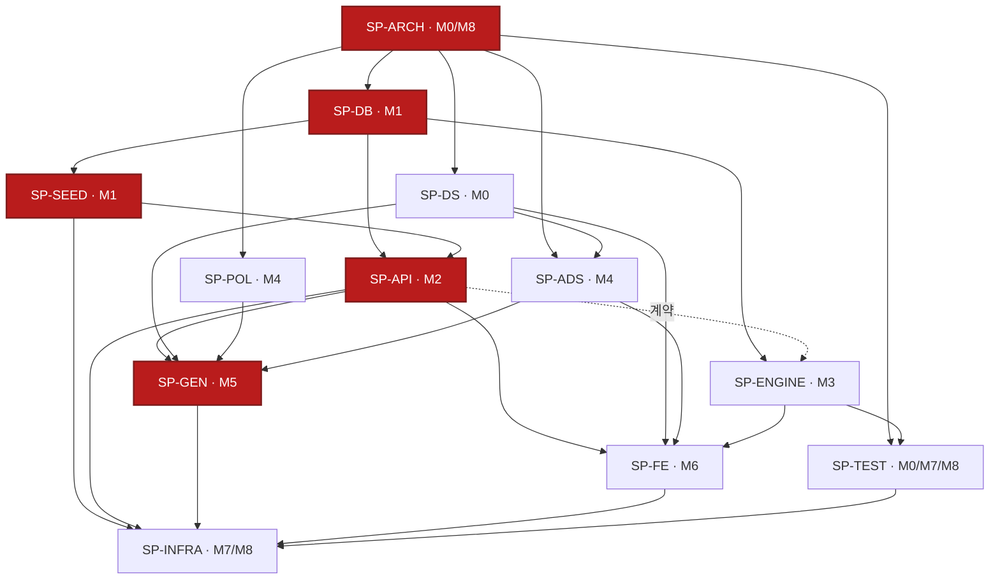

# TASK 00 — 빌드순서·마일스톤 (정본)

> **이 파일이 소유하는 것(정본)**: 마일스톤(M0~M8)·도메인 간 의존 DAG·크리티컬 패스·결정 게이트(DG-1~4)·Tier-0 회귀 게이트 맵·릴리스 게이트(G1~G4)·릴리스 순서(SP-ARCH-9). **리프 상세(구현·테스트 계약)는 소유하지 않는다** — 그건 각 도메인 TASK `01~12`가 소유한다. 본 문서는 그 12개를 **언제·어떤 순서로·무엇을 게이트 삼아** 엮을지만 확정한다.
> 진행 마커: 미착수 `- [ ]` · 진행중 `- [-]` · 완료 `- [v]`. 완료(- [v]) = 구현 + 대응 테스트 green(SP-TEST-1 DoD). 상위 인덱스는 [../TASK.md](../TASK.md).
> 교차검증: 각 도메인 드래프트 메타의 `upstreamDeps` + RESUME §7(미결 결정) + SPEC §5(Tier-0)·SPEC/12 §8(릴리스 게이트)·SPEC/01 SP-ARCH-9(릴리스 순서)와 정합.

## 1. 마일스톤 (M0~M8)

빌드는 9개 마일스톤으로 흐른다. 각 마일스톤 = "게이트 케이스가 green이 되는 단위". 게이트가 깨지면 다음 마일스톤 진입 금지.

| 마일스톤 | 포함 SP-대역 | 산출물 요약 | 선행 의존 | 게이트 케이스 | 상태 |
| --- | --- | --- | --- | --- | :---: |
| **M0** 기반 스캐폴드 | SP-ARCH(디렉토리·버전 pin)·**SP-DS**(전체·독립)·SP-TEST(`run_tests.sh` 골격·`harness.test.js` MT-1) | `web/ server/ db/ generator/ infra/ docs/` 6종 트리·`.gitignore`·`requirements.txt`/`package.json` 버전 pin·`styles.css` 토큰·집계 러너/메타 하네스 골격 | 없음(최상위) · **DG-4**(T-01.2.1 착수 전) | **T1**(6 디렉토리)·MT-1 | - [-] |
| **M1** 데이터 계층 | SP-DB → SP-SEED | `schema.sql` 5테이블·`AMT_SOURCE_CD`·백필 DDL → `reference.sql`·96 복지 재이식(→95 등록)·회사≈95 매핑·프리셋 28·DEC-2 백필·`load.py` | M0 + **DG-1·DG-2·DG-3 해소** | SD-3·DC-2·DC-12·DC-13·SB-1·SB-6 | - [v] (2026-07-11 완료: 98 pass) |
| **M2** API·번들 | SP-API | `build_reference_bundle` 단일 소스·Pydantic 모델·GET 4종·인메모리 TTL 캐시·CORS·표면 가드 | M1 · **DG-4**(T-04.6.2 선택 리프 한정) | TS-1·TS-2·TR-1~3·TR-5 | - [v] (2026-07-11 완료: 166 pass) |
| **M3** 계산엔진 | SP-ENGINE | `calc.js` 전 export·밴드(DEC-2)·순수 ES모듈 | M1 데이터 계약(필드명)만 · 러닝 API 무의존 → **M2와 병렬** · DG-1 | T-ENGINE-26·41·45 | - [v] |
| **M4** 광고·정책 기반 | SP-ADS + SP-POL | `adsConfig`·`adPolicy`/`mountAds`·`affiliate.json`·동의 배너 + 정책 4종 문안·정정 경로·푸터 링크 | M0(SP-DS·SP-ARCH) · **SP-FE-9·10 원시**(`dom.js` 안전유틸·`store.js` — M4 전 선행, §2) | UT-ADS-GATE-1·PC-13 | - [-] (SP-POL 콘텐츠 9/18) |
| **M5** 정적 생성 | SP-GEN | 회사 상세≈95·인기 조합·정책·404·`slug`·Jinja2·SEO·JSON-LD·`sitemap.xml`/`robots.txt`·비-JS 본문 | M2(번들 빌더)·M4(SP-POL·SP-ADS)·M0(SP-DS) | GC-2·GC-10·GC-21 | - [v] (2026-07-11 완료: 151 pass) |
| **M6** 프론트 SPA | SP-FE | 셸·라우팅·`boot`/REF·검색·입력·`normalizeCompany`·엔진 어댑터·`report` 렌더·`store`·이스케이프 | M3(SP-ENGINE)·M2(SP-API)·M4(SP-ADS)·M0(SP-DS) | UT-ESC-1~3 | - [-] (원시 dom/store 6/46) |
| **M7** 인프라·집계 | SP-INFRA + SP-TEST(집계 완성·MT-2) | `nginx.conf`·`systemd` 유닛·`mysql.cnf`·`release.sh`·`smoke.sh`·백업 + `run_tests.sh` 집계 완성·MT-1~4 배선 | 전 컴포넌트(M1~M6) | CFG-1~6·SM-1~14·MT-1~4 | - [-] (스크립트·MT-1~4 완성·게이트 ALL GREEN; 라이브 SM/CFG는 M8) |
| **M8** 하드닝·릴리스 | SP-ARCH(T7·T8)·SP-TEST(MT-3) + Tier-0 회귀 전량 + 수동 QA + 승인 게이트 | 통합 스모크 green·Tier-0 27 green·수동 QA(MB-*·MB-ADS-*·MD-*) 체크·AdSense 실 client id 치환·정책 법률 검토 | M7 | **T7·T8·G1~G4**·Tier-0 전량 | - [ ] |

## 2. 의존 DAG (SP-대역)

방향: `A --> B` = **A가 B의 선행**(A를 먼저 빌드해야 B 착수). 붉은 노드 = 크리티컬 패스. 점선(`계약`) = 러닝코드 무의존·데이터 계약 필드명만 참조.

**드래프트 메타 소프트-사이클 2건 해소(사이클 없음 보장):**
- **SP-ADS ↔ SP-FE**: 두 결합의 **성격이 다르다**. (1) **마운트 계약**: `mountAds`/`initConsentBanner` 호출 지점은 M4(SP-ADS가 인터페이스 정의) → M6(SP-FE가 `bindGlobalUI`·report 뷰 전환에서 소비) = **SP-ADS → SP-FE**. (2) **원시 유틸 의존(코드)**: `ads.js`는 `dom.js`의 `escapeHtml`/`safeUrl`/`el`(SP-FE-9)·`store.js`의 `store`(SP-FE-10)를 **import·소비**한다(`filterAffiliate`/`buildAffiliateAttrs`의 `safeUrl`, `getConsent`의 `store`). 이 원시들(SP-FE 리프 T-06.9.1·9.2·9.3·T-06.12.1)은 순수·앱무의존(T-06.1.1)이라 **M4 착수 전 선행 확보되는 공유 원시 서브셋**으로 앞당긴다(SP-FE 본체 셸·라우팅·리포트는 M6 유지). 따라서 대역-DAG 간선은 마운트 계약 기준 `SP-ADS → SP-FE`를 유지하되 원시 서브셋은 `dom/store(원시) → SP-ADS`로 읽어 사이클 없이 정합한다. SP-ADS 순수 UT(`filterAffiliate`/`buildAffiliateAttrs`/`getConsent`)는 이 원시 확보 후 green이 된다.
- **SP-INFRA ↔ SP-TEST**: SP-TEST 메타에 SP-INFRA가, SP-INFRA 메타에 SP-TEST가 상호 등장한다. `run_tests.sh`(SP-TEST)를 `release.sh`(SP-INFRA)가 호출하므로 **SP-TEST → SP-INFRA** 한 방향만 그린다. SP-TEST의 MT-3(=`release.sh` 소스 린트)이 green이 되는 시점은 M8의 **테스트-랜딩 역참조**이며 빌드 선행 간선이 아니다(사이클 아님).

## 3. 크리티컬 패스

배포까지 최단 직렬 경로는 데이터가 흐르는 축이다:

**SP-ARCH → SP-DB → SP-SEED → SP-API → SP-GEN**  (→ SP-INFRA 배치)

- 이 축의 어느 단계가 지연되면 전체 릴리스가 지연된다(붉은 노드).
- **병렬 갈래**(크리티컬 패스와 독립적으로 진행 가능):
  - **SP-ENGINE**(M3): SP-DB/SP-API 데이터 계약 필드명만 참조, 러닝 API 무의존 → **M2와 병렬**.
  - **SP-DS**(M0): SP-ARCH 디렉토리만 의존, 전 도메인과 독립 → M0에 조기 완결.
  - **SP-ADS·SP-POL**(M4): SP-ARCH·SP-DS 위에서 M5/M6 소비 전 준비.
- 합류점: **SP-GEN**(M5)은 SP-API·SP-POL·SP-ADS·SP-DS 4갈래를, **SP-FE**(M6)는 SP-ENGINE·SP-API·SP-ADS·SP-DS 4갈래를 각각 합류시킨다. **SP-INFRA**(M7)가 전 컴포넌트를 배치·기동해 최종 합류.

## 4. 결정 게이트 (DG-1~4)

구현 전 **임의 판단 금지 — 항상 AskUserQuestion으로 확인**(RESUME §3·§7 / RESEARCH §8). 해소 전에는 해당 리프·마일스톤 착수 차단.

| 게이트 | 결정 대상(무엇) | 왜 필요 | 차단 대역·리프(게이트 케이스) | 차단 마일스톤 | 해소 방법 | 상태 |
| --- | --- | --- | --- | :---: | --- | :---: |
| **DG-1** (OI-3) | 카테고리별 만료 TTL 값 (후보: compensation 6·perks 9·time_off/flexibility 12·work_env/health/growth/leisure/family 18개월) | `EXPIRES_DTM` 백필 상수 + 만료 밴드 `+0.15` 판정 입력 | SP-SEED T-03.5.5(SB-8·9) · SP-ENGINE T-05.6.2(T-ENGINE-24·25) | M1·M3 | 착수 전 AskUserQuestion로 TTL 표 확정 | - [ ] |
| **DG-2** (OI-6) | `amt_source` 백필 판별 규칙 (기존 `(추정)`/`환산` 표기 → stated/estimated/none) | DEC-2 백필의 `AMT_SOURCE_CD` 도출 규칙 | SP-SEED T-03.5.2(SB-2·3·4·5·7) | M1 | AskUserQuestion로 판별 규칙 확정 | - [ ] |
| **DG-3** | 엔씨소프트 시드 메타(별칭·산업·`work_style` — KOSPI/KOSDAQ 200 목록 밖) 확보 | 회사 매핑에서 엔씨 리프 시드 불가 | SP-SEED T-03.4.3(SI-2·3) | M1 | 메타 확보 후 AskUserQuestion 확정 | - [ ] |
| **DG-4** (OI-4/5/7 + 도메인 로컬) | RESEARCH §8 기타 미결 + 로컬 선결정: SP-ARCH **MySQL 인증 플러그인**(`caching_sha2_password`→`cryptography` 포함 vs `mysql_native_password`) · SP-API **`/health` 레디니스 503 확장**(선택) | 매니페스트 pin·엔드포인트 계약 확정 전 임의판단 금지 | SP-ARCH T-01.2.1 · SP-API T-04.6.2 + RESEARCH §8 관련 리프 | M0(ARCH pin)·M2(API) | 각 리프 착수 전 AskUserQuestion | - [ ] |

> **드래프트 라벨 정합(정정 완료)**: 초기 드래프트가 로컬로 `DG-1`로 표기했던 두 항목 — SP-ARCH T-01.2.1(MySQL 인증 플러그인)·SP-API T-04.6.2(`/health` 레디니스) — 은 본 **전역 레지스트리에서 DG-4로 통합**하며, 해당 도메인 파일(01·04)의 표기도 **DG-4로 정정**했다(같은 AskUserQuestion 규율). 전역 `DG-1`은 항상 **OI-3 만료 TTL**만을 뜻하며 SP-SEED T-03.5.5·SP-ENGINE T-05.6.2가 이를 참조한다.

> **결정 확정(2026-07-11)**: DG-1 = **균일 18개월 TTL**(초단순 — 카테고리 차등 대신 전 카테고리 18개월). DG-2 = **표기 기반 백필**(레거시 텍스트 `(추정)`/`환산` 포함→estimated ±20% · 금액 있고 추정표기 없음→stated ±5% · 정성→none). DG-3 = **엔씨소프트 재이식 + 회사 메타 수동구성**(산업=게임, 별칭 NC/NCSOFT). DG-4 = **cryptography 포함**(caching_sha2_password); `/health` 레디니스 503 확장은 미채택(MVP 라이브니스). 개발/테스트 DB = 스키마 `LOUPIT`(사용자 `APP_LOUPIT`), 별도 `loupit_test` 권한 없어 동 스키마에서 테이블 재생성으로 격리.

## 5. Tier-0 회귀 게이트 맵

각 도메인의 `tier0Leaves`를 한 표로 모은다. **하나라도 깨지면 배포 차단(예외 없음)** — `release.sh` 4·7단계가 로컬 강제(SP-TEST-7·SP-ARCH-10·SPEC §5 정합). 총 **27개 리프**.

| # | 대역·마일스톤 | 리프 | 게이트 케이스 | 배포 차단 케이스(무엇을 지키나) | 러너 |
| :-: | --- | --- | --- | --- | --- |
| 1 | SP-DB · M1 | T-02.4.1 | DC-13 | 백필 후 `BADGE_CD='est'`=0 (96 전량 official 승격)+멱등 | pytest |
| 2 | SP-DB · M1 | T-02.4.2 | DC-12 | `official × estimated` 공존 ≥1 (DEC-2 디커플링 서명) | pytest |
| 3 | SP-DB · M1 | T-02.5.2 | DC-2 | `TCOMPANY` 행수 ≈96 (≥90 하한, 목업 회피) | pytest |
| 4 | SP-SEED · M1 | T-03.3.4 | SD-3 | `TCOMPANY`=95 (≠200) | pytest |
| 5 | SP-SEED · M1 | T-03.5.1 | SB-1 | 백필 후 등록 복지 `BADGE_CD='est'`=0 (전량 official) | pytest |
| 6 | SP-SEED · M1 | T-03.5.3 | SB-6 | `official × estimated` 공존 ≥1 (디커플링 실재) | pytest |
| 7 | SP-API · M2 | T-04.5.2 | TS-1 | API 표면=GET 4종·쓰기 라우트 0 (INV-1) | pytest+httpx |
| 8 | SP-API · M2 | T-04.5.3 | TS-2 | 미들웨어=CORS 1종·무인증·무세션 | pytest+httpx |
| 9 | SP-API · M2 | T-04.7.1 | TR-1 | `reference/all` 캐시 미스 조립·직렬 바이트 반환 | pytest+httpx |
| 10 | SP-API · M2 | T-04.7.2 | TR-2 | `reference/all` 전송 헤더(`Cache-Control: public, max-age=3600`) | pytest+httpx |
| 11 | SP-API · M2 | T-04.7.3 | TR-3 | 프로파일러 키(`profiles`/`job_groups`/`questions`) 부재 (INV-2) | pytest+httpx |
| 12 | SP-API · M2 | T-04.7.5 | TR-5 | 인메모리 캐시 1회 조립 | pytest+httpx |
| 13 | SP-ENGINE · M3 | T-05.6.3 | T-ENGINE-26 | official 배지 × estimated = ±20% (badge 무시, DEC-2·INV-5) | node:test |
| 14 | SP-ENGINE · M3 | T-05.8.3 | T-ENGINE-41 | 필수 결측 무크래시 (missing 미산출·throw 없음) | node:test |
| 15 | SP-ENGINE · M3 | T-05.9.1 | T-ENGINE-45 | 순수성 (부수효과 0·불변 입력·결정성, INV-4) | node:test |
| 16 | SP-FE · M6 | T-06.9.1 | UT-ESC-1 | `escapeHtml`·`h` 태그드 템플릿 | node:test |
| 17 | SP-FE · M6 | T-06.9.2 | UT-ESC-2 | `safeUrl` 스킴 화이트리스트 | node:test |
| 18 | SP-FE · M6 | T-06.9.3 | UT-ESC-3 | `el` 안전 DOM 빌더·raw html 차단 | node:test |
| 19 | SP-GEN · M5 | T-07.11.2 | GC-2 | 회사 페이지 개수 ≈95 (≠200) | pytest |
| 20 | SP-GEN · M5 | T-07.11.3 | GC-10 | 비-JS 본문 렌더 (INV-3) | pytest |
| 21 | SP-GEN · M5 | T-07.11.4 | GC-21 | XSS 이스케이프 (autoescape) | pytest |
| 22 | SP-ADS · M4 | T-08.3.1 | UT-ADS-GATE-1 | `input` page_type 무광고 폴백 | node:test |
| 23 | SP-POL · M4 | T-09.2.2 | PC-13 | XSS 이스케이프·비-JS 렌더 안전 | pytest |
| 24 | SP-TEST · M0 | T-12.1.1 | MT-1 | `run_tests.sh` 4 서브스위트 호출 + `set -euo pipefail` | node:test |
| 25 | SP-TEST · M7 | T-12.2.1 | MT-2 | 필수 테스트 파일 존재·명명 규약 린트 | node:test |
| 26 | SP-TEST · M8 | T-12.2.2 | MT-3 | `release.sh` 게이트 호출·early-exit 배선 | node:test |
| 27 | SP-TEST · M3+ | T-12.2.3 | MT-4 | `calc.js` export 커버리지 하한(미커버=0) | node:test |

> **SP-ARCH 위임 정합(SP-ARCH-10)**: SP-ARCH는 INV-1~6 회귀를 계약(T2·T4·T5·T6)으로만 소유하고 실구현은 위임한다 — T2(INV-1 API 표면)→#7·8(TS-1·TS-2, SP-API), T4(INV-2 번들 계약)→#9·10·11·12(TR-1~3·TR-5, SP-API), T5(INV-4·5 순수성·밴드)→#13·14·15(SP-ENGINE), T6(INV-3·6 생성물)→#19·20·21(SP-GEN). 01·04 위임표와 정합. 따라서 SP-ARCH 고유 리프에는 Tier-0가 없다.

## 6. 릴리스 게이트 (G1~G4) · 릴리스 순서

### 6.1 자동 게이트 G1~G4 (배포 전 전부 green — SP-TEST-8)

`release.sh`(로컬, CI 없음)가 강제. 어느 게이트든 실패 시 non-zero exit로 배포 차단.

| 게이트 | 명령 | 포함 스위트(green 필수) |
| --- | --- | --- |
| **G1** | `pytest server/tests/` | SC·CN·DC(SP-DB) + SD·SI·SB·SM(SP-SEED) + TS·TH·TR·TSE·TC·TM·TN·TCORS·TE(SP-API) |
| **G2** | `pytest generator/tests/` | GC-1~26(SP-GEN) + PC-1~13(SP-POL) |
| **G3** | `node --test web/` | T-ENGINE-1~48(SP-ENGINE) + UT-*(SP-FE) + UT-ADS-*(SP-ADS) + UT-TOKEN/CONTRAST-*(SP-DS) + **MT-1~4**(SP-TEST 메타) |
| **G4**(스모크) | `smoke.sh`(서비스 기동 후) | `curl /`·`/api/v1/health`·`/api/v1/reference/all`(+캐시 헤더)·`/company/{slug}` 모두 200 (T8) |

### 6.2 릴리스 순서 (SP-ARCH-9, 작업 순서 재서술)

M8에서 아래 7단계를 순차 실행. **4단계 게이트 실패 시 5~7단계(재시작·reload·스모크) 미실행**(early-exit — MT-3이 이 배선을 린트).

1. **schema** — `mysql < db/schema.sql` (idempotent DDL, 참조 테이블 5종)
2. **seed** — `db/seed/*.sql` 적재(트랜잭션): 기업유형 6·프리셋·회사·별칭 ~96·상세 복지 SQL → MySQL이 유일 참조 원천
3. **generator** — `python generator/build.py --out web/dist` (`build_reference_bundle` 번들 → HTML·`sitemap.xml`·`robots.txt`)
4. **검증** — 생성물 검증 테스트 통과 **(G1~G3 게이트, SP-GEN·SP-TEST)** ← 실패 시 여기서 중단
5. **restart** — `systemctl restart loupit-api`
6. **nginx reload** — `nginx -t && systemctl reload nginx`
7. **스모크** — **G4**(T8): `/`·`/api/v1/health`·`/api/v1/reference/all`(+캐시 헤더)·`/company/{slug}` 200 확인

> **별도 승인 게이트(코드 게이트 아님, M8)**: AdSense 승인 후 **실 client id 치환 + 재검증**(SP-ADS), **정책 문안 법률 검토**(SP-POL PC-11 초안 배너 해제)는 PRD 릴리스 게이트가 소유하며 위 자동 게이트와 별개로 통과해야 배포 가능.
